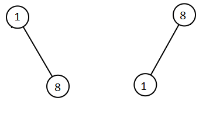

Given two binary search trees `root1` and `root2`, return *a list containing all the integers from both trees sorted in **ascending** order*.

 

**Example 1:**


```
Input: root1 = [2,1,4], root2 = [1,0,3]
Output: [0,1,1,2,3,4]
```

**Example 2:**



```
Input: root1 = [1,null,8], root2 = [8,1]
Output: [1,1,8,8]
```

 

**Constraints:**

- The number of nodes in each tree is in the range `[0, 5000]`.
- `-10 ** 5 <= Node.val <= 10 ** 5`

```python
def getAllElements(self, root1: TreeNode, root2: TreeNode) -> List[int]:
    """merge two binary trees

    Args:
        root1 (TreeNode): Tree 1
        root2 (TreeNode): Tree 2

    Returns:
        List[int]: merged Tree in ascending order
    """
    ans = []
    def element(node) -> list:
        if node: 
            ans.append(node.val)
            element(node.left)
            element(node.right)

    element(root1)
    element(root2)
    return sorted(ans)
```

