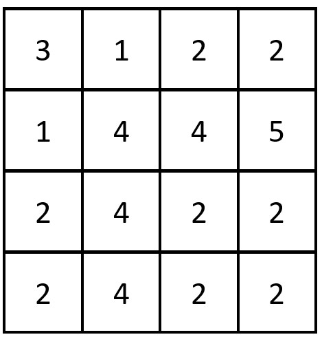

### 2351. First Letter to Appear Twice

Given a string `s` consisting of lowercase English letters, return *the first letter to appear **twice***.

**Note**:

- A letter `a` appears twice before another letter `b` if the **second** occurrence of `a` is before the **second** occurrence of `b`.
- `s` will contain at least one letter that appears twice.

 

**Example 1:**

```
Input: s = "abccbaacz"
Output: "c"
Explanation:
The letter 'a' appears on the indexes 0, 5 and 6.
The letter 'b' appears on the indexes 1 and 4.
The letter 'c' appears on the indexes 2, 3 and 7.
The letter 'z' appears on the index 8.
The letter 'c' is the first letter to appear twice, because out of all the letters the index of its second occurrence is the smallest.
```

**Example 2:**

```
Input: s = "abcdd"
Output: "d"
Explanation:
The only letter that appears twice is 'd' so we return 'd'.
```

 

**Constraints:**

- `2 <= s.length <= 100`
- `s` consists of lowercase English letters.
- `s` has at least one repeated letter.

```python
def repeatedCharacter(self, s: str) -> str:
    visited = set()
    for i in s:
        if i in visited: return i
        visited.add(i)
```

### 2352. Equal Row and Column Pairs

Given a **0-indexed** `n x n` integer matrix `grid`, *return the number of pairs* `(Ri, Cj)` *such that row* `Ri` *and column* `Cj` *are equal*.

A row and column pair is considered equal if they contain the same elements in the same order (i.e. an equal array).

 

**Example 1:**


```
Input: grid = [[3,2,1],[1,7,6],[2,7,7]]
Output: 1
Explanation: There is 1 equal row and column pair:
- (Row 2, Column 1): [2,7,7]
```

**Example 2:**



```
Input: grid = [[3,1,2,2],[1,4,4,5],[2,4,2,2],[2,4,2,2]]
Output: 3
Explanation: There are 3 equal row and column pairs:
- (Row 0, Column 0): [3,1,2,2]
- (Row 2, Column 2): [2,4,2,2]
- (Row 3, Column 2): [2,4,2,2]
```

 

**Constraints:**

- `n == grid.length == grid[i].length`
- `1 <= n <= 200`
- `1 <= grid[i][j] <= 10 ** 5`

```python
def equalPairs(self, grid: List[List[int]]) -> int:
    n = len(grid)
    for i, j in product(range(n), range(n)):
        grid[i][j] = str(grid[i][j])
    row = collections.Counter([','.join(r) for r in grid])
    col = collections.Counter([','.join([grid[i][j] for i in range(n)]) for j in range(n)])
    intersect = row.keys() & col.keys()
    return sum([row[i] * col[i] for i in intersect])
```

### 2353. Design a Food Rating System

Design a food rating system that can do the following:

- **Modify** the rating of a food item listed in the system.
- Return the highest-rated food item for a type of cuisine in the system.

Implement the `FoodRatings` class:

- `FoodRatings(String[] foods, String[] cuisines, int[] ratings)` Initializes the system. The food items are described by `foods`, `cuisines` and `ratings`, all of which have a length of `n`.
  - `foods[i]` is the name of the `ith` food,
  - `cuisines[i]` is the type of cuisine of the `ith` food, and
  - `ratings[i]` is the initial rating of the `ith` food.
- `void changeRating(String food, int newRating)` Changes the rating of the food item with the name `food`.
- `String highestRated(String cuisine)` Returns the name of the food item that has the highest rating for the given type of `cuisine`. If there is a tie, return the item with the **lexicographically smaller** name.

Note that a string `x` is lexicographically smaller than string `y` if `x` comes before `y` in dictionary order, that is, either `x` is a prefix of `y`, or if `i` is the first position such that `x[i] != y[i]`, then `x[i]` comes before `y[i]` in alphabetic order.

 

**Example 1:**

```
Input
["FoodRatings", "highestRated", "highestRated", "changeRating", "highestRated", "changeRating", "highestRated"]
[[["kimchi", "miso", "sushi", "moussaka", "ramen", "bulgogi"], ["korean", "japanese", "japanese", "greek", "japanese", "korean"], [9, 12, 8, 15, 14, 7]], ["korean"], ["japanese"], ["sushi", 16], ["japanese"], ["ramen", 16], ["japanese"]]
Output
[null, "kimchi", "ramen", null, "sushi", null, "ramen"]

Explanation
FoodRatings foodRatings = new FoodRatings(["kimchi", "miso", "sushi", "moussaka", "ramen", "bulgogi"], ["korean", "japanese", "japanese", "greek", "japanese", "korean"], [9, 12, 8, 15, 14, 7]);
foodRatings.highestRated("korean"); // return "kimchi"
                                    // "kimchi" is the highest rated korean food with a rating of 9.
foodRatings.highestRated("japanese"); // return "ramen"
                                      // "ramen" is the highest rated japanese food with a rating of 14.
foodRatings.changeRating("sushi", 16); // "sushi" now has a rating of 16.
foodRatings.highestRated("japanese"); // return "sushi"
                                      // "sushi" is the highest rated japanese food with a rating of 16.
foodRatings.changeRating("ramen", 16); // "ramen" now has a rating of 16.
foodRatings.highestRated("japanese"); // return "ramen"
                                      // Both "sushi" and "ramen" have a rating of 16.
                                      // However, "ramen" is lexicographically smaller than "sushi".
```

 

**Constraints:**

- `1 <= n <= 2 * 10 ** 4`
- `n == foods.length == cuisines.length == ratings.length`
- `1 <= foods[i].length, cuisines[i].length <= 10`
- `foods[i]`, `cuisines[i]` consist of lowercase English letters.
- `1 <= ratings[i] <= 10 ** 8`
- All the strings in `foods` are **distinct**.
- `food` will be the name of a food item in the system across all calls to `changeRating`.
- `cuisine` will be a type of cuisine of **at least one** food item in the system across all calls to `highestRated`.
- At most `2 * 10 ** 4` calls **in total** will be made to `changeRating` and `highestRated`.

> Since foods are distinct
>
> SortedList.remove()
>
> SortedList.add()

```python
#!/usr/bin/env python3
from typing import List
import collections
from sortedcontainers import SortedList

class FoodRatings:

    def __init__(self, foods: List[str], cuisines: List[str], ratings: List[int]):
        # current ratings and cuisines
        self.d = dict()

        # group types
        self.types = collections.defaultdict(SortedList)
        for f, c, r in zip(foods, cuisines, ratings):
            self.d[f] = (c, r)
            self.types[c].add((-r, f))

    def changeRating(self, food: str, newRating: int) -> None:
        cuisine, old_rating = self.d[food]
        self.d[food] = (newRating, cuisine)
        self.types[cuisine].remove((-old_rating, food))
        self.types[cuisine].add((-newRating, food))

    def highestRated(self, cuisine: str) -> str:
        return self.types[cuisine][0][1]


if __name__ == '__main__':
    # Your FoodRatings object will be instantiated and called as such:
    # obj = FoodRatings(foods, cuisines, ratings)
    # obj.changeRating(food,newRating)
    # param_2 = obj.highestRated(cuisine)
    in1 = ["FoodRatings", "highestRated", "highestRated", "changeRating", "highestRated", "changeRating", "highestRated"]
    in2 = [[["kimchi", "miso", "sushi", "moussaka", "ramen", "bulgogi"], ["korean", "japanese", "japanese", "greek", "japanese", "korean"], [9, 12, 8, 15, 14, 7]], ["korean"], ["japanese"], ["sushi", 16], ["japanese"], ["ramen", 16], ["japanese"]]
    fr = FoodRatings(['kimchi', 'miso', 'sushi', 'moussaka', 'ramen', 'bulgogi'],['korean', 'japanese', 'japanese', 'greek', 'japanese', 'korean'],[9, 12, 8, 15, 14, 7])
    for function, para in zip(in1[1:], in2[1:]):
        para = str(para)
        para = para[1 : len(para) - 1]
        print(eval('fr.' + function + '(' + para + ')'))
```

### 2354. Number of Excellent Pairs

You are given a **0-indexed** positive integer array `nums` and a positive integer `k`.

A pair of numbers `(num1, num2)` is called **excellent** if the following conditions are satisfied:

- **Both** the numbers `num1` and `num2` exist in the array `nums`.
- The sum of the number of set bits in `num1 OR num2` and `num1 AND num2` is greater than or equal to `k`, where `OR` is the bitwise **OR** operation and `AND` is the bitwise **AND** operation.

Return *the number of **distinct** excellent pairs*.

Two pairs `(a, b)` and `(c, d)` are considered distinct if either `a != c` or `b != d`. For example, `(1, 2)` and `(2, 1)` are distinct.

**Note** that a pair `(num1, num2)` such that `num1 == num2` can also be excellent if you have at least **one** occurrence of `num1` in the array.

 

**Example 1:**

```
Input: nums = [1,2,3,1], k = 3
Output: 5
Explanation: The excellent pairs are the following:
- (3, 3). (3 AND 3) and (3 OR 3) are both equal to (11) in binary. The total number of set bits is 2 + 2 = 4, which is greater than or equal to k = 3.
- (2, 3) and (3, 2). (2 AND 3) is equal to (10) in binary, and (2 OR 3) is equal to (11) in binary. The total number of set bits is 1 + 2 = 3.
- (1, 3) and (3, 1). (1 AND 3) is equal to (01) in binary, and (1 OR 3) is equal to (11) in binary. The total number of set bits is 1 + 2 = 3.
So the number of excellent pairs is 5.
```

**Example 2:**

```
Input: nums = [5,1,1], k = 10
Output: 0
Explanation: There are no excellent pairs for this array.
```

 

**Constraints:**

- `1 <= nums.length <= 10 ** 5`
- `1 <= nums[i] <= 10 ** 9`
- `1 <= k <= 60`

> bit_count(A OR B) + bit_count(A AND B) = bit_count(A) + bit_count(B)

```python
def countExcellentPairs(self, nums: List[int], k: int) -> int:
    cnt = collections.Counter(map(int.bit_count, set(nums)))
    return sum(cnt[n1] * cnt[n2] for n1, n2 in product(cnt.keys(), cnt.keys()) if n1 + n2 >= k)
```

