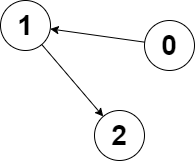
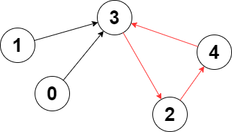

### 2357. Make Array Zero by Subtracting Equal Amounts

You are given a non-negative integer array `nums`. In one operation, you must:

- Choose a positive integer `x` such that `x` is less than or equal to the **smallest non-zero** element in `nums`.
- Subtract `x` from every **positive** element in `nums`.

Return *the **minimum** number of operations to make every element in* `nums` *equal to* `0`.

 

**Example 1:**

```
Input: nums = [1,5,0,3,5]
Output: 3
Explanation:
In the first operation, choose x = 1. Now, nums = [0,4,0,2,4].
In the second operation, choose x = 2. Now, nums = [0,2,0,0,2].
In the third operation, choose x = 2. Now, nums = [0,0,0,0,0].
```

**Example 2:**

```
Input: nums = [0]
Output: 0
Explanation: Each element in nums is already 0 so no operations are needed.
```

 

**Constraints:**

- `1 <= nums.length <= 100`
- `0 <= nums[i] <= 100`

```python
def minimumOperations(self, nums: List[int]) -> int:
    heapq.heapify(nums)
    target = max(nums)
    acc = cnt = 0
    while nums:
        tmp = heapq.heappop(nums) - acc
        if tmp == 0: continue
        target -= tmp
        cnt += 1
        acc += tmp
        if target == 0: break
    return cnt
```

### 2358. Maximum Number of Groups Entering a Competition

You are given a positive integer array `grades` which represents the grades of students in a university. You would like to enter **all** these students into a competition in **ordered** non-empty groups, such that the ordering meets the following conditions:

- The sum of the grades of students in the `ith` group is **less than** the sum of the grades of students in the `(i + 1)th` group, for all groups (except the last).
- The total number of students in the `ith` group is **less than** the total number of students in the `(i + 1)th` group, for all groups (except the last).

Return *the **maximum** number of groups that can be formed*.

 

**Example 1:**

```
Input: grades = [10,6,12,7,3,5]
Output: 3
Explanation: The following is a possible way to form 3 groups of students:
- 1st group has the students with grades = [12]. Sum of grades: 12. Student count: 1
- 2nd group has the students with grades = [6,7]. Sum of grades: 6 + 7 = 13. Student count: 2
- 3rd group has the students with grades = [10,3,5]. Sum of grades: 10 + 3 + 5 = 18. Student count: 3
It can be shown that it is not possible to form more than 3 groups.
```

**Example 2:**

```
Input: grades = [8,8]
Output: 1
Explanation: We can only form 1 group, since forming 2 groups would lead to an equal number of students in both groups.
```

 

**Constraints:**

- `1 <= grades.length <= 10 ** 5`
- `1 <= grades[i] <= 10 ** 5`

```python
def maximumGroups(self, grades: List[int]) -> int:
    # binary search
    # 1 + 2 + ... + n
    left, right = 1, len(grades) + 1
    while left < right:
        mid = (left + right) >> 1
        if mid * (mid + 1) // 2 <= len(grades): left = mid + 1
        else: right = mid
    return left - 1
```

### 2359. Find Closest Node to Given Two Nodes

You are given a **directed** graph of `n` nodes numbered from `0` to `n - 1`, where each node has **at most one** outgoing edge.

The graph is represented with a given **0-indexed** array `edges` of size `n`, indicating that there is a directed edge from node `i` to node `edges[i]`. If there is no outgoing edge from `i`, then `edges[i] == -1`.

You are also given two integers `node1` and `node2`.

Return *the **index** of the node that can be reached from both* `node1` *and* `node2`*, such that the **maximum** between the distance from* `node1` *to that node, and from* `node2` *to that node is **minimized***. If there are multiple answers, return the node with the **smallest** index, and if no possible answer exists, return `-1`.

Note that `edges` may contain cycles.

 

**Example 1:**


```
Input: edges = [2,2,3,-1], node1 = 0, node2 = 1
Output: 2
Explanation: The distance from node 0 to node 2 is 1, and the distance from node 1 to node 2 is 1.
The maximum of those two distances is 1. It can be proven that we cannot get a node with a smaller maximum distance than 1, so we return node 2.
```

**Example 2:**



```
Input: edges = [1,2,-1], node1 = 0, node2 = 2
Output: 2
Explanation: The distance from node 0 to node 2 is 2, and the distance from node 2 to itself is 0.
The maximum of those two distances is 2. It can be proven that we cannot get a node with a smaller maximum distance than 2, so we return node 2.
```

 

**Constraints:**

- `n == edges.length`
- `2 <= n <= 10 ** 5`
- `-1 <= edges[i] < n`
- `edges[i] != i`
- `0 <= node1, node2 < n`

```python
def closestMeetingNode(self, edges: List[int], node1: int, node2: int) -> int:
    n = len(edges)

    def helper(node):
        step = [float('inf')] * n
        cnt = 0
        while node != -1 and step[node] == float('inf'):
            step[node] = cnt
            node = edges[node]
            cnt += 1
        return step

    s1, s2 = helper(node1), helper(node2)
    ret_step = float('inf')
    ret = []
    for idx, (i, j) in enumerate(zip(s1, s2)):
        if i < float('inf') and j < float('inf'):
            # node idx can be reached by both
            step = max(i, j)
            if step < ret_step: 
                ret_step = step
                ret = [idx]
            if step == ret_step: ret.append(idx)
    return min(ret) if ret else -1
```

### 2360. Longest Cycle in a Graph

You are given a **directed** graph of `n` nodes numbered from `0` to `n - 1`, where each node has **at most one** outgoing edge.

The graph is represented with a given **0-indexed** array `edges` of size `n`, indicating that there is a directed edge from node `i` to node `edges[i]`. If there is no outgoing edge from node `i`, then `edges[i] == -1`.

Return *the length of the **longest** cycle in the graph*. If no cycle exists, return `-1`.

A cycle is a path that starts and ends at the **same** node.

 

**Example 1:**



```
Input: edges = [3,3,4,2,3]
Output: 3
Explanation: The longest cycle in the graph is the cycle: 2 -> 4 -> 3 -> 2.
The length of this cycle is 3, so 3 is returned.
```

**Example 2:**


```
Input: edges = [2,-1,3,1]
Output: -1
Explanation: There are no cycles in this graph.
```

 

**Constraints:**

- `n == edges.length`
- `2 <= n <= 10 ** 5`
- `-1 <= edges[i] < n`
- `edges[i] != i`

> 1. if a node is inside a circle, it must has ingoing and outgoing edges
> 2. since each node has at most one outgoing edge, it cannot be involved into multiple circles. Thus, we don’t need to do further search if we already visited this node.

```python
def longestCycle(self, edges: List[int]) -> int:
    ingoing, outgoing = set(), set()
    for idx, i in enumerate(edges):
        if i != -1:
            ingoing.add(i)
            outgoing.add(idx)
    cand = ingoing & outgoing

    visited = set()
    ret = [-1]

    def dfs(node, length, visit):
        """helper function

        Args:
            node (int): the node we are visiting
            length (int): the length of the path we visited
            visited (set): a dict, key = node id, value = path length
        """
        visited.add(node)
        visit[node] = length
        nxt = edges[node]
        if nxt in visit:
            ret[0] = max(ret[0], length - visit[nxt] + 1)
            visited.add(nxt)
            return
        if nxt not in visited and nxt in cand:
            dfs(nxt, length + 1, visit)

    for i in cand:
        dfs(i, 1, {})
    return ret[0]
```

