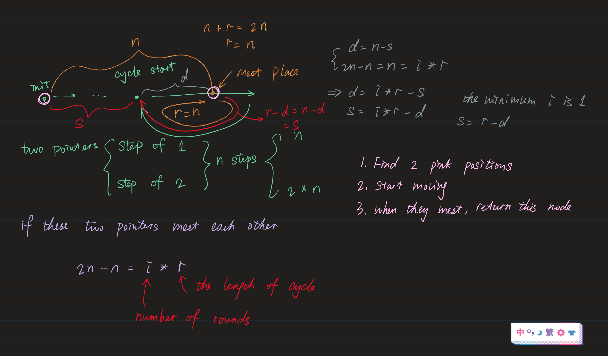

Given the `head` of a linked list, return *the node where the cycle begins. If there is no cycle, return* `null`.

There is a cycle in a linked list if there is some node in the list that can be reached again by continuously following the `next` pointer. Internally, `pos` is used to denote the index of the node that tail's `next` pointer is connected to (**0-indexed**). It is `-1` if there is no cycle. **Note that** `pos` **is not passed as a parameter**.

**Do not modify** the linked list.

 

**Example 1:**


```
Input: head = [3,2,0,-4], pos = 1
Output: tail connects to node index 1
Explanation: There is a cycle in the linked list, where tail connects to the second node.
```

**Example 2:**


```
Input: head = [1,2], pos = 0
Output: tail connects to node index 0
Explanation: There is a cycle in the linked list, where tail connects to the first node.
```

**Example 3:**


```
Input: head = [1], pos = -1
Output: no cycle
Explanation: There is no cycle in the linked list.
```

 

**Constraints:**

- The number of the nodes in the list is in the range `[0, 10 ** 4]`.
- `-10 ** 5 <= Node.val <= 10 ** 5`
- `pos` is `-1` or a **valid index** in the linked-list.

 

**Follow up:** Can you solve it using `O(1)` (i.e. constant) memory?

#### First Approach

O(n) space complexity

```python
def detectCycle(self, head: ListNode) -> ListNode:
    # regardless of O(1) memory
    visited = set() # key = listnode, value = idx
    while head:
        if head in visited: return head
        visited.add(head)
        head = head.next
    return None
```

#### Discussion approach



1. create two pointers, one of them move 1 step forward, while the other move 2 steps.
2. they will meet after n steps. please refer to the image above, we need to find two pink positions.
3. restart iteration from start position and meet position, return the first node they meet, this is where cycle start.

```python
def detectCycle(self, head: ListNode) -> ListNode:
        # regardless of O(1) memory
        # visited = set() # key = listnode, value = idx
        # while head:
        #     if head in visited: return head
        #     visited.add(head)
        #     head = head.next
        # return None

        # O(1) space complexity
        if not head: return None
        slow = fast = head
        first = True
        while first or slow != fast:
            first = False
            if (not fast.next) or (not fast.next.next): return None
            slow = slow.next
            fast = fast.next.next
        
        while slow != head:
            slow = slow.next
            head = head.next
        
        return head
```

