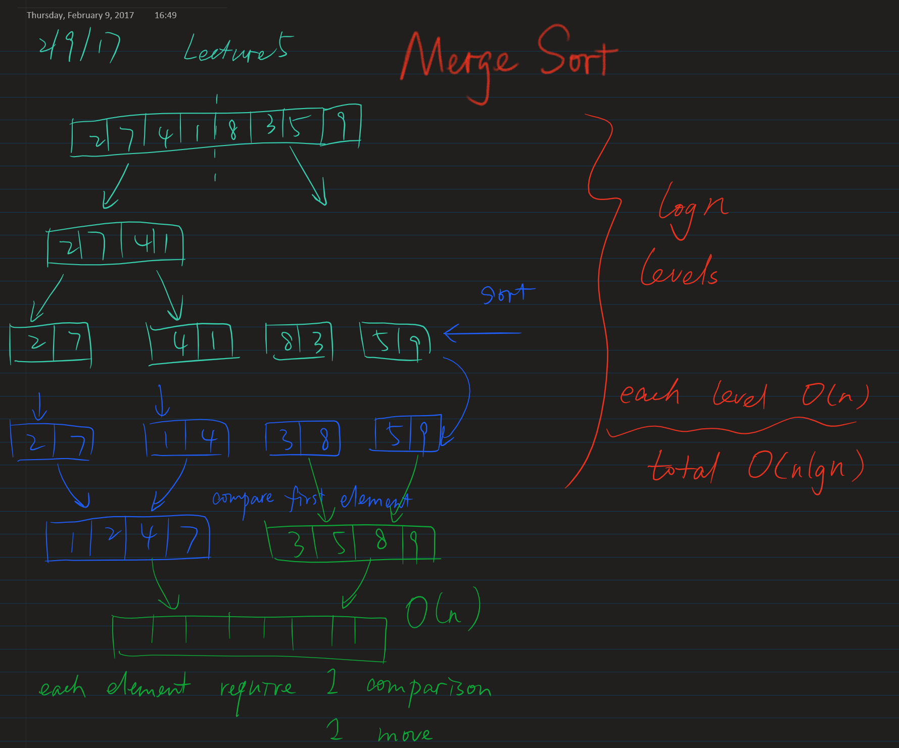

Given the `head` of a linked list, return *the list after sorting it in **ascending order***.

 

**Example 1:**


```
Input: head = [4,2,1,3]
Output: [1,2,3,4]
```

**Example 2:**


```
Input: head = [-1,5,3,4,0]
Output: [-1,0,3,4,5]
```

**Example 3:**

```
Input: head = []
Output: []
```

 

**Constraints:**

- The number of nodes in the list is in the range `[0, 5 * 104]`.
- `-105 <= Node.val <= 105`

 

**Follow up:** Can you sort the linked list in `O(n logn)` time and `O(1)` memory (i.e. constant space)?

#### Brute force approach

```python
def sortList(self, head: ListNode) -> ListNode:
    li = []
    while head:
        heapq.heappush(li, head.val)
        head = head.next
    ans = curr = ListNode(-1)
    while li:
        curr.next = ListNode(heapq.heappop(li))
        curr = curr.next
    return ans.next
```

#### Follow up approach

```python
def sortList(self, head: ListNode) -> ListNode:
    # merger sort
    # divide list into two halves
    if not head or not head.next: return head
    slow, fast = head, head.next
    while fast and fast.next:
        slow = slow.next
        fast = fast.next.next
    # slow is the start node of second half list
    second = slow.next
    slow.next = None

    def merge(first, second):
        dummy = curr = ListNode(-1)
        while first and second:
            if first.val < second.val:
                curr.next, curr, first = first, first, first.next
            else:
                curr.next, curr, second = second, second, second.next
        if first: curr.next = first
        if second: curr.next = second
        return dummy.next

    return merge(self.sortList(head), self.sortList(second))
```



