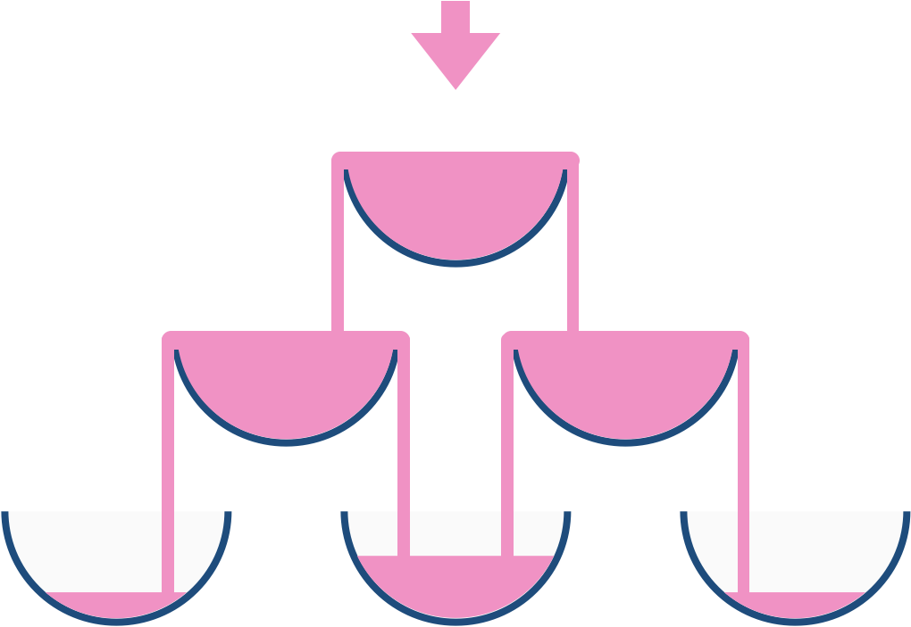

We stack glasses in a pyramid, where the **first** row has `1` glass, the **second** row has `2` glasses, and so on until the 100th row. Each glass holds one cup of champagne.

Then, some champagne is poured into the first glass at the top. When the topmost glass is full, any excess liquid poured will fall equally to the glass immediately to the left and right of it. When those glasses become full, any excess champagne will fall equally to the left and right of those glasses, and so on. (A glass at the ==bottom row== has its excess champagne ==fall on the floor==.)

For example, after one cup of champagne is poured, the top most glass is full. After two cups of champagne are poured, the two glasses on the second row are half full. After three cups of champagne are poured, those two cups become full - there are 3 full glasses total now. After four cups of champagne are poured, the third row has the middle glass half full, and the two outside glasses are a quarter full, as pictured below.



Now after pouring some non-negative integer cups of champagne, return how full the `jth` glass in the `ith` row is (both `i` and `j` are 0-indexed.)

 

**Example 1:**

```
Input: poured = 1, query_row = 1, query_glass = 1
Output: 0.00000
Explanation: We poured 1 cup of champange to the top glass of the tower (which is indexed as (0, 0)). There will be no excess liquid so all the glasses under the top glass will remain empty.
```

**Example 2:**

```
Input: poured = 2, query_row = 1, query_glass = 1
Output: 0.50000
Explanation: We poured 2 cups of champange to the top glass of the tower (which is indexed as (0, 0)). There is one cup of excess liquid. The glass indexed as (1, 0) and the glass indexed as (1, 1) will share the excess liquid equally, and each will get half cup of champange.
```

**Example 3:**

```
Input: poured = 100000009, query_row = 33, query_glass = 17
Output: 1.00000
```

 

**Constraints:**

- `0 <= poured <= 10 ** 9`
- `0 <= query_glass <= query_row < 100`


> DP is a reasonable solution
>
> - it is easy to find out that level i is determined by level i - 1
> - as the champange flowing top-down, we could assume that all glasses have unlimited capacities first, then let each glass consume 1 cup of champange or all they have got if they have less than 1 cup champange. Pour the remain champange to next level.

```python
def champagneTower(self, poured: int, query_row: int, query_glass: int) -> float:
    # level 0 -> 1 glass
    # level 1 -> 2 glasses
    # ...
    # level 99 -> 100 glasses
    res = [poured] # top level
    for row in range(1, query_row + 1):
        # append two empty glasses at both sides
        res = [0] + res + [0]
        # level i has i + 1 glasses, indexed from 0 to i
        """
        level 2         0   1   2   3   4
        with extra two glasses at both sides
        level 3           0   1   2   3
        dp[i + 1][j] = dp[i][j]'s half + dp[i][j + 1]'s half
        """
        res = [max(res[i] - 1, 0) / 2.0 + max(res[i + 1] - 1, 0) / 2.0 for i in range(row + 1)]
    return min(res[query_glass], 1)
```

