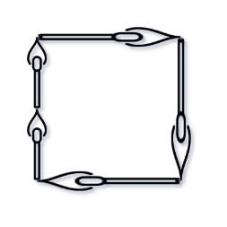

You are given an integer array `matchsticks` where `matchsticks[i]` is the length of the `ith` matchstick. You want to use **all the matchsticks** to make one square. You **should not break** any stick, but you can link them up, and each matchstick must be used **exactly one time**.

Return `true` if you can make this square and `false` otherwise.

 

**Example 1:**



```
Input: matchsticks = [1,1,2,2,2]
Output: true
Explanation: You can form a square with length 2, one side of the square came two sticks with length 1.
```

**Example 2:**

```
Input: matchsticks = [3,3,3,3,4]
Output: false
Explanation: You cannot find a way to form a square with all the matchsticks.
```

 

**Constraints:**

- `1 <= matchsticks.length <= 15`
- `1 <= matchsticks[i] <= 108`

```python
def makesquare(self, matchsticks: List[int]) -> bool:
    n = len(matchsticks)
    total = sum(matchsticks)
    target = total // 4
    if total % 4 or max(matchsticks) > target: return False

    @functools.cache
    def helper(bitmask):
        # all matchsticks are used
        if not bitmask: return 0
        for i in range(n):
            if bitmask & (1 << i):
                # ith matchstick have not been used yet
                ret = helper(bitmask - (1 << i))
                if ret >= 0 and ret + matchsticks[i] <= target:
                    return (ret + matchsticks[i]) % target
        return -1
    return helper((1 << n) - 1) == 0
```

