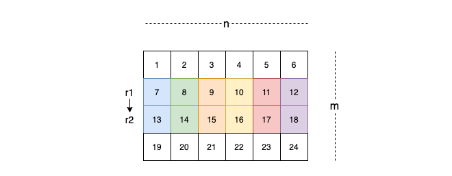

Given an `m x n` matrix `matrix` and an integer `k`, return *the max sum of a rectangle in the matrix such that its sum is no larger than* `k`.

It is **guaranteed** that there will be a rectangle with a sum no larger than `k`.

 

**Example 1:**


```
Input: matrix = [[1,0,1],[0,-2,3]], k = 2
Output: 2
Explanation: Because the sum of the blue rectangle [[0, 1], [-2, 3]] is 2, and 2 is the max number no larger than k (k = 2).
```

**Example 2:**

```
Input: matrix = [[2,2,-1]], k = 3
Output: 3
```

 

**Constraints:**

- `m == matrix.length`
- `n == matrix[i].length`
- `1 <= m, n <= 100`、
- `-100 <= matrix[i][j] <= 100`
- `-10 ** 5 <= k <= 10 ** 5`

> typical acc-2d problem
>
> 

```python
def maxSumSubmatrix(self, matrix: List[List[int]], k: int) -> int:
    # convert 2d to 1d, and then use SortedList to find the most cloest element
    m, n = len(matrix), len(matrix[0])

    def helper(arr):
        """a helper function that return the biggest sum of subarrays that is smaller or equal to k

        Args:
            arr (list): input list

        Returns:
            int: biggest sum <= k
        """
        pre = 0
        ret = -float('inf')
        sl = SortedList([pre])
        for i in arr:
            pre += i
            # pre - target <= k
            # target >= pre - k
            target = pre - k # find the smallest previous sum that is bigger or equal to target
            idx = sl.bisect_left(target)
            if idx < len(sl): ret = max(ret, pre - sl[idx])
            sl.add(pre)
        return ret

    ret = -float('inf')
    for r1 in range(m):
        curr = [0] * n
        for r2 in range(r1, m):
            curr = [a + b for a, b in zip(curr, matrix[r2])]
            ret = max(ret, helper(curr))
    return ret
```

