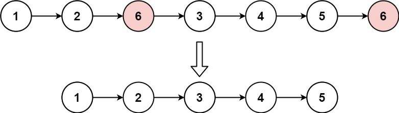

### 217. Contains Duplicate

Given an integer array `nums`, return `true` if any value appears **at least twice** in the array, and return `false` if every element is distinct.

 

**Example 1:**

```
Input: nums = [1,2,3,1]
Output: true
```

**Example 2:**

```
Input: nums = [1,2,3,4]
Output: false
```

**Example 3:**

```
Input: nums = [1,1,1,3,3,4,3,2,4,2]
Output: true
```

 

**Constraints:**

- `1 <= nums.length <= 10 ** 5`
- `-10 ** 9 <= nums[i] <= 10 ** 9`

```python
def containsDuplicate(self, nums: List[int]) -> bool:
    visited = set()
    for i in nums:
        if i in visited: return True	
        visited.add(i)
    return False
```

### 53. Maximum Subarray

Given an integer array `nums`, find the contiguous subarray (containing at least one number) which has the largest sum and return *its sum*.

A **subarray** is a **contiguous** part of an array.

 

**Example 1:**

```
Input: nums = [-2,1,-3,4,-1,2,1,-5,4]
Output: 6
Explanation: [4,-1,2,1] has the largest sum = 6.
```

**Example 2:**

```
Input: nums = [1]
Output: 1
```

**Example 3:**

```
Input: nums = [5,4,-1,7,8]
Output: 23
```

 

**Constraints:**

- `1 <= nums.length <= 10 ** 5`
- `-10 ** 4 <= nums[i] <= 10 ** 4`

 

**Follow up:** If you have figured out the `O(n)` solution, try coding another solution using the **divide and conquer** approach, which is more subtle.

```python
def maxSubArray(self, nums: List[int]) -> int:
    pre_min = 0
    ans = nums[0]
    s = 0
    for i in nums:
        s += i
        ans = max(ans, s - pre_min)
        pre_min = min(pre_min, s)
    return ans
```

### 1. Two Sum

Given an array of integers `nums` and an integer `target`, return *indices of the two numbers such that they add up to `target`*.

You may assume that each input would have ***exactly\* one solution**, and you may not use the *same* element twice.

You can return the answer in any order.

 

**Example 1:**

```
Input: nums = [2,7,11,15], target = 9
Output: [0,1]
Explanation: Because nums[0] + nums[1] == 9, we return [0, 1].
```

**Example 2:**

```
Input: nums = [3,2,4], target = 6
Output: [1,2]
```

**Example 3:**

```
Input: nums = [3,3], target = 6
Output: [0,1]
```

 

**Constraints:**

- `2 <= nums.length <= 10 ** 4`
- `-10 ** 9 <= nums[i] <= 10 ** 9`
- `-10 ** 9 <= target <= 10 ** 9`
- **Only one valid answer exists.**

```python
def twoSum(self, nums: List[int], target: int) -> List[int]:
    visited = dict()
    for i, v in enumerate(nums):
        if target - v in visited:
            return [visited[target - v], i]
        visited[v] = i
```

### 88. Merge Sorted Array

You are given two integer arrays `nums1` and `nums2`, sorted in **non-decreasing order**, and two integers `m` and `n`, representing the number of elements in `nums1` and `nums2` respectively.

**Merge** `nums1` and `nums2` into a single array sorted in **non-decreasing order**.

The final sorted array should not be returned by the function, but instead be *stored inside the array* `nums1`. To accommodate this, `nums1` has a length of `m + n`, where the first `m` elements denote the elements that should be merged, and the last `n` elements are set to `0` and should be ignored. `nums2` has a length of `n`.

 

**Example 1:**

```
Input: nums1 = [1,2,3,0,0,0], m = 3, nums2 = [2,5,6], n = 3
Output: [1,2,2,3,5,6]
Explanation: The arrays we are merging are [1,2,3] and [2,5,6].
The result of the merge is [1,2,2,3,5,6] with the underlined elements coming from nums1.
```

**Example 2:**

```
Input: nums1 = [1], m = 1, nums2 = [], n = 0
Output: [1]
Explanation: The arrays we are merging are [1] and [].
The result of the merge is [1].
```

**Example 3:**

```
Input: nums1 = [0], m = 0, nums2 = [1], n = 1
Output: [1]
Explanation: The arrays we are merging are [] and [1].
The result of the merge is [1].
Note that because m = 0, there are no elements in nums1. The 0 is only there to ensure the merge result can fit in nums1.
```

 

**Constraints:**

- `nums1.length == m + n`
- `nums2.length == n`
- `0 <= m, n <= 200`
- `1 <= m + n <= 200`
- `-10 ** 9 <= nums1[i], nums2[j] <= 10 ** 9`

 

**Follow up:** Can you come up with an algorithm that runs in `O(m + n)` time?

```python
def merge(self, nums1: List[int], m: int, nums2: List[int], n: int) -> None:
    """
    Do not return anything, modify nums1 in-place instead.
    """
    stack = collections.deque([])

    i = j = 0
    while i < m or j < n:
        if j == n or (i < m and nums1[i] <= nums2[j]):
            stack.append(nums1[i])
            nums1[i] = stack.popleft()
            i += 1
        elif i == m or (j < n and nums1[i] > nums2[j]):
            stack.append(nums2[j])
            j += 1
    while i < m + n:
        nums1[i] = stack.popleft()
        i += 1
```

### 141. Linked List Cycle

Given `head`, the head of a linked list, determine if the linked list has a cycle in it.

There is a cycle in a linked list if there is some node in the list that can be reached again by continuously following the `next` pointer. Internally, `pos` is used to denote the index of the node that tail's `next` pointer is connected to. **Note that `pos` is not passed as a parameter**.

Return `true` *if there is a cycle in the linked list*. Otherwise, return `false`.

 

**Example 1:**


```
Input: head = [3,2,0,-4], pos = 1
Output: true
Explanation: There is a cycle in the linked list, where the tail connects to the 1st node (0-indexed).
```

**Example 2:**


```
Input: head = [1,2], pos = 0
Output: true
Explanation: There is a cycle in the linked list, where the tail connects to the 0th node.
```

**Example 3:**


```
Input: head = [1], pos = -1
Output: false
Explanation: There is no cycle in the linked list.
```

 

**Constraints:**

- The number of the nodes in the list is in the range `[0, 10 ** 4]`.
- `-10 ** 5 <= Node.val <= 10 ** 5`
- `pos` is `-1` or a **valid index** in the linked-list.

 

**Follow up:** Can you solve it using `O(1)` (i.e. constant) memory?

> Problems about finding a cycle in LinkedList, can be easily solved by two pointers with different steps

```python
def hasCycle(self, head: ListNode) -> bool:
    if not head or not head.next: return False
    move, jump = head, head.next
    while jump and jump.next:
        if move == jump: return True
        move = move.next
        jump = jump.next.next
    return False
```

### 21. Merge Two Sorted Lists

You are given the heads of two sorted linked lists `list1` and `list2`.

Merge the two lists in a one **sorted** list. The list should be made by splicing together the nodes of the first two lists.

Return *the head of the merged linked list*.

 

**Example 1:**


```
Input: list1 = [1,2,4], list2 = [1,3,4]
Output: [1,1,2,3,4,4]
```

**Example 2:**

```
Input: list1 = [], list2 = []
Output: []
```

**Example 3:**

```
Input: list1 = [], list2 = [0]
Output: [0]
```

 

**Constraints:**

- The number of nodes in both lists is in the range `[0, 50]`.
- `-100 <= Node.val <= 100`
- Both `list1` and `list2` are sorted in **non-decreasing** order.

```python
def mergeTwoLists(self, list1: ListNode, list2: ListNode) -> ListNode:
    ans = ListNode(-1)
    curr = ans
    while list1 and list2:
        if list1.val < list2.val:
            curr.next = ListNode(list1.val)
            list1 = list1.next
        else:
            curr.next = ListNode(list2.val)
            list2 = list2.next
        curr = curr.next
    if list1: curr.next = list1
    if list2: curr.next = list2
    return ans.next
```

### 203. Remove Linked List Elements

Given the `head` of a linked list and an integer `val`, remove all the nodes of the linked list that has `Node.val == val`, and return *the new head*.

 

**Example 1:**



```
Input: head = [1,2,6,3,4,5,6], val = 6
Output: [1,2,3,4,5]
```

**Example 2:**

```
Input: head = [], val = 1
Output: []
```

**Example 3:**

```
Input: head = [7,7,7,7], val = 7
Output: []
```

 

**Constraints:**

- The number of nodes in the list is in the range `[0, 10 ** 4]`.
- `1 <= Node.val <= 50`
- `0 <= val <= 50`

```python
def removeElements(self, head: ListNode, val: int) -> ListNode:
    pre = ans = ListNode(-1)
    ans.next = head
    while head:
        if head.val == val: 
            pre.next = head.next
            head = head.next
        else:
            pre, head = head, head.next
    return ans.next
```

### 206. Reverse Linked List

Given the `head` of a singly linked list, reverse the list, and return *the reversed list*.

 

**Example 1:**


```
Input: head = [1,2,3,4,5]
Output: [5,4,3,2,1]
```

**Example 2:**


```
Input: head = [1,2]
Output: [2,1]
```

**Example 3:**

```
Input: head = []
Output: []
```

 

**Constraints:**

- The number of nodes in the list is the range `[0, 5000]`.
- `-5000 <= Node.val <= 5000`

 

**Follow up:** A linked list can be reversed either iteratively or recursively. Could you implement both?

```python
def reverseList(self, head: ListNode) -> ListNode:
    if not head: return head
    nxt = head.next
    head.next = None

    while nxt:
        temp = nxt.next
        nxt.next = head
        head, nxt = nxt, temp
    return head
```

### 83. Remove Duplicates from Sorted List

Given the `head` of a sorted linked list, *delete all duplicates such that each element appears only once*. Return *the linked list **sorted** as well*.

 

**Example 1:**


```
Input: head = [1,1,2]
Output: [1,2]
```

**Example 2:**


```
Input: head = [1,1,2,3,3]
Output: [1,2,3]
```

 

**Constraints:**

- The number of nodes in the list is in the range `[0, 300]`.
- `-100 <= Node.val <= 100`
- The list is guaranteed to be **sorted** in ascending order.

```python
def deleteDuplicates(self, head: ListNode) -> ListNode:
    if not head: return head
    curr = head

    while curr:
        first = curr
        temp = curr.val
        while curr and curr.val == temp:
            curr = curr.next
        first.next = curr
    return head
```

### 20. Valid Parentheses

Given a string `s` containing just the characters `'('`, `')'`, `'{'`, `'}'`, `'['` and `']'`, determine if the input string is valid.

An input string is valid if:

1. Open brackets must be closed by the same type of brackets.
2. Open brackets must be closed in the correct order.

 

**Example 1:**

```
Input: s = "()"
Output: true
```

**Example 2:**

```
Input: s = "()[]{}"
Output: true
```

**Example 3:**

```
Input: s = "(]"
Output: false
```

 

**Constraints:**

- `1 <= s.length <= 104`
- `s` consists of parentheses only `'()[]{}'`.

```python
def isValid(self, s: str) -> bool:
    remain = []
    pair = {'(': ')', '[': ']', '{': '}'}
    for i in s:
        if i in '([{':
            remain.append(i)
        else:
            if not remain or i != pair[remain.pop()]: return False
    return not remain
```

### 232. Implement Queue using Stacks

Implement a first in first out (FIFO) queue using only two stacks. The implemented queue should support all the functions of a normal queue (`push`, `peek`, `pop`, and `empty`).

Implement the `MyQueue` class:

- `void push(int x)` Pushes element x to the back of the queue.
- `int pop()` Removes the element from the front of the queue and returns it.
- `int peek()` Returns the element at the front of the queue.
- `boolean empty()` Returns `true` if the queue is empty, `false` otherwise.

**Notes:**

- You must use **only** standard operations of a stack, which means only `push to top`, `peek/pop from top`, `size`, and `is empty` operations are valid.
- Depending on your language, the stack may not be supported natively. You may simulate a stack using a list or deque (double-ended queue) as long as you use only a stack's standard operations.

 

**Example 1:**

```
Input
["MyQueue", "push", "push", "peek", "pop", "empty"]
[[], [1], [2], [], [], []]
Output
[null, null, null, 1, 1, false]

Explanation
MyQueue myQueue = new MyQueue();
myQueue.push(1); // queue is: [1]
myQueue.push(2); // queue is: [1, 2] (leftmost is front of the queue)
myQueue.peek(); // return 1
myQueue.pop(); // return 1, queue is [2]
myQueue.empty(); // return false
```

 

**Constraints:**

- `1 <= x <= 9`
- At most `100` calls will be made to `push`, `pop`, `peek`, and `empty`.
- All the calls to `pop` and `peek` are valid.

 

**Follow-up:** Can you implement the queue such that each operation is **[amortized](https://en.wikipedia.org/wiki/Amortized_analysis)** `O(1)` time complexity? In other words, performing `n` operations will take overall `O(n)` time even if one of those operations may take longer.

