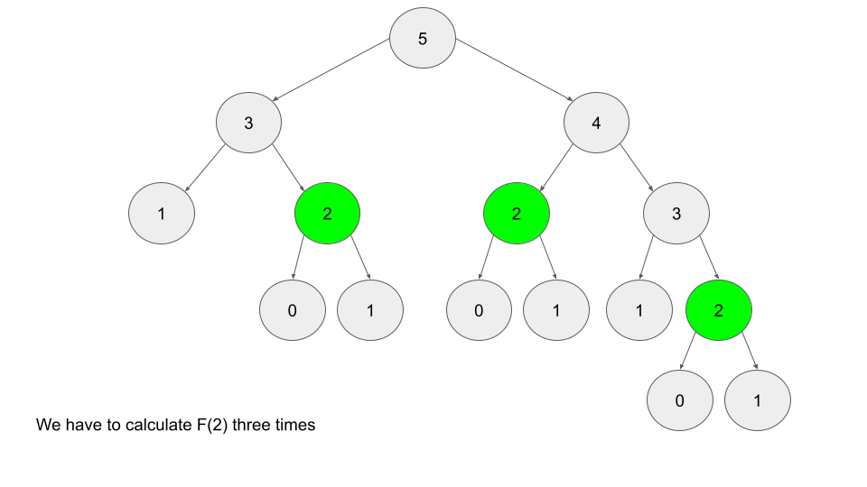

# intro to dynamic programming

## What is Dynamic Programming?

------

**Dynamic Programming** (DP) is a programming paradigm that can systematically and efficiently explore all possible solutions to a problem. As such, it is capable of solving a wide variety of problems that often have the following characteristics:

1. The problem can be broken down into "overlapping subproblems" - smaller versions of the original problem that are re-used multiple times.
2. The problem has an "optimal substructure" - an optimal solution can be formed from optimal solutions to the overlapping subproblems of the original problem.

As a beginner, these theoretical definitions may be hard to wrap your head around. Don't worry though - at the end of this chapter, we'll talk about how to practically spot when DP is applicable. For now, let's look a little deeper at both characteristics.

The [Fibonacci sequence](https://en.wikipedia.org/wiki/Fibonacci_number) is a classic example used to explain DP. For those who are unfamiliar with the Fibonacci sequence, it is a sequence of numbers that starts with 0, 1, and each subsequent number is obtained by adding the previous two numbers together.

If you wanted to find the *n**t**h* Fibonacci number *F*(*n*), you can break it down into smaller **subproblems** - find *F*(*n*−1) and *F*(*n*−2) instead. Then, adding the solutions to these subproblems together gives the answer to the original question, *F*(*n*−1)+*F*(*n*−2)=*F*(*n*), which means the problem has **optimal substructure**, since a solution *F*(*n*) to the original problem can be formed from the solutions to the subproblems. These subproblems are also **overlapping** - for example, we would need *F*(4) to calculate both *F*(5) and *F*(6).

These attributes may seem familiar to you. Greedy problems have optimal substructure, but not overlapping subproblems. Divide and conquer algorithms break a problem into subproblems, but these subproblems are not **overlapping** (which is why DP and divide and conquer are commonly mistaken for one another).

Dynamic programming is a powerful tool because it can break a complex problem into manageable subproblems, avoid unnecessary recalculation of overlapping subproblems, and use the results of those subproblems to solve the initial complex problem. DP not only aids us in solving complex problems, but it also greatly improves the time complexity compared to brute force solutions. For example, the brute force solution for calculating the Fibonacci sequence has exponential time complexity, while the dynamic programming solution will have linear time complexity. Throughout this explore card, you will gain a better understanding of what makes DP so powerful. In the next section, we'll discuss the two main methods of implementing a DP algorithm.


## Top-down and Bottom-up

------

There are two ways to implement a DP algorithm:

1. Bottom-up, also known as tabulation.
2. Top-down, also known as memoization.

Let's take a quick look at each method.


### Bottom-up (Tabulation)

Bottom-up is implemented with iteration and starts at the base cases. Let's use the Fibonacci sequence as an example again. The base cases for the Fibonacci sequence are *F*(0)=0 and *F*(1)=1. With bottom-up, we would use these base cases to calculate *F*(2), and then use that result to calculate *F*(3), and so on all the way up to *F*(*n*).

```
// Pseudocode example for bottom-up

F = array of length (n + 1)
F[0] = 0
F[1] = 1
for i from 2 to n:
    F[i] = F[i - 1] + F[i - 2]
```


### Top-down (Memoization)

Top-down is implemented with recursion and made efficient with memoization. If we wanted to find the *n**t**h* Fibonacci number *F*(*n*), we try to compute this by finding *F*(*n*−1) and *F*(*n*−2). This defines a recursive pattern that will continue on until we reach the base cases *F*(0)=*F*(1)=1. The problem with just implementing it recursively is that there is a ton of unnecessary repeated computation. Take a look at the recursion tree if we were to find *F*(5):





Notice that we need to calculate *F*(2) three times. This might not seem like a big deal, but if we were to calculate *F*(6), this **entire image** would be only one child of the root. Imagine if we wanted to find *F*(100) - the amount of computation is exponential and will quickly explode. The solution to this is to **memoize** results.

> **memoizing** a result means to store the result of a function call, usually in a hashmap or an array, so that when the same function call is made again, we can simply return the **memoized** result instead of recalculating the result.

After we calculate *F*(2), let's store it somewhere (typically in a hashmap), so in the future, whenever we need to find *F*(2), we can just refer to the value we already calculated instead of having to go through the entire tree again. Below is an example of what the recursion tree for finding *F*(6) looks like with and without memoization:


```
// Pseudocode example for top-down

memo = hashmap
Function F(integer i):
    if i is 0 or 1: 
        return i
    if i doesn't exist in memo:
        memo[i] = F(i - 1) + F(i - 2)
    return memo[i]
```


### Which is better?

Any DP algorithm can be implemented with either method, and there are reasons for choosing either over the other. However, each method has one main advantage that stands out:

- A bottom-up implementation's runtime is usually faster, as iteration does not have the overhead that recursion does.
- A top-down implementation is usually much easier to write. This is because with recursion, the ordering of subproblems does not matter, whereas with tabulation, we need to go through a logical ordering of solving subproblems.

> We'll be talking more about these two options throughout the card. For now, all you need to know is that top-down uses recursion, and bottom-up uses iteration.


## When to Use DP

------

When it comes to solving an algorithm problem, especially in a high-pressure scenario such as an interview, half the battle is figuring out how to even approach the problem. In the first section, we defined what makes a problem a good candidate for dynamic programming. Recall:

1. The problem can be broken down into "overlapping subproblems" - smaller versions of the original problem that are re-used multiple times
2. The problem has an "optimal substructure" - an optimal solution can be formed from optimal solutions to the overlapping subproblems of the original problem

Unfortunately, it is hard to identify when a problem fits into these definitions. Instead, let's discuss some common characteristics of DP problems that are easy to identify.

**The first characteristic** that is common in DP problems is that the problem will ask for the optimum value (maximum or minimum) of something, or the number of ways there are to do something. For example:

- What is the minimum cost of doing...
- What is the maximum profit from...
- How many ways are there to do...
- What is the longest possible...
- Is it possible to reach a certain point...

> **Note:** Not all DP problems follow this format, and not all problems that follow these formats should be solved using DP. However, these formats are very common for DP problems and are generally a hint that you should consider using dynamic programming.

When it comes to identifying if a problem should be solved with DP, this first characteristic is not sufficient. Sometimes, a problem in this format (asking for the max/min/longest etc.) is meant to be solved with a greedy algorithm. The next characteristic will help us determine whether a problem should be solved using a greedy algorithm or dynamic programming.

**The second characteristic** that is common in DP problems is that future "decisions" depend on earlier decisions. Deciding to do something at one step may affect the ability to do something in a later step. This characteristic is what makes a greedy algorithm invalid for a DP problem - we need to factor in results from previous decisions. Admittedly, this characteristic is not as well defined as the first one, and the best way to identify it is to go through some examples.

[House Robber](https://leetcode.com/problems/house-robber/) is an excellent example of a dynamic programming problem. The problem description is:

> You are a professional robber planning to rob houses along a street. Each house has a certain amount of money stashed, the only constraint stopping you from robbing each of them is that adjacent houses have security systems connected and it will automatically contact the police if two adjacent houses were broken into on the same night.
>
> Given an integer array nums representing the amount of money of each house, return the maximum amount of money you can rob tonight without alerting the police.

In this problem, each decision will affect what options are available to the robber in the future. For example, with the test case nums = [2, 7, 9, 3, 1], the optimal solution is to rob the houses with 2, 9, and 1 money. However, if we were to iterate from left to right in a greedy manner, our first decision would be whether to rob the first or second house. 7 is way more money than 2, so if we were greedy, we would choose to rob house 7. However, this prevents us from robbing the house with 9 money. As you can see, our decision between robbing the first or second house affects which options are available for future decisions.

[Longest Increasing Subsequence](https://leetcode.com/problems/longest-increasing-subsequence/) is another example of a classic dynamic programming problem. In this problem, we need to determine the length of the longest (first characteristic) subsequence that is strictly increasing. For example, if we had the input nums = [1, 2, 6, 3, 5], the answer would be 4, from the subsequence [1, 2, 3, 5]. Again, the important decision comes when we arrive at the 6 - do we take it or not take it? If we decide to take it, then we get to increase our current length by 1, but it affects the future - we can no longer take the 3 or 5. Of course, with such a small example, it's easy to see why we shouldn't take it - but how are we supposed to design an algorithm that can always make the correct decision with huge inputs? Imagine if nums contained 10,000 numbers instead.

> When you're solving a problem on your own and trying to decide if the second characteristic is applicable, assume it isn't, then try to think of a counterexample that proves a greedy algorithm won't work. If you can think of an example where earlier decisions affect future decisions, then DP is applicable.

**To summarize**: if a problem is asking for the maximum/minimum/longest/shortest of something, the number of ways to do something, or if it is possible to reach a certain point, it is probably greedy or DP. With time and practice, it will become easier to identify which is the better approach for a given problem. Although, in general, if the problem has constraints that cause decisions to affect other decisions, such as using one element prevents the usage of other elements, then we should consider using dynamic programming to solve the problem. **These two characteristics can be used to identify if a problem should be solved with DP.**

> Note: these characteristics should only be used as guidelines - while they are extremely common in DP problems, at the end of the day DP is a very broad topic.


### Additional Reading:

An **algorithm** is a sequence of steps that take inputs from the user and after some computation, produces an output. A **parallel algorithm** is an algorithm that can execute several instructions simultaneously on different processing devices and then combine all the individual outputs to produce the final result.


Depending on the architecture of computers, we have two types of algorithms −

- **Sequential Algorithm** − An algorithm in which some consecutive steps of instructions are executed in a chronological order to solve a problem.
- **Parallel Algorithm** − The problem is divided into sub-problems and are executed in parallel to get individual outputs. Later on, these individual outputs are combined together to get the final desired output.


==divide and conquer== approaches can be parallelized while ==dynamic programming== approaches cannot.

> Strictly speaking, both can be parallelized, however the steps required to parallelize dynamic programming approaches are quite complex. So generally speaking, divide and conquer approaches can be parallelized while dynamic programming approaches cannot be (easily) parallelized. This is because the subproblems in divide an conquer approaches are independent of one another (they do not overlap) while in dynamic programming, the subproblems do overlap.

