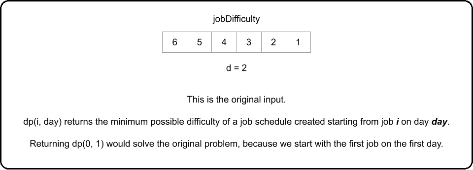
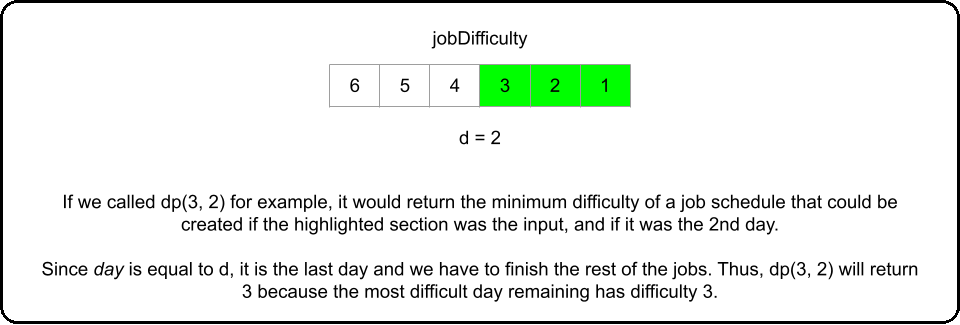
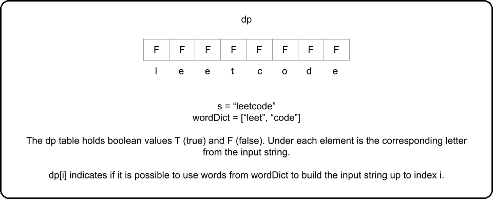
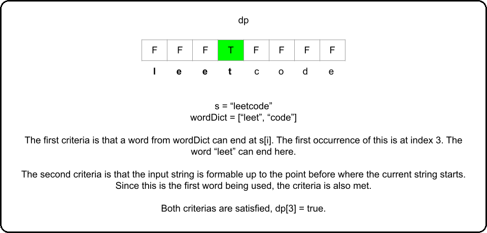
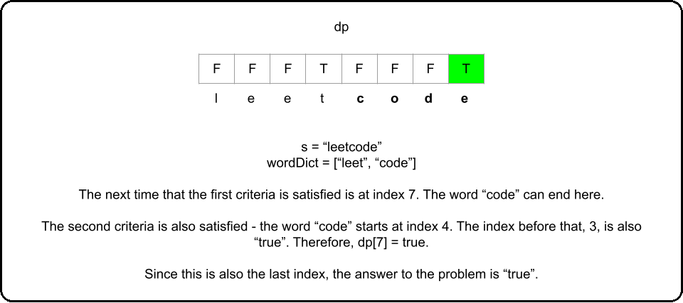
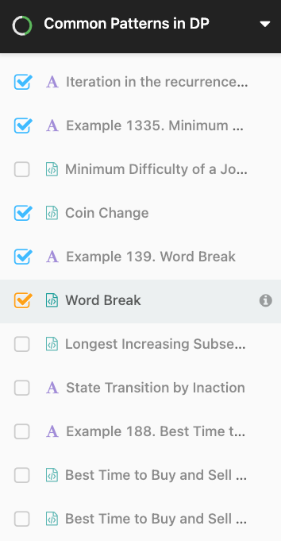
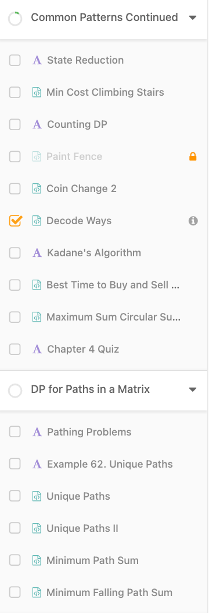
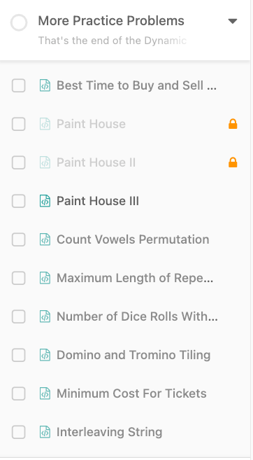

# Common Patterns in DP

## Iteration in the recurrence relation

------

In all the problems we have looked at so far, the recurrence relation is a static equation - it never changes. Recall [Min Cost Climbing Stairs](https://leetcode.com/problems/min-cost-climbing-stairs/). The recurrence relation was:

\text{dp(i)} = \min( \text{dp(i - 1) + cost[i - 1], dp(i - 2) + cost[i - 2]})dp(i)=min(dp(i - 1) + cost[i - 1], dp(i - 2) + cost[i - 2])

because we are only allowed to climb 1 or 2 steps at a time. What if the question was rephrased so that we could take up to \text{k}k steps at a time? The recurrence relation would become dynamic - it would be:

\text{dp(i)} = \min( \text{dp(j) + cost[j])}dp(i)=min(dp(j) + cost[j]) for all \text{(i - k)} \leq \text{j} < \text{i}(i - k)≤j<i

We would need iteration in our recurrence relation.

This is a common pattern in DP problems, and in this chapter, we're going to take a look at some problems using the framework where this pattern is applicable. While iteration usually increases the difficulty of a DP problem, particularly with bottom-up implementations, the idea isn't too complicated. Instead of choosing from a static number of options, we usually add a for-loop to iterate through a dynamic number of options and choose the best one.


## Example 1335. Minimum Difficulty of a Job Schedule

------

> We'll start with a top-down approach.

In this article, we'll be using the framework to solve [Minimum Difficulty of a Job Schedule](https://leetcode.com/problems/minimum-difficulty-of-a-job-schedule/). We can tell this is a problem where Dynamic Programming can be used because we are asked for the minimum of something, and deciding how many jobs to do on a given day affects the jobs we can do on all future days. Let's start solving:

1. A **function** that answers the problem for a given state

Let's first decide on state variables. What decisions are there to make, and what information do we need to make these decisions? Reading the problem description carefully, there are \text{d}d total days, and on each day we need to complete some number of jobs. By the end of the \text{d}d days, we must have finished all jobs (in the given order). Therefore, we can see that on each day, we need to decide how many jobs to take.

- Let's use one state variable \text{i}i, where \text{i}i is the index of the first job that will be done on the current day.
- Let's use another state variable \text{day}day, where \text{day}day indicates what day it currently is.

The problem is asking for the minimum difficulty, so let's have a function \text{dp(i, day)}dp(i, day) that returns the minimum difficulty of a job schedule which starts on the i^{th}*i**t**h* job and day, \text{day}day. To solve the original problem, we will just return \text{dp(0, 1)}dp(0, 1), since we start on the first day with no jobs done yet.








2. A **recurrence relation** to transition between states

At each state, we are on day \text{day}day and need to do job \text{i}i. Then, we can choose to do a few more jobs. How many more jobs are we allowed to do? The problem says that we need to do at least one job per day. This means we **must** leave at least \text{d - day}d - day jobs so that all the future days have at least one job that can be scheduled on that day. If \text{n}n is the total number of jobs, \text{jobDifficulty.length}jobDifficulty.length, that means from any given state \text{(i, day)}(i, day), we are allowed to do the jobs from index \text{i}i up to but not including index \text{n - (d - day)}n - (d - day).

We should try all the options for a given day - try doing only one job, then two jobs, etc. until we can't do any more jobs. The best option is the one that results in the easiest job schedule.

The difficulty of a given day is the most difficult job that we did that day. Since the jobs have to be done in order, if we are trying all the jobs we are allowed to do on that day (iterating through them), then we can use a variable \text{hardest}hardest to keep track of the difficulty of the hardest job done today. If we choose to do jobs up to the j^{th}*j**t**h* job (inclusive), where \text{i} \leq \text{j} < \text{n - (d - day)}i≤j<n - (d - day) (as derived above), then that means on the next day, we start with the (j + 1)^{th}(*j*+1)*t**h* job. Therefore, our total difficulty is \text{hardest + dp(j + 1, day + 1)}hardest + dp(j + 1, day + 1). This gives us our scariest recurrence relation so far:

\text{dp(i, day) = min(hardest + dp(j + 1, day + 1))}dp(i, day) = min(hardest + dp(j + 1, day + 1)) for all \text{i} \leq \text{j} < \text{n - (d - day)}i≤j<n - (d - day), where \text{hardest = max(jobDifficulty[k])}hardest = max(jobDifficulty[k]) for all \text{i} \leq \text{k} \leq \text{j}i≤k≤j.

The codified recurrence relation is a scary one to look at for sure. However, it is easier to understand when we break it down bit by bit. On each day, we try all the options - do only one job, then two jobs, etc. until we can't do any more (since we need to leave some jobs for future days). \text{hardest}hardest is the hardest job we do on the current day, which means it is also the difficulty of the current day. We add \text{hardest}hardest to the next state which is the next day, starting with the next job. After trying all the jobs we are allowed to do, choose the best result.


3. **Base cases**

Despite the recurrence relation being complicated, the base cases are much simpler. We need to finish all jobs in \text{d}d days. Therefore, if it is the last day (\text{day == d}day == d), we need to finish up all the remaining jobs on this day, and the total difficulty will just be the largest number in \text{jobDifficulty}jobDifficulty on or after index \text{i}i.

\text{if day == d}if day == d then return the maximum job difficulty between job \text{i}i and the end of the array (inclusive).

We can precompute an array \text{hardestJobRemaining}hardestJobRemaining where \text{hardestJobRemaining[i]}hardestJobRemaining[i] represents the difficulty of the hardest job on or after day \text{i}i, so that we this base case is handled in constant time.

Additionally, if there are more days than jobs (\text{n < d}n < d), then it is impossible to do at least one job each day, and per the problem description, we should return \text{-1}-1. We can check for this case at the very start.


### Top-down Implementation

Let's combine these 3 parts for a top-down implementation. Again, we will use [functools](https://docs.python.org/3/library/functools.html) in Python, and a 2D array in Java for memoization. In the Python implementation, we are passing \text{None}None to `lru_cache` which means the cache size is not limited. We are doing this because the number of states that will be re-used in this problem is large, and we don't want to evict a state early and have to re-calculate it.

```python
class Solution:
    def minDifficulty(self, jobDifficulty: List[int], d: int) -> int:
        n = len(jobDifficulty)
        # If we cannot schedule at least one job per day, 
        # it is impossible to create a schedule
        if n < d:
            return -1
        
        hardest_job_remaining = [0] * n
        hardest_job = 0
        for i in range(n - 1, -1, -1):
            hardest_job = max(hardest_job, jobDifficulty[i])
            hardest_job_remaining[i] = hardest_job
        
        @lru_cache(None)
        def dp(i, day):
            # Base case, it's the last day so we need to finish all the jobs
            if day == d:
                return hardest_job_remaining[i]
            
            best = float("inf")
            hardest = 0
            # Iterate through the options and choose the best
            for j in range(i, n - (d - day)): # Leave at least 1 job per remaining day
                hardest = max(hardest, jobDifficulty[j])
                best = min(best, hardest + dp(j + 1, day + 1)) # Recurrence relation

            return best
        
        return dp(0, 1)
```

### Bottom-up Implementation

With bottom-up, we now use a 2D array where \text{dp[i][day]}dp[i][day] represents the minimum difficulty of a job schedule that starts on day \text{day}day and job \text{i}i. It depends on the problem, but the bottom-up code generally has a faster runtime than its top-down equivalent. However, as you can see from the code, it looks like it is more challenging to implement. We need to first tabulate the base case and then work backwards from them using nested for loops.

The for-loops should start iterating from the base cases, and there should be one for-loop for each state variable. Remember that one of our base cases is that on the final day, we need to complete all jobs. Therefore, our for-loop iterating over \text{day}day should iterate from the final day to the first day. Then, our next for-loop for \text{i}i should conform to the restraints of the problem - we need to do at least one job per day.

```python
class Solution:
    def minDifficulty(self, jobDifficulty: List[int], d: int) -> int:
        n = len(jobDifficulty)
        # If we cannot schedule at least one job per day, 
        # it is impossible to create a schedule
        if n < d:
            return -1
        
        dp = [[float("inf")] * (d + 1) for _ in range(n)]
        
        # Set base cases
        dp[-1][d] = jobDifficulty[-1]

        # On the last day, we must schedule all remaining jobs, so dp[i][d]
        # is the maximum difficulty job remaining
        for i in range(n - 2, -1, -1):
            dp[i][d] = max(dp[i + 1][d], jobDifficulty[i])

        for day in range(d - 1, 0, -1):
            for i in range(day - 1, n - (d - day)):
                hardest = 0
                # Iterate through the options and choose the best
                for j in range(i, n - (d - day)):
                    hardest = max(hardest, jobDifficulty[j])
                    # Recurrence relation
                    dp[i][day] = min(dp[i][day], hardest + dp[j + 1][day + 1])

        return dp[0][1]
```

Here's an animation showing the algorithm in action:


The time and space complexity of these algorithms can be quite tricky, and as in this example, there are sometimes slight differences between the top-down and bottom-up complexities.

Let's start with the bottom-up space complexity, because it follows what we learned in the previous chapter about finding time and space complexity. For this problem, the number of states is n \cdot d*n*⋅*d*. This means the space complexity is O(n \cdot d)*O*(*n*⋅*d*) as our \text{dp}dp table takes up that much space.

The top-down algorithm's space complexity is actually a bit better. In top-down, when we memoize results with a hashtable, the hashtable's size only grows when we visit a state and calculate the answer for it. Because of the restriction of needing to complete at least one task per day, we don't actually need to visit all n \cdot d*n*⋅*d* states. For example, if there were \text{10}10 jobs and \text{5}5 days, then the state \text{(9, 2)}(9, 2) (starting the final job on the second day) is not reachable, because the 3rd, 4th, and 5th days wouldn't have a job to complete. This is true for both implementations and is enforced by our for-loops, and as a result, we only actually visit d \cdot (n - d)*d*⋅(*n*−*d*) states. This means the space complexity for top-down is O(d \cdot (n - d))*O*(*d*⋅(*n*−*d*)). This is one advantage that top-down can have over bottom-up. With the bottom-up implementation, we can't really avoid allocating space for n \cdot d*n*⋅*d* states because we are using a 2D array.

The time complexity for both algorithms is more complicated. As we just found out, we only actually visit d \cdot (n - d)*d*⋅(*n*−*d*) states. At each state, we go through a for-loop (with variable \text{j}j) that iterates on average \dfrac{n - d}{2}2*n*−*d* times. This means our time complexity for both algorithms is O(d \cdot (n - d)^2)*O*(*d*⋅(*n*−*d*)2).

**To summarize:**

Time complexity (both algorithms): O(d \cdot (n - d)^2)*O*(*d*⋅(*n*−*d*)2)

Space complexity (top-down): O((n - d) \cdot d)*O*((*n*−*d*)⋅*d*)

Space complexity (bottom-up): O(n \cdot d)*O*(*n*⋅*d*)

> While the theoretical space complexity is better with top-down, practically speaking, the 2D array is more space-efficient than a hashmap, and the difference in space complexities here doesn't justify saying that top-down will use less space than bottom-up.


### Up Next

The next problem is a classical one and popular in interviews. Try it out yourself, and come back here if you need some hints:


**322. Coin Change**

<details open="" style="box-sizing: border-box; display: block;"><p style="box-sizing: border-box; margin: 0px 0px 1em; color: rgb(90, 90, 90);"></p><p style="box-sizing: border-box; margin: 0px 0px 1em; color: rgb(90, 90, 90);"></p><summary style="box-sizing: border-box; display: list-item; touch-action: manipulation;">Click here to show hint regarding state variables and<span>&nbsp;</span><span class="maths katex-rendered" style="box-sizing: border-box;"><span class="katex" style="box-sizing: border-box; font: 1.21em / 1.2 KaTeX_Main, &quot;Times New Roman&quot;, serif; text-indent: 0px; text-rendering: auto;"><span class="katex-mathml" style="box-sizing: border-box; position: absolute; clip: rect(1px, 1px, 1px, 1px); padding: 0px; border: 0px; height: 1px; width: 1px; overflow: hidden;"><math><semantics><annotation encoding="application/x-tex">\text{dp}</annotation></semantics></math></span><span class="katex-html" aria-hidden="true" style="box-sizing: border-box;"><span class="base" style="box-sizing: border-box; position: relative; white-space: nowrap; width: min-content; display: inline-block;"><span class="strut" style="box-sizing: border-box; display: inline-block; height: 0.88888em; vertical-align: -0.19444em;"></span><span class="mord text" style="box-sizing: border-box;"><span class="mord" style="box-sizing: border-box;">dp</span></span></span></span></span></span></summary><p style="box-sizing: border-box; margin: 0px 0px 1em; color: rgb(90, 90, 90);"></p><p style="box-sizing: border-box; margin: 0px 0px 1em; color: rgb(90, 90, 90);">Let<span>&nbsp;</span><span class="maths katex-rendered" style="box-sizing: border-box;"><span class="katex" style="box-sizing: border-box; font: 1.21em / 1.2 KaTeX_Main, &quot;Times New Roman&quot;, serif; text-indent: 0px; text-rendering: auto;"><span class="katex-mathml" style="box-sizing: border-box; position: absolute; clip: rect(1px, 1px, 1px, 1px); padding: 0px; border: 0px; height: 1px; width: 1px; overflow: hidden;"><math><semantics><annotation encoding="application/x-tex">\text{dp[i]}</annotation></semantics></math></span><span class="katex-html" aria-hidden="true" style="box-sizing: border-box;"><span class="base" style="box-sizing: border-box; position: relative; white-space: nowrap; width: min-content; display: inline-block;"><span class="strut" style="box-sizing: border-box; display: inline-block; height: 1em; vertical-align: -0.25em;"></span><span class="mord text" style="box-sizing: border-box;"><span class="mord" style="box-sizing: border-box;">dp[i]</span></span></span></span></span></span><span>&nbsp;</span>represent the fewest number of coins needed to make up<span>&nbsp;</span><span class="maths katex-rendered" style="box-sizing: border-box;"><span class="katex" style="box-sizing: border-box; font: 1.21em / 1.2 KaTeX_Main, &quot;Times New Roman&quot;, serif; text-indent: 0px; text-rendering: auto;"><span class="katex-mathml" style="box-sizing: border-box; position: absolute; clip: rect(1px, 1px, 1px, 1px); padding: 0px; border: 0px; height: 1px; width: 1px; overflow: hidden;"><math><semantics><annotation encoding="application/x-tex">\text{i}</annotation></semantics></math></span><span class="katex-html" aria-hidden="true" style="box-sizing: border-box;"><span class="base" style="box-sizing: border-box; position: relative; white-space: nowrap; width: min-content; display: inline-block;"><span class="strut" style="box-sizing: border-box; display: inline-block; height: 0.66786em; vertical-align: 0em;"></span><span class="mord text" style="box-sizing: border-box;"><span class="mord" style="box-sizing: border-box;">i</span></span></span></span></span></span><span>&nbsp;</span>money.</p><p style="box-sizing: border-box; margin: 0px 0px 1em; color: rgb(90, 90, 90);"></p><p style="box-sizing: border-box; margin: 0px 0px 1em; color: rgb(90, 90, 90);"></p><details open="" style="box-sizing: border-box; display: block;"><p style="box-sizing: border-box; margin: 0px 0px 1em; color: rgb(90, 90, 90);"></p><p style="box-sizing: border-box; margin: 0px 0px 1em; color: rgb(90, 90, 90);"></p><summary style="box-sizing: border-box; display: list-item; touch-action: manipulation;">Click here to show hint regarding the recurrence relation.</summary><p style="box-sizing: border-box; margin: 0px 0px 1em; color: rgb(90, 90, 90);"></p><p style="box-sizing: border-box; margin: 0px 0px 1em; color: rgb(90, 90, 90);">For each coin available, we can get to<span>&nbsp;</span><span class="maths katex-rendered" style="box-sizing: border-box;"><span class="katex" style="box-sizing: border-box; font: 1.21em / 1.2 KaTeX_Main, &quot;Times New Roman&quot;, serif; text-indent: 0px; text-rendering: auto;"><span class="katex-mathml" style="box-sizing: border-box; position: absolute; clip: rect(1px, 1px, 1px, 1px); padding: 0px; border: 0px; height: 1px; width: 1px; overflow: hidden;"><math><semantics><annotation encoding="application/x-tex">\text{i}</annotation></semantics></math></span><span class="katex-html" aria-hidden="true" style="box-sizing: border-box;"><span class="base" style="box-sizing: border-box; position: relative; white-space: nowrap; width: min-content; display: inline-block;"><span class="strut" style="box-sizing: border-box; display: inline-block; height: 0.66786em; vertical-align: 0em;"></span><span class="mord text" style="box-sizing: border-box;"><span class="mord" style="box-sizing: border-box;">i</span></span></span></span></span></span><span>&nbsp;</span>from<span>&nbsp;</span><span class="maths katex-rendered" style="box-sizing: border-box;"><span class="katex" style="box-sizing: border-box; font: 1.21em / 1.2 KaTeX_Main, &quot;Times New Roman&quot;, serif; text-indent: 0px; text-rendering: auto;"><span class="katex-mathml" style="box-sizing: border-box; position: absolute; clip: rect(1px, 1px, 1px, 1px); padding: 0px; border: 0px; height: 1px; width: 1px; overflow: hidden;"><math><semantics><annotation encoding="application/x-tex">\text{i - coin}</annotation></semantics></math></span><span class="katex-html" aria-hidden="true" style="box-sizing: border-box;"><span class="base" style="box-sizing: border-box; position: relative; white-space: nowrap; width: min-content; display: inline-block;"><span class="strut" style="box-sizing: border-box; display: inline-block; height: 0.66786em; vertical-align: 0em;"></span><span class="mord text" style="box-sizing: border-box;"><span class="mord" style="box-sizing: border-box;">i&nbsp;-&nbsp;coin</span></span></span></span></span></span>. Make sure that<span>&nbsp;</span><span class="maths katex-rendered" style="box-sizing: border-box;"><span class="katex" style="box-sizing: border-box; font: 1.21em / 1.2 KaTeX_Main, &quot;Times New Roman&quot;, serif; text-indent: 0px; text-rendering: auto;"><span class="katex-mathml" style="box-sizing: border-box; position: absolute; clip: rect(1px, 1px, 1px, 1px); padding: 0px; border: 0px; height: 1px; width: 1px; overflow: hidden;"><math><semantics><annotation encoding="application/x-tex">\text{coin} \leq \text{i}</annotation></semantics></math></span><span class="katex-html" aria-hidden="true" style="box-sizing: border-box;"><span class="base" style="box-sizing: border-box; position: relative; white-space: nowrap; width: min-content; display: inline-block;"><span class="strut" style="box-sizing: border-box; display: inline-block; height: 0.80383em; vertical-align: -0.13597em;"></span><span class="mord text" style="box-sizing: border-box;"><span class="mord" style="box-sizing: border-box;">coin</span></span><span class="mspace" style="box-sizing: border-box; display: inline-block; margin-right: 0.277778em;"></span><span class="mrel" style="box-sizing: border-box;">≤</span><span class="mspace" style="box-sizing: border-box; display: inline-block; margin-right: 0.277778em;"></span></span><span class="base" style="box-sizing: border-box; position: relative; white-space: nowrap; width: min-content; display: inline-block;"><span class="strut" style="box-sizing: border-box; display: inline-block; height: 0.66786em; vertical-align: 0em;"></span><span class="mord text" style="box-sizing: border-box;"><span class="mord" style="box-sizing: border-box;">i</span></span></span></span></span></span>.</p><p style="box-sizing: border-box; margin: 0px 0px 1em; color: rgb(90, 90, 90);"></p><p style="box-sizing: border-box; margin: 0px 0px 1em; color: rgb(90, 90, 90);"></p><details open="" style="box-sizing: border-box; display: block;"><p style="box-sizing: border-box; margin: 0px 0px 1em; color: rgb(90, 90, 90);"></p><p style="box-sizing: border-box; margin: 0px 0px 1em; color: rgb(90, 90, 90);"></p><summary style="box-sizing: border-box; display: list-item; touch-action: manipulation;">Click here to show hint regarding the base cases.</summary><p style="box-sizing: border-box; margin: 0px 0px 1em; color: rgb(90, 90, 90);"></p><p style="box-sizing: border-box; margin: 0px 0px 1em; color: rgb(90, 90, 90);">According to the constraints, the minimum value for a coin is 1. Therefore, it is impossible to have 0 money, therefore<span>&nbsp;</span><span class="maths katex-rendered" style="box-sizing: border-box;"><span class="katex" style="box-sizing: border-box; font: 1.21em / 1.2 KaTeX_Main, &quot;Times New Roman&quot;, serif; text-indent: 0px; text-rendering: auto;"><span class="katex-mathml" style="box-sizing: border-box; position: absolute; clip: rect(1px, 1px, 1px, 1px); padding: 0px; border: 0px; height: 1px; width: 1px; overflow: hidden;"><math><semantics><annotation encoding="application/x-tex">\text{dp[0] = 0}</annotation></semantics></math></span><span class="katex-html" aria-hidden="true" style="box-sizing: border-box;"><span class="base" style="box-sizing: border-box; position: relative; white-space: nowrap; width: min-content; display: inline-block;"><span class="strut" style="box-sizing: border-box; display: inline-block; height: 1em; vertical-align: -0.25em;"></span><span class="mord text" style="box-sizing: border-box;"><span class="mord" style="box-sizing: border-box;">dp[0]&nbsp;=&nbsp;0</span></span></span></span></span></span>.</p><p style="box-sizing: border-box; margin: 0px 0px 1em; color: rgb(90, 90, 90);"></p><p style="box-sizing: border-box; margin: 0px 0px 1em; color: rgb(90, 90, 90);"><br style="box-sizing: border-box;"></p><hr style="box-sizing: content-box; height: 1px; margin: 10px 0px; border: none; overflow: hidden; padding: 0px; background-color: rgb(221, 221, 221);"></details></details></details>


## Minimum Difficulty of a Job Schedule

You want to schedule a list of jobs in `d` days. Jobs are dependent (i.e To work on the `ith` job, you have to finish all the jobs `j` where `0 <= j < i`).

You have to finish **at least** one task every day. The difficulty of a job schedule is the sum of difficulties of each day of the `d` days. The difficulty of a day is the maximum difficulty of a job done on that day.

You are given an integer array `jobDifficulty` and an integer `d`. The difficulty of the `ith` job is `jobDifficulty[i]`.

Return *the minimum difficulty of a job schedule*. If you cannot find a schedule for the jobs return `-1`.

 

**Example 1:**


```
Input: jobDifficulty = [6,5,4,3,2,1], d = 2
Output: 7
Explanation: First day you can finish the first 5 jobs, total difficulty = 6.
Second day you can finish the last job, total difficulty = 1.
The difficulty of the schedule = 6 + 1 = 7 
```

**Example 2:**

```
Input: jobDifficulty = [9,9,9], d = 4
Output: -1
Explanation: If you finish a job per day you will still have a free day. you cannot find a schedule for the given jobs.
```

**Example 3:**

```
Input: jobDifficulty = [1,1,1], d = 3
Output: 3
Explanation: The schedule is one job per day. total difficulty will be 3.
```

 

**Constraints:**

- `1 <= jobDifficulty.length <= 300`
- `0 <= jobDifficulty[i] <= 1000`
- `1 <= d <= 10`

> Hide Hint #1 

Use DP. Try to cut the array into d non-empty sub-arrays. Try all possible cuts for the array.

> Hide Hint #2 

Use `dp[i][j]` where DP states are `i` the index of the last cut and `j` the number of remaining cuts. Complexity is `O(n * n * d)`.

```python
# TODO
def minDifficulty(self, jobDifficulty: List[int], d: int) -> int:
```


## Coin Change

You are given an integer array `coins` representing coins of different denominations and an integer `amount` representing a total amount of money.

Return *the fewest number of coins that you need to make up that amount*. If that amount of money cannot be made up by any combination of the coins, return `-1`.

You may assume that you have an infinite number of each kind of coin.

 

**Example 1:**

```
Input: coins = [1,2,5], amount = 11
Output: 3
Explanation: 11 = 5 + 5 + 1
```

**Example 2:**

```
Input: coins = [2], amount = 3
Output: -1
```

**Example 3:**

```
Input: coins = [1], amount = 0
Output: 0
```

 

**Constraints:**

- `1 <= coins.length <= 12`
- `1 <= coins[i] <= 231 - 1`
- `0 <= amount <= 104`

```python
def coinChange(self, coins: List[int], amount: int) -> int:
    # dp
    dp = [float('inf')] * (amount + 1)
    dp[0] = 0
    for i in range(1, amount + 1):
        dp[i] = min([dp[i]] + [1 + dp[i - coin]
                    for coin in coins if i - coin >= 0])
    return dp[-1] if dp[-1] != float('inf') else -1
```

## Example 139. Word Break

------

In this article, we'll use the framework to solve [Word Break](https://leetcode.com/problems/word-break/). So far, in this card, this is the most unique and perhaps the most difficult problem to see that dynamic programming is a viable approach. This is because, unlike all of the previous problems, we will not be working with numbers at all. When a question asks, "is it possible to do..." it isn't necessarily a dead giveaway that it should be solved with DP. However, we can see that in this question, the order in which we choose words from \text{wordDict}wordDict is important, and a greedy strategy will not work.

> Recall back in the first chapter, we said that a good way to check if a problem should be solved with DP or greedy is to first assume that it can be solved greedily, then try to think of a counterexample.

Let's say that we had \text{s} =s= "abcdef" and \text{wordDict = [}wordDict = [ "abcde", "ef", "abc", "a", "d"\text{]}]. A greedy algorithm (picking the longest substring available) will not be able to determine that picking "abcde" here is the wrong decision. Likewise, a greedy algorithm (picking the shortest substring available) will not be able to determine that picking "a" first is the wrong decision.

With that being said, let's develop a DP algorithm using our framework:

> For this problem, we'll look at bottom-up first.

1. An **array** that answers the problem for a given state

Despite this problem being unlike the ones we have seen so far, we should still stick to the ideas of the framework. In the article where we learned about multi-dimensional dynamic programming, we talked about how an index variable, usually denoted \text{i}i is typically used in DP problems where the input is an array or string. All the problems that we have looked at up to this point reflect this.

- With this in mind, let's use a state variable \text{i}i, which keeps track of which index we are currently at in \text{s}s.
- Do we need any other state variables? The other input is \text{wordDict}wordDict - however, it says in the problem that we can reuse words from \text{wordDict}wordDict as much as we want. Therefore, a state variable isn't necessary because \text{wordDict}wordDict and what we can do with it never changes. If the problem was changed so that we can only use a word once, or say \text{k}k times, then we would need extra state variables to know what words we are allowed to use at each state.

In all the past problems, we had a function \text{dp}dp return the answer to the original problem for some state. We should try to do the same thing here. The problem is asking, is it possible to create \text{s}s by combining words in \text{wordDict}wordDict. So, let's have an array \text{dp}dp where \text{dp[i]}dp[i] represents if it is possible to build the string \text{s}s up to index \text{i}i from \text{wordDict}wordDict. To answer the original problem, we can return \text{dp[s.length - 1]}dp[s.length - 1] after populating \text{dp}dp.

2. A **recurrence relation** to transition between states

At each index \text{i}i, what criteria determines if \text{dp[i]}dp[i] is true? First, a word from \text{wordDict}wordDict needs to be able to **end** at index \text{i}i. In terms of code, this means that there is some \text{word}word from \text{wordDict}wordDict that matches the substring of \text{s}s that starts at index \text{i - word.length + 1}i - word.length + 1 and ends at index \text{i}i.

We can iterate through all states of \text{i}i from \text{0}0 up to but not including \text{s.length}s.length, and at each state, check all the words in \text{wordDict}wordDict for this criteria. For each \text{word}word in \text{wordDict}wordDict, if \text{s}s from index \text{i - word.length + 1}i - word.length + 1 to \text{i}i is equal to \text{word}word, that means \text{word}word **ends** at \text{i}i. However, this is not the sole criteria.

Remember, we are forming \text{s}s by adding words together. That means, if a \text{word}word meets the first criteria and we want to use it in a solution, we would add it on top of another string. We need to make sure that the string before it is also formable. If \text{word}word meets the first criteria, it starts at index \text{i - word.length + 1}i - word.length + 1. The index before that is \text{i - word.length}i - word.length, and the second criteria is that \text{s}s up to this index is also formable from \text{wordDict}wordDict. This gives us our recurrence relation:

```
dp(i) = true` if `s.substring(i - word.length + 1, i + 1) == word` and `dp[i - word.length] == true` for any `word` in `wordDict`, otherwise `false
```











In summary, the criteria is:

1. A \text{word}word from \text{wordDict}wordDict can **end** at the current index \text{i}i.
2. If that \text{word}word is to end at index \text{i}i, then it starts at index \text{i - word.length + 1}i - word.length + 1. The index before that \text{i - word.length}i - word.length should also be formable from \text{wordDict}wordDict.

3. **Base cases**

The base case for this problem is another simple one. The first word used from \text{wordDict}wordDict starts at index \text{0}0, which means we would need to check \text{dp[-1]}dp[-1] for the second criteria, which is out of bounds. To fix this, we say that the second criteria can also be satisfied by \text{i == word.length - 1}i == word.length - 1.


### Bottom-up Implementation

```python
class Solution:
    def wordBreak(self, s: str, wordDict: List[str]) -> bool:
        dp = [False] * len(s)
        for i in range(len(s)):
            for word in wordDict:
                # Make sure to stay in bounds while checking criteria
                if i >= len(word) - 1 and (i == len(word) - 1 or dp[i - len(word)]):
                    if s[i - len(word) + 1 : i + 1] == word:
                        dp[i] = True
                        break
        
        return dp[-1]
```


### Top-down Implementation

In the top-down approach, we can check for the base case by returning \text{true}true if \text{i < 0}i < 0. In Java, we will memoize by using a \text{-1}-1 to indicate that the state is unvisited, \text{0}0 to indicate \text{false}false, and \text{1}1 to indicate \text{true}true.

```python
class Solution:
    def wordBreak(self, s: str, wordDict: List[str]) -> bool:
        @lru_cache(None)
        def dp(i):
            if i < 0: 
                return True
            for word in wordDict:
                if (i >= len(word) - 1) and dp(i - len(word)):
                    if s[i - len(word) + 1 : i + 1] == word:
                        return True
            
            return False
        
        return dp(len(s) - 1)
```

Let's say that \text{n = s.length}n = s.length, \text{k = wordDict.length}k = wordDict.length, and \text{L}L is the average length of the words in \text{wordDict}wordDict. While the space complexity for this problem is the same as the number of states \text{n}n, the time complexity is much worse. At each state \text{i}i, we iterate through \text{wordDict}wordDict and splice \text{s}s to a new string with average length \text{L}L. This gives us a time complexity of O(n \cdot k \cdot L)*O*(*n*⋅*k*⋅*L*).


### Up Next

Before we move on to the next pattern, try the next practice problem which involves iteration on your own. It is a very classical computer science problem and is popular in interviews. As always, come back here if you need hints:

**300. Longest Increasing Subsequence**


<details open="" style="box-sizing: border-box; display: block;"><p style="box-sizing: border-box; margin: 0px 0px 1em; color: rgb(90, 90, 90);"></p><p style="box-sizing: border-box; margin: 0px 0px 1em; color: rgb(90, 90, 90);"></p><summary style="box-sizing: border-box; display: list-item; touch-action: manipulation;">Click here to show hint regarding state variables and dp</summary><p style="box-sizing: border-box; margin: 0px 0px 1em; color: rgb(90, 90, 90);"></p><p style="box-sizing: border-box; margin: 0px 0px 1em; color: rgb(90, 90, 90);">Let<span>&nbsp;</span><span class="maths katex-rendered" style="box-sizing: border-box;"><span class="katex" style="box-sizing: border-box; font: 1.21em / 1.2 KaTeX_Main, &quot;Times New Roman&quot;, serif; text-indent: 0px; text-rendering: auto;"><span class="katex-mathml" style="box-sizing: border-box; position: absolute; clip: rect(1px, 1px, 1px, 1px); padding: 0px; border: 0px; height: 1px; width: 1px; overflow: hidden;"><math><semantics><annotation encoding="application/x-tex">\text{dp[i]}</annotation></semantics></math></span><span class="katex-html" aria-hidden="true" style="box-sizing: border-box;"><span class="base" style="box-sizing: border-box; position: relative; white-space: nowrap; width: min-content; display: inline-block;"><span class="strut" style="box-sizing: border-box; display: inline-block; height: 1em; vertical-align: -0.25em;"></span><span class="mord text" style="box-sizing: border-box;"><span class="mord" style="box-sizing: border-box;">dp[i]</span></span></span></span></span></span><span>&nbsp;</span>represent the length of the longest increasing subsequence that ends at index<span>&nbsp;</span><code style="box-sizing: border-box; font-family: SFMono-Regular, Consolas, &quot;Liberation Mono&quot;, Menlo, Courier, monospace; font-size: 1em; padding: 2px 4px; color: rgb(199, 37, 78); background-color: rgb(249, 242, 244); border-radius: 4px;">i</code>.</p><p style="box-sizing: border-box; margin: 0px 0px 1em; color: rgb(90, 90, 90);"></p><p style="box-sizing: border-box; margin: 0px 0px 1em; color: rgb(90, 90, 90);"></p><details open="" style="box-sizing: border-box; display: block;"><p style="box-sizing: border-box; margin: 0px 0px 1em; color: rgb(90, 90, 90);"></p><p style="box-sizing: border-box; margin: 0px 0px 1em; color: rgb(90, 90, 90);"></p><summary style="box-sizing: border-box; display: list-item; touch-action: manipulation;">Click here to show hint regarding recurrence relation</summary><p style="box-sizing: border-box; margin: 0px 0px 1em; color: rgb(90, 90, 90);"></p><p style="box-sizing: border-box; margin: 0px 0px 1em; color: rgb(90, 90, 90);">Let's say you have an index<span>&nbsp;</span><span class="maths katex-rendered" style="box-sizing: border-box;"><span class="katex" style="box-sizing: border-box; font: 1.21em / 1.2 KaTeX_Main, &quot;Times New Roman&quot;, serif; text-indent: 0px; text-rendering: auto;"><span class="katex-mathml" style="box-sizing: border-box; position: absolute; clip: rect(1px, 1px, 1px, 1px); padding: 0px; border: 0px; height: 1px; width: 1px; overflow: hidden;"><math><semantics><annotation encoding="application/x-tex">\text{j}</annotation></semantics></math></span><span class="katex-html" aria-hidden="true" style="box-sizing: border-box;"><span class="base" style="box-sizing: border-box; position: relative; white-space: nowrap; width: min-content; display: inline-block;"><span class="strut" style="box-sizing: border-box; display: inline-block; height: 0.8623em; vertical-align: -0.19444em;"></span><span class="mord text" style="box-sizing: border-box;"><span class="mord" style="box-sizing: border-box;">j</span></span></span></span></span></span>, where<span>&nbsp;</span><span class="maths katex-rendered" style="box-sizing: border-box;"><span class="katex" style="box-sizing: border-box; font: 1.21em / 1.2 KaTeX_Main, &quot;Times New Roman&quot;, serif; text-indent: 0px; text-rendering: auto;"><span class="katex-mathml" style="box-sizing: border-box; position: absolute; clip: rect(1px, 1px, 1px, 1px); padding: 0px; border: 0px; height: 1px; width: 1px; overflow: hidden;"><math><semantics><annotation encoding="application/x-tex">\text{j &lt; i}</annotation></semantics></math></span><span class="katex-html" aria-hidden="true" style="box-sizing: border-box;"><span class="base" style="box-sizing: border-box; position: relative; white-space: nowrap; width: min-content; display: inline-block;"><span class="strut" style="box-sizing: border-box; display: inline-block; height: 0.8623em; vertical-align: -0.19444em;"></span><span class="mord text" style="box-sizing: border-box;"><span class="mord" style="box-sizing: border-box;">j&nbsp;&lt;&nbsp;i</span></span></span></span></span></span>. If<span>&nbsp;</span><span class="maths katex-rendered" style="box-sizing: border-box;"><span class="katex" style="box-sizing: border-box; font: 1.21em / 1.2 KaTeX_Main, &quot;Times New Roman&quot;, serif; text-indent: 0px; text-rendering: auto;"><span class="katex-mathml" style="box-sizing: border-box; position: absolute; clip: rect(1px, 1px, 1px, 1px); padding: 0px; border: 0px; height: 1px; width: 1px; overflow: hidden;"><math><semantics><annotation encoding="application/x-tex">\text{nums[i] &gt; nums[j]}</annotation></semantics></math></span><span class="katex-html" aria-hidden="true" style="box-sizing: border-box;"><span class="base" style="box-sizing: border-box; position: relative; white-space: nowrap; width: min-content; display: inline-block;"><span class="strut" style="box-sizing: border-box; display: inline-block; height: 1em; vertical-align: -0.25em;"></span><span class="mord text" style="box-sizing: border-box;"><span class="mord" style="box-sizing: border-box;">nums[i]&nbsp;&gt;&nbsp;nums[j]</span></span></span></span></span></span>, that means we can add onto whatever subsequence ends at index<span>&nbsp;</span><span class="maths katex-rendered" style="box-sizing: border-box;"><span class="katex" style="box-sizing: border-box; font: 1.21em / 1.2 KaTeX_Main, &quot;Times New Roman&quot;, serif; text-indent: 0px; text-rendering: auto;"><span class="katex-mathml" style="box-sizing: border-box; position: absolute; clip: rect(1px, 1px, 1px, 1px); padding: 0px; border: 0px; height: 1px; width: 1px; overflow: hidden;"><math><semantics><annotation encoding="application/x-tex">\text{j}</annotation></semantics></math></span><span class="katex-html" aria-hidden="true" style="box-sizing: border-box;"><span class="base" style="box-sizing: border-box; position: relative; white-space: nowrap; width: min-content; display: inline-block;"><span class="strut" style="box-sizing: border-box; display: inline-block; height: 0.8623em; vertical-align: -0.19444em;"></span><span class="mord text" style="box-sizing: border-box;"><span class="mord" style="box-sizing: border-box;">j</span></span></span></span></span></span><span>&nbsp;</span>using<span>&nbsp;</span><span class="maths katex-rendered" style="box-sizing: border-box;"><span class="katex" style="box-sizing: border-box; font: 1.21em / 1.2 KaTeX_Main, &quot;Times New Roman&quot;, serif; text-indent: 0px; text-rendering: auto;"><span class="katex-mathml" style="box-sizing: border-box; position: absolute; clip: rect(1px, 1px, 1px, 1px); padding: 0px; border: 0px; height: 1px; width: 1px; overflow: hidden;"><math><semantics><annotation encoding="application/x-tex">\text{nums[i]}</annotation></semantics></math></span><span class="katex-html" aria-hidden="true" style="box-sizing: border-box;"><span class="base" style="box-sizing: border-box; position: relative; white-space: nowrap; width: min-content; display: inline-block;"><span class="strut" style="box-sizing: border-box; display: inline-block; height: 1em; vertical-align: -0.25em;"></span><span class="mord text" style="box-sizing: border-box;"><span class="mord" style="box-sizing: border-box;">nums[i]</span></span></span></span></span></span>.</p><p style="box-sizing: border-box; margin: 0px 0px 1em; color: rgb(90, 90, 90);"></p><p style="box-sizing: border-box; margin: 0px 0px 1em; color: rgb(90, 90, 90);"></p><details open="" style="box-sizing: border-box; display: block;"><p style="box-sizing: border-box; margin: 0px 0px 1em; color: rgb(90, 90, 90);"></p><p style="box-sizing: border-box; margin: 0px 0px 1em; color: rgb(90, 90, 90);"></p><summary style="box-sizing: border-box; display: list-item; touch-action: manipulation;">Click here to show hint regarding base cases</summary><p style="box-sizing: border-box; margin: 0px 0px 1em; color: rgb(90, 90, 90);"></p><p style="box-sizing: border-box; margin: 0px 0px 1em; color: rgb(90, 90, 90);">By default, every number on its own is an increasing subsequence of length 1.</p><p style="box-sizing: border-box; margin: 0px 0px 1em; color: rgb(90, 90, 90);"></p><p style="box-sizing: border-box; margin: 0px 0px 1em; color: rgb(90, 90, 90);"><br style="box-sizing: border-box;"></p><hr style="box-sizing: content-box; height: 1px; margin: 10px 0px; border: none; overflow: hidden; padding: 0px; background-color: rgb(221, 221, 221);"></details></details></details>






