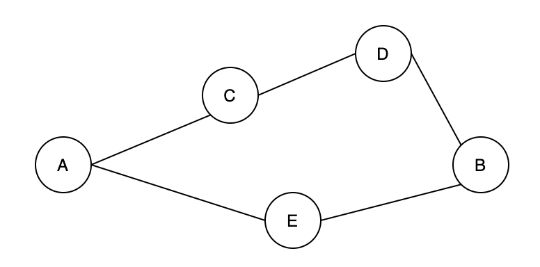

# Depth-First Search

## Overview of Depth-First Search Algorithm

------


Previously, we learned how to check the connectivity between two vertices with the “disjoint set” data structure. Now, let's switch gears and consider: Given a graph, how can we find all of its vertices, and how can we find all paths between two vertices?

The depth-first search algorithm is ideal in solving these kinds of problems because it can explore all paths from the start vertex to all other vertices. Let's start by considering an example. In Figure 7, there are five vertices `[A, C, D, B, E]`. Given two vertices `A` and `B`, there are two paths between them. One path is `[A, C, D, B]`, and the other is `[A, E, B]`.





Figure 7. An undirected graph

In Graph theory, the depth-first search algorithm (abbreviated as DFS) is mainly used to:

1. Traverse all vertices in a “graph”;
2. Traverse all paths between any two vertices in a “graph”.


## Traversing all Vertices – Depth-First Search Algorithm

------


### Video Introduction

------

In the following video, you'll learn how traversing all vertices in the graph can be done using a Depth-First Search (DFS) approach.

video is not accessible :(


### Complexity Analysis

------

- Time Complexity: `O(V + E)`. Here, `V` represents the number of vertices, and `E` represents the number of edges. We need to check every vertex and traverse through every edge in the graph.
- Space Complexity: `O(V)`. Either the manually created stack or the recursive call stack can store up to `V` vertices.


## Traversing all paths between two vertices – Depth-First Search Algorithm

------


### Video Introduction

------

In the following video, we'll explain how to find all paths between two vertices using a Depth-First Search (DFS) approach.


### Complexity Analysis

------

- Time Complexity: `O((V - 1)!)` The above example is for an undirected graph. The worst-case scenario, when trying to find all paths, is a complete graph. A complete graph is a graph where every vertex is connected to every other vertex.

In a complete graph, there will be `V - 1` unique paths of length one that start at the source vertex; one of these paths will go to the target and end. Each of the remaining paths will have `V - 2` unique paths that extend from it (since none of them will go back to the source vertex which was already visited). This process will continue and lead to approximately `(V - 1)!` total paths. Remember, once a path reaches the target vertex, it ends, so the total number of paths will be less than `(V - 1)!`.

The precise total number of paths in the worst-case scenario is equivalent to the [Number of Arrangements](https://oeis.org/wiki/Number_of_arrangements) of the subset of vertices excluding the source and target node, which equals `e(V - 2)!`.

While finding all paths, at each iteration, we add all valid paths from the current vertex to the stack, as shown in the video. Each time we add a path to the stack requires `O(V)` time to create a copy of the current path, append a vertex to it, and push it onto the stack. Since the path grows by one vertex each time, a path of length `V` must have been copied and pushed onto the stack `V` times before reaching its current length. Therefore, it is intuitive to think that each path should require `O(V^2)` time in total. However, there is a flaw in our logic. Consider the example above; at 2:50 we add `ADE` to the stack. Then at 3:20, we add `ADEC`, `ADEB`, and `ADEF` to the stack. `ADE` is a subpath of `ADEC`, `ADEB`, and `ADEF`, but `ADE` was only created once. So the time required for each path to create `ADE` can be thought of as `O(V)` divided by the number of paths that stem from `ADE`. With this in mind, the time spent to create a path is `V` plus `V - 1` divided by the number of paths that stem from this subpath plus `V - 2` times... For a complete graph with many nodes, this averages out to `O(2V) = O(V)` time per path.

Thus, the time complexity to find all paths in an undirected graph in the worst-case scenario is equal to the number of paths found `O((V - 2)!)` times the average time to find a path `O(V)` which simplifies to `O((V - 1)!)`.

- Space Complexity: `O(V^3)`

  . The space used is by the stack which will contain:

  - `(V - 1)` paths after adding first `V - 1` paths to the stack.
  - `(V - 1) - 1 + (V - 2)` paths after popping one path and adding second set of paths.
  - `(V - 1) - 1 + (V - 2) - 1 + (V - 3) - 1 + ... ≈ V(V - 1) / 2 + 1` paths will be at most in the stack, and each path added to the stack will take `O(V)` space.

Therefore, in total, this solution will require `O(V(V - 1) / 2 + 1)V = O(V^3)` space. Note that the space used to store the result does not count towards the space complexity.


## Find if Path Exists in Graph

There is a **bi-directional** graph with `n` vertices, where each vertex is labeled from `0` to `n - 1` (**inclusive**). The edges in the graph are represented as a 2D integer array `edges`, where each `edges[i] = [ui, vi]` denotes a bi-directional edge between vertex `ui` and vertex `vi`. Every vertex pair is connected by **at most one** edge, and no vertex has an edge to itself.

You want to determine if there is a **valid path** that exists from vertex `source` to vertex `destination`.

Given `edges` and the integers `n`, `source`, and `destination`, return `true` *if there is a **valid path** from* `source` *to* `destination`*, or* `false` *otherwise**.*

 

**Example 1:**


```
Input: n = 3, edges = [[0,1],[1,2],[2,0]], source = 0, destination = 2
Output: true
Explanation: There are two paths from vertex 0 to vertex 2:
- 0 → 1 → 2
- 0 → 2
```

**Example 2:**


```
Input: n = 6, edges = [[0,1],[0,2],[3,5],[5,4],[4,3]], source = 0, destination = 5
Output: false
Explanation: There is no path from vertex 0 to vertex 5.
```

 

**Constraints:**

- `1 <= n <= 2 * 10 ** 5`
- `0 <= edges.length <= 2 * 10 ** 5`
- `edges[i].length == 2`
- `0 <= ui, vi <= n - 1`
- `ui != vi`
- `0 <= source, destination <= n - 1`
- There are no duplicate edges.
- There are no self edges.

>  should we use BFS rather than DFS here??

```python
def validPath(self, n: int, edges: List[List[int]], source: int, destination: int) -> bool:
    graph = collections.defaultdict(list)

    for i, j in edges:
        graph[i].append(j)
        graph[j].append(i)

    visited = set()
    curr = collections.deque([source])

    while curr:
        temp = curr.popleft()
        if temp == destination: return True
        for i in graph[temp]:
            if i not in visited:
                visited.add(i)
                curr.append(i)
    return False
```

>  this problem can also be solved with disjoint set algorithm

```python
def validPath(self, n: int, edges: List[List[int]], source: int, destination: int) -> bool:    
    """
    disjoint set
    """
    uf = UnionFind(n)
    for i, j in edges:
        uf.union(i, j)
    return uf.connected(source, destination)
```


## All Paths From Source to Target

Given a directed acyclic graph (**DAG**) of `n` nodes labeled from `0` to `n - 1`, find all possible paths from node `0` to node `n - 1` and return them in **any order**.

The graph is given as follows: `graph[i]` is a list of all nodes you can visit from node `i` (i.e., there is a directed edge from node `i` to node `graph[i][j]`).

 

**Example 1:**


```
Input: graph = [[1,2],[3],[3],[]]
Output: [[0,1,3],[0,2,3]]
Explanation: There are two paths: 0 -> 1 -> 3 and 0 -> 2 -> 3.
```

**Example 2:**


```
Input: graph = [[4,3,1],[3,2,4],[3],[4],[]]
Output: [[0,4],[0,3,4],[0,1,3,4],[0,1,2,3,4],[0,1,4]]
```

 

**Constraints:**

- `n == graph.length`
- `2 <= n <= 15`
- `0 <= graph[i][j] < n`
- `graph[i][j] != i` (i.e., there will be no self-loops).
- All the elements of `graph[i]` are **unique**.
- The input graph is **guaranteed** to be a **DAG**.

```python
def allPathsSourceTarget(self, graph: List[List[int]]) -> List[List[int]]:
    """find all paths from source to target

    Args:
        graph (List[List[int]]): a list of edges in a DAG

    Returns:
        List[List[int]]: all paths from 0 to n - 1
    """
    path = collections.defaultdict(list)
    n = len(graph)
    for i in range(n):
        for j in graph[i]:
            path[i].append(j)

    ans = []
    def move(pre, pre_set):
        if pre[-1] == n - 1:
            ans.append(pre)
            return
        for nxt in path[pre[-1]]:
            if nxt not in pre_set:
                move(pre + [nxt], pre_set | {nxt})

    move([0], {0})
    return ans
```

Official solution:

```python
# better space complexity
def allPathsSourceTarget(self, graph: List[List[int]]) -> List[List[int]]:
    def dfs(node):
        path.append(node)
        if node == len(graph) - 1:
            paths.append(path.copy())
            return

        next_nodes = graph[node]
        for next_node in next_nodes:
            dfs(next_node)
            path.pop()

    paths = []
    path = []
    if not graph or len(graph) == 0:
        return paths
    dfs(0)
    return paths
```

### Complexity Analysis

------

- Time Complexity: O(2^V^V). Here, V represents the number of vertices.
  - For a directed acyclic graph (DAG) with V vertices, there could be at most 2^V-1^ - 1 possible paths to go from the starting vertex to the target vertex. We need O(V) time to build each such path.
  - Therefore, a loose upper bound on the time complexity would be (2^V-1^ - 1)O(V) = O(2^V^V).
  - Since we have overlap between the paths, the actual time spent on the traversal will be lower to some extent.
- Space Complexity: O(V). The recursion depth can be no more than V, and we need O(V) space to store all the previously visited vertices while recursively traversing deeper with the current path. Please note that we don't count the space usage for the output, i.e., to store all the paths we obtained.


## Clone Graph

Given a reference of a node in a **[connected](https://en.wikipedia.org/wiki/Connectivity_(graph_theory)#Connected_graph)** undirected graph.

Return a [**deep copy**](https://en.wikipedia.org/wiki/Object_copying#Deep_copy) (clone) of the graph.

Each node in the graph contains a value (`int`) and a list (`List[Node]`) of its neighbors.

```
class Node {
    public int val;
    public List<Node> neighbors;
}
```

 

**Test case format:**

For simplicity, each node's value is the same as the node's index (1-indexed). For example, the first node with `val == 1`, the second node with `val == 2`, and so on. The graph is represented in the test case using an adjacency list.

**An adjacency list** is a collection of unordered **lists** used to represent a finite graph. Each list describes the set of neighbors of a node in the graph.

The given node will always be the first node with `val = 1`. You must return the **copy of the given node** as a reference to the cloned graph.

 

**Example 1:**


```
Input: adjList = [[2,4],[1,3],[2,4],[1,3]]
Output: [[2,4],[1,3],[2,4],[1,3]]
Explanation: There are 4 nodes in the graph.
1st node (val = 1)'s neighbors are 2nd node (val = 2) and 4th node (val = 4).
2nd node (val = 2)'s neighbors are 1st node (val = 1) and 3rd node (val = 3).
3rd node (val = 3)'s neighbors are 2nd node (val = 2) and 4th node (val = 4).
4th node (val = 4)'s neighbors are 1st node (val = 1) and 3rd node (val = 3).
```

**Example 2:**


```
Input: adjList = [[]]
Output: [[]]
Explanation: Note that the input contains one empty list. The graph consists of only one node with val = 1 and it does not have any neighbors.
```

**Example 3:**

```
Input: adjList = []
Output: []
Explanation: This an empty graph, it does not have any nodes.
```

 

**Constraints:**

- The number of nodes in the graph is in the range `[0, 100]`.
- `1 <= Node.val <= 100`
- `Node.val` is unique for each node.
- There are no repeated edges and no self-loops in the graph.
- The Graph is connected and all nodes can be visited starting from the given node.

#### Discussion approach

```python
def cloneGraph(self, node: Node) -> Node:
    """
    # Definition for a Node.
    class Node:
        def __init__(self, val = 0, neighbors = None):
            self.val = val
            self.neighbors = neighbors if neighbors is not None else []
    """
    if not node: return None
    cp = {node: Node(node.val, [])}
    curr = collections.deque([node])

    while curr:
        temp = curr.popleft()
        for ne in temp.neighbors:
            if ne not in cp:
                ne_cp = Node(ne.val, [])
                cp[ne] = ne_cp
                curr.append(ne)
            cp[temp].neighbors.append(cp[ne])
    return cp[node]
```

## Reconstruct Itinerary

You are given a list of airline `tickets` where `tickets[i] = [fromi, toi]` represent the departure and the arrival airports of one flight. Reconstruct the itinerary in order and return it.

All of the tickets belong to a man who departs from `"JFK"`, thus, the itinerary must begin with `"JFK"`. If there are multiple valid itineraries, you should return the itinerary that has the smallest lexical order when read as a single string.

- For example, the itinerary `["JFK", "LGA"]` has a smaller lexical order than `["JFK", "LGB"]`.

You may assume all tickets form at least one valid itinerary. You must use all the tickets once and only once.

 

**Example 1:**


```
Input: tickets = [["MUC","LHR"],["JFK","MUC"],["SFO","SJC"],["LHR","SFO"]]
Output: ["JFK","MUC","LHR","SFO","SJC"]
```

**Example 2:**


```
Input: tickets = [["JFK","SFO"],["JFK","ATL"],["SFO","ATL"],["ATL","JFK"],["ATL","SFO"]]
Output: ["JFK","ATL","JFK","SFO","ATL","SFO"]
Explanation: Another possible reconstruction is ["JFK","SFO","ATL","JFK","ATL","SFO"] but it is larger in lexical order.
```

 

**Constraints:**

- `1 <= tickets.length <= 300`
- `tickets[i].length == 2`
- `fromi.length == 3`
- `toi.length == 3`
- `fromi` and `toi` consist of uppercase English letters.
- `fromi != toi`

```python
def findItinerary(self, tickets: List[List[str]]) -> List[str]:
    """
    find the smallest lexical order itinerary for a man who departs from "JFK"
    all tickets should be used once and only once

    Args:
        tickets (List[List[str]]): list of tickets

    Returns:
        List[str]: fly path
    """
    path = collections.defaultdict(dict) # key: departure airport | value: dict -> {arrival airport: cnt}
    for i, j in tickets:
        if j not in path[i]:
            path[i][j] = 0
        path[i][j] += 1

    def fly(curr, cnt):
        if cnt == 0: return [curr]
        for k in sorted(path[curr].keys()):
            if path[curr][k] == 0:
                continue
            path[curr][k] -= 1
            ret = fly(k, cnt - 1)
            if ret: return [curr] + ret
            path[curr][k] += 1
        return None

    return fly('JFK', len(tickets))
```

