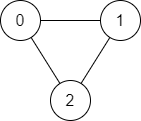
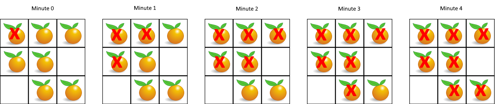

# Breadth-First Search

## Overview of Breadth-First Search

------


Previously, we discussed the “depth-first search” algorithm. This section will talk about a closely related and equally popular algorithm called “breadth-first search”. Similarly, the “breadth-first search” algorithm can traverse all vertices of a “graph” and traverse all paths between two vertices. However, the most advantageous use case of “breadth-first search” is to efficiently find the shortest path between two vertices in a “graph” where **all edges have equal and positive weights**.

Although the “depth-first search” algorithm can find the shortest path between two vertices in a “graph” with equal and positive weights, it must traverse all paths between two vertices before finding the shortest one. The “breadth-first search” algorithm, in most cases, can find the shortest path without traversing all paths. This is because when using "breadth-first search", as soon as a path between the source vertex and target vertex is found, it is guaranteed to be the shortest path between the two nodes.

In Figure 8, the vertices are `[A, C, D, B, E]`. Given vertices `A` and `B`, there are two paths between them. One path is `[A, C, D, B]`, and the other is `[A, E, B]`. Obviously, `[A, E, B]` is the shortest path between `A` and `B`.


Figure 8. An undirected graph

In Graph theory, the primary use cases of the “breadth-first search” (“BFS”) algorithm are:

1. Traversing all vertices in the “graph”;
2. Finding the shortest path between two vertices in a graph where **all edges have equal and positive weights**.


## Traversing all Vertices - Breadth-First Search

------


### Video Introduction

------

In the following video, we will demonstrate how to perform a graph traversal using a Breadth-First Search (BFS) approach.


### Complexity Analysis

------

- Time Complexity: O(V + E). Here, V represents the number of vertices, and E*E* represents the number of edges. We need to check every vertex and traverse through every edge in the graph. The time complexity is the same as it was for the DFS approach.
- Space Complexity: O(V). Generally, we will check if a vertex has been visited before adding it to the queue, so the queue will use at most O(V) space. Keeping track of which vertices have been visited will also require O(V) space.


## Shortest Path Between Two Vertices - Breadth-First Search

------


### Video Introduction

------

In the following video, we will discuss how to find the shortest path between two vertices using a Breadth-First Search (BFS).


### Complexity Analysis

------

- same as traverse all vertices


## Find if Path Exists in Graph

There is a **bi-directional** graph with `n` vertices, where each vertex is labeled from `0` to `n - 1` (**inclusive**). The edges in the graph are represented as a 2D integer array `edges`, where each `edges[i] = [ui, vi]` denotes a bi-directional edge between vertex `ui` and vertex `vi`. Every vertex pair is connected by **at most one** edge, and no vertex has an edge to itself.

You want to determine if there is a **valid path** that exists from vertex `source` to vertex `destination`.

Given `edges` and the integers `n`, `source`, and `destination`, return `true` *if there is a **valid path** from* `source` *to* `destination`*, or* `false` *otherwise*.

 

**Example 1:**



```
Input: n = 3, edges = [[0,1],[1,2],[2,0]], source = 0, destination = 2
Output: true
Explanation: There are two paths from vertex 0 to vertex 2:
- 0 → 1 → 2
- 0 → 2
```

**Example 2:**


```
Input: n = 6, edges = [[0,1],[0,2],[3,5],[5,4],[4,3]], source = 0, destination = 5
Output: false
Explanation: There is no path from vertex 0 to vertex 5.
```

 

**Constraints:**

- `1 <= n <= 2 * 105`
- `0 <= edges.length <= 2 * 105`
- `edges[i].length == 2`
- `0 <= ui, vi <= n - 1`
- `ui != vi`
- `0 <= source, destination <= n - 1`
- There are no duplicate edges.
- There are no self edges.

```python
def validPath(self, n: int, edges: List[List[int]], source: int, destination: int) -> bool:
        """find if there is a path from source vertex to the destination vertex

        Args:
            n (int): Ummm, useless
            edges (List[List[int]]): [description]
            source (int): [description]
            destination (int): [description]

        Returns:
            bool: [description]
        """
        # DFS & BFS
        graph = collections.defaultdict(list)
        for i, j in edges:
            graph[i].append(j)
            graph[j].append(i)
        
        visited = set()
        curr = collections.deque([source])
        while curr:
            # popleft() to implement a BFS solution
            # while pop() to implement a DFS solution
            temp = curr.popleft()
            if temp == destination: return True
            for i in graph[temp]:
                if i not in visited:
                    visited.add(i)
                    curr.append(i)
        return False

        # disjoint set
        uf = UnionFind(n)
        for i, j in edges:
            uf.union(i, j)
        return uf.connected(source, destination)
```


## All Paths From Source to Target

Given a directed acyclic graph (**DAG**) of `n` nodes labeled from `0` to `n - 1`, find all possible paths from node `0` to node `n - 1` and return them in **any order**.

The graph is given as follows: `graph[i]` is a list of all nodes you can visit from node `i` (i.e., there is a directed edge from node `i` to node `graph[i][j]`).

 

**Example 1:**


```
Input: graph = [[1,2],[3],[3],[]]
Output: [[0,1,3],[0,2,3]]
Explanation: There are two paths: 0 -> 1 -> 3 and 0 -> 2 -> 3.
```

**Example 2:**


```
Input: graph = [[4,3,1],[3,2,4],[3],[4],[]]
Output: [[0,4],[0,3,4],[0,1,3,4],[0,1,2,3,4],[0,1,4]]
```

 

**Constraints:**

- `n == graph.length`
- `2 <= n <= 15`
- `0 <= graph[i][j] < n`
- `graph[i][j] != i` (i.e., there will be no self-loops).
- All the elements of `graph[i]` are **unique**.
- The input graph is **guaranteed** to be a **DAG**.


## Populating Next Right Pointers in Each Node

You are given a **perfect binary tree** where all leaves are on the same level, and every parent has two children. The binary tree has the following definition:

```
struct Node {
  int val;
  Node *left;
  Node *right;
  Node *next;
}
```

Populate each next pointer to point to its next right node. If there is no next right node, the next pointer should be set to `NULL`.

Initially, all next pointers are set to `NULL`.

 

**Example 1:**


```
Input: root = [1,2,3,4,5,6,7]
Output: [1,#,2,3,#,4,5,6,7,#]
Explanation: Given the above perfect binary tree (Figure A), your function should populate each next pointer to point to its next right node, just like in Figure B. The serialized output is in level order as connected by the next pointers, with '#' signifying the end of each level.
```

**Example 2:**

```
Input: root = []
Output: []
```

 

**Constraints:**

- The number of nodes in the tree is in the range `[0, 212 - 1]`.
- `-1000 <= Node.val <= 1000`

 

**Follow-up:**

- You may only use constant extra space.
- The recursive approach is fine. You may assume implicit stack space does not count as extra space for this problem.


## Shortest Path in Binary Matrix

Given an `n x n` binary matrix `grid`, return *the length of the shortest **clear path** in the matrix*. If there is no clear path, return `-1`.

A **clear path** in a binary matrix is a path from the **top-left** cell (i.e., `(0, 0)`) to the **bottom-right** cell (i.e., `(n - 1, n - 1)`) such that:

- All the visited cells of the path are `0`.
- All the adjacent cells of the path are **8-directionally** connected (i.e., they are different and they share an edge or a corner).

The **length of a clear path** is the number of visited cells of this path.

 

**Example 1:**


```
Input: grid = [[0,1],[1,0]]
Output: 2
```

**Example 2:**


```
Input: grid = [[0,0,0],[1,1,0],[1,1,0]]
Output: 4
```

**Example 3:**

```
Input: grid = [[1,0,0],[1,1,0],[1,1,0]]
Output: -1
```

 

**Constraints:**

- `n == grid.length`
- `n == grid[i].length`
- `1 <= n <= 100`
- `grid[i][j] is 0 or 1`

```python
def shortestPathBinaryMatrix(self, grid: List[List[int]]) -> int:
    """find the shortest path from top-left cell to bottom-right cell

    Args:
        grid (List[List[int]]): map 1 = block & 0 = empty

    Returns:
        int: length of shortest path
    """
    if grid[0][0] == 1: return -1
    dir = [[0, 1], [0, -1], [-1, -1], [-1, 0], [-1, 1], [1, -1], [1, 0], [1, 1]]
    pq = [(1, 0, 0)]
    m, n = len(grid), len(grid[0])
    while pq:
        cnt, x, y = heapq.heappop(pq)
        if x == m - 1 and y == n - 1: return cnt
        for i, j in dir:
            xi, yj = x + i, y + j
            if m > xi >= 0 <= yj < n and grid[xi][yj] == 0:
                grid[xi][yj] = 1
                heapq.heappush(pq, (cnt + 1, xi, yj))
    return -1
```


## N-ary Tree Level Order Traversal

Given an n-ary tree, return the *level order* traversal of its nodes' values.

*Nary-Tree input serialization is represented in their level order traversal, each group of children is separated by the null value (See examples).*

 

**Example 1:**


```
Input: root = [1,null,3,2,4,null,5,6]
Output: [[1],[3,2,4],[5,6]]
```

**Example 2:**


```
Input: root = [1,null,2,3,4,5,null,null,6,7,null,8,null,9,10,null,null,11,null,12,null,13,null,null,14]
Output: [[1],[2,3,4,5],[6,7,8,9,10],[11,12,13],[14]]
```

 

**Constraints:**

- The height of the n-ary tree is less than or equal to `1000`
- The total number of nodes is between `[0, 10 ** 4]`

```python
def levelOrder(self, root: Node) -> List[List[int]]:
    """
    # Definition for a Node.
    class Node:
        def __init__(self, val=None, children=None):
            self.val = val
            self.children = children
    """
    ans = list()
    curr = [root]

    while curr:
        ans.append([])
        temp = list()
        for i in curr:
            ans[-1].append(i.val)
            if i.children: temp += i.children
        curr = temp
    return ans
```


## Rotting Oranges

You are given an `m x n` `grid` where each cell can have one of three values:

- `0` representing an empty cell,
- `1` representing a fresh orange, or
- `2` representing a rotten orange.

Every minute, any fresh orange that is **4-directionally adjacent** to a rotten orange becomes rotten.

Return *the minimum number of minutes that must elapse until no cell has a fresh orange*. If *this is impossible, return* `-1`.

 

**Example 1:**



```
Input: grid = [[2,1,1],[1,1,0],[0,1,1]]
Output: 4
```

**Example 2:**

```
Input: grid = [[2,1,1],[0,1,1],[1,0,1]]
Output: -1
Explanation: The orange in the bottom left corner (row 2, column 0) is never rotten, because rotting only happens 4-directionally.
```

**Example 3:**

```
Input: grid = [[0,2]]
Output: 0
Explanation: Since there are already no fresh oranges at minute 0, the answer is just 0.
```

 

**Constraints:**

- `m == grid.length`
- `n == grid[i].length`
- `1 <= m, n <= 10`
- `grid[i][j]` is `0`, `1`, or `2`.

```python
def orangesRotting(self, grid: List[List[int]]) -> int:
    # frash orange will become rotten if it is adjacent to a rotten orange
    # BFS approach
    dir = [[0, 1], [0, -1], [1, 0], [-1, 0]]
    m, n = len(grid), len(grid[0])
    ans = 0
    rotten = collections.deque([[i, j] for i, j in product(range(m), range(n)) if grid[i][j] == 2])
    cnt = sum([1 for i, j in product(range(m), range(n)) if grid[i][j] == 1])

    while rotten:
        size = len(rotten)
        for _ in range(size):
            x, y = rotten.popleft()
            for i, j in dir:
                xi, yj = x + i, y + j
                if m > xi >= 0 <= yj < n and grid[xi][yj] == 1:
                    grid[xi][yj] = 2
                    cnt -= 1
                    rotten.append([xi, yj])
        if rotten: ans += 1

    return ans if cnt == 0 else -1
```

