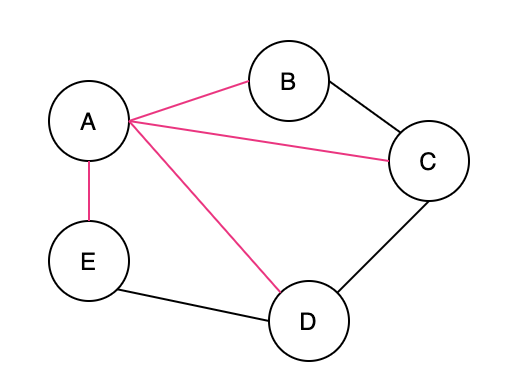
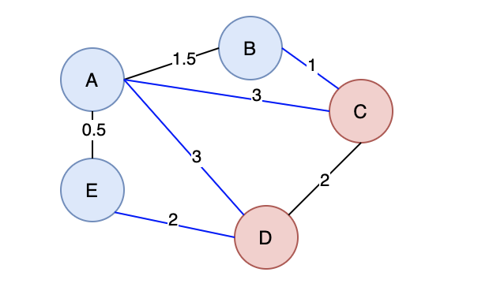
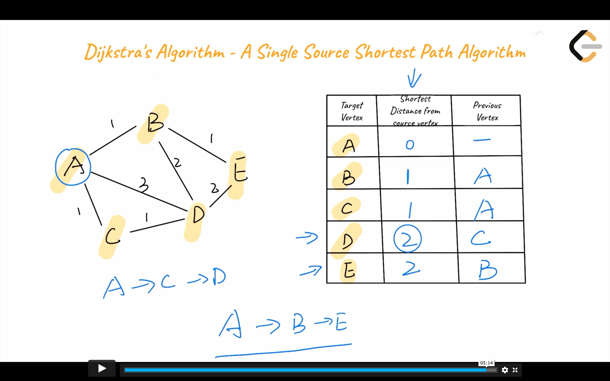
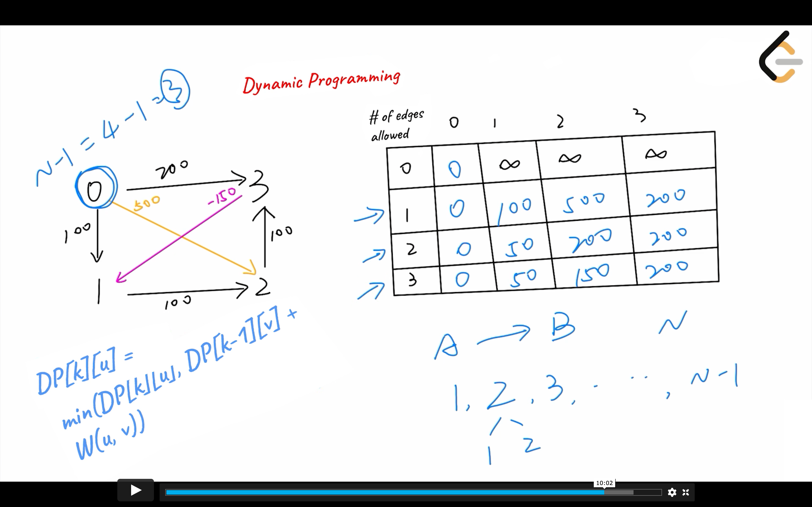
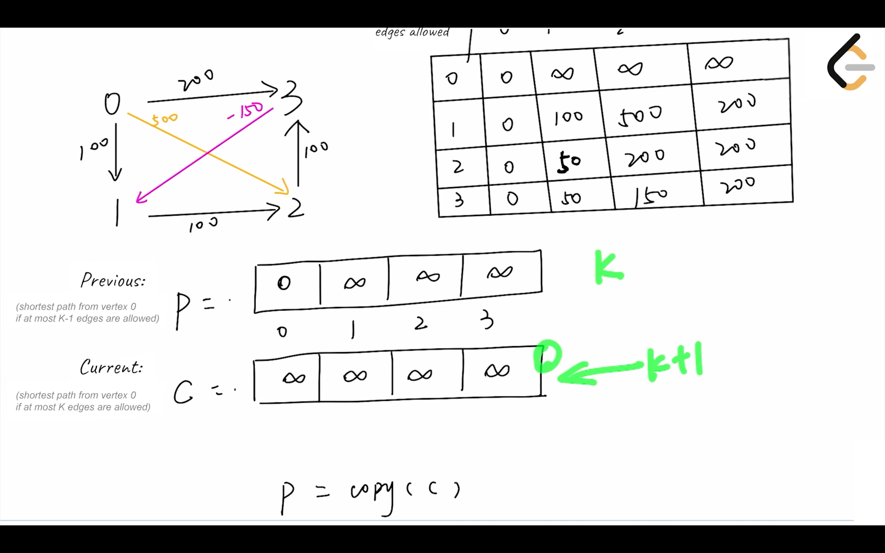
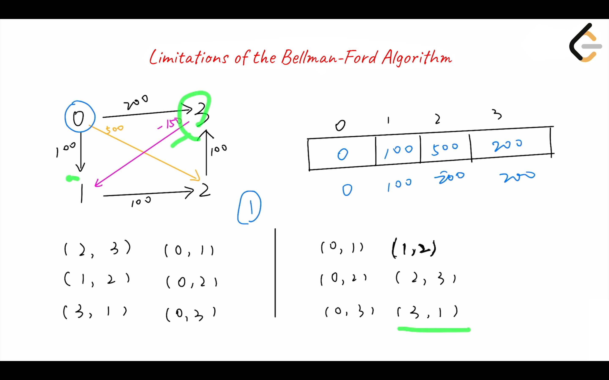
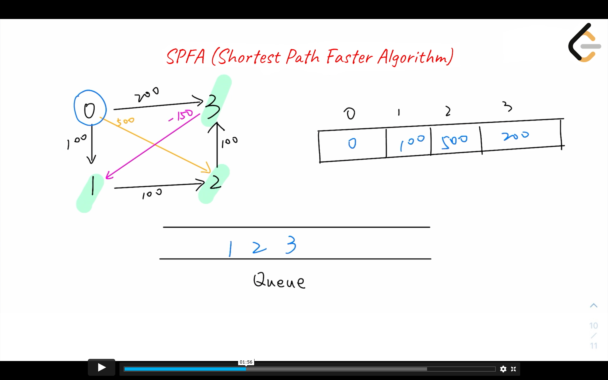
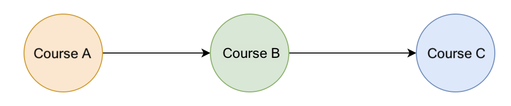
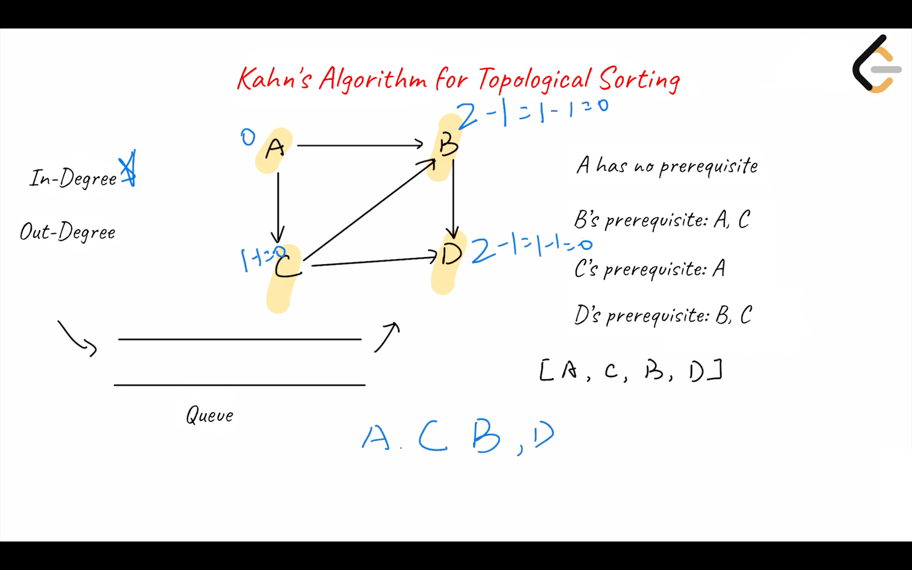

# Minimum Spanning Tree

## Overview of Minimum Spanning Tree

------


You might wonder: what is a spanning tree? A **spanning tree** is a connected subgraph in an undirected graph where **all vertices** are connected with the **minimum number** of edges. In Figure 9, all pink edges `[(A, B), (A, C), (A, D), (A, E)]` form a tree, which is a spanning tree of this undirected graph. Note that `[(A, E), (A, B), (B, C), (C, D)]` is also a spanning tree of the undirected graph. Thus, an “undirected graph” can have multiple spanning trees.





Figure 9. Spanning tree

After learning what a spanning tree is, you might have another question: what is a **minimum spanning tree**? A minimum spanning tree is a spanning tree with the minimum possible total edge weight in a “weighted undirected graph”. In Figure 10, a spanning tree formed by green edges `[(A, E), (A, B), (B, C), (C, D)]` is one of the minimum spanning trees in this weighted undirected graph. Actually, `[(A, E), (E, D), (A, B), (B, C)]` forms another minimum spanning tree of the weighted undirected graph. Thus, a “weighted undirected graph” can have multiple minimum spanning trees.


Figure 10. Minimum spanning tree

In this chapter, we will learn about the “cut property and two algorithms for constructing a “minimum spanning tree”:

- ==Kruskal’s Algorithm==
- ==Prim’s algorithm==


## Cut Property

------


What is a “cut”? Although many theorems are named after people’s names, “cut” is not one of them. To understand the “cut property”, we need to understand two basic concepts.

- First, in Graph theory, a “cut” is a partition of vertices in a “graph” into two disjoint subsets. Figure 11 illustrates a “cut”, where `(B, A, E)` forms one subset, and `(C, D)` forms the other subset.
- Second, a crossing edge is an edge that connects a vertex in one set with a vertex in the other set. In Figure 11, `(B, C)`, `(A, C)`, `(A, D)`, `(E, D)` are all “crossing edges”.





Figure 11. Graph with a cut

After knowing the basics of a graph cut, let’s delve into the “cut property”. The cut property provides theoretical support for Kruskal’s algorithm and Prim’s algorithm. So, what is the “cut property”? According to [Wikipedia](https://en.wikipedia.org/wiki/Minimum_spanning_tree#Cut_property), the “cut property” refers to:

> For any cut `C` of the graph, if the weight of an edge `E` in the cut-set of `C` is strictly smaller than the weights of all other edges of the cut-set of `C`, then this edge belongs to all MSTs of the graph.


### Proof of the Cut Property

------

In the following video, we'll explain and prove the “cut property”.


## Kruskal’s Algorithm

------


“Kruskal’s algorithm” is an algorithm to construct a “minimum spanning tree” of a “weighted undirected graph”.


### Visual Example

------


The above animation shows how Kruskal's algorithm *grows* the minimum spanning tree by adding edges. In this example, the distance between two vertices is the edge weight. We try adding each edge, one at a time, from the lowest weight edge up to the highest weight edge. If either of the edges' vertices is not already part of the MST, then the edge is added to the MST.


### Why does Kruskal’s Algorithm only choose N-1 edges?

------

In the following video, we'll prove that we need to choose exactly N-1 edges of the graph with N edges in total to construct a “minimum spanning tree” of that graph.


video


Please note that in the video above, all the graphs are linked lists. However, it's not necessary for a “minimum spanning tree” to be a linked list only. In other words, we can form an MST without forming a linked list. In any case, only `N-1` edges are needed.


### Why can we apply the “greedy strategy”?

------

In the subsequent video, you'll see why the greedy approach does work in accomplishing our task.


### Complexity Analysis

------

- Time Complexity:  *O*(*E*⋅log*E*). Here, *E* represents the number of edges.
  - At first, we need to sort all the edges of the graph in ascending order. Sorting will take *O*(*E*log*E*) time.
  - Next, we can start building our minimum spanning tree by selecting which edges should be included. For each edge, we will look at whether both of the vertices of the edge belong to the same connected component; which is an *O*(*α*(*V*)) operation, where *α* refers to the Inverse Ackermann function. In the worst case, the tree will not be complete until we reach the very last edge (the edge with the largest weight), so this process will take *O*(*E*⋅*α*(*V*)) time.
  - Therefore, in total, the time complexity is *O*(*E*log*E*+*E*⋅*α*(*V*))=*O*(*E*log*E*).
- Space Complexity: *O*(*V*). *V* represents the number of vertices. Keeping track of the root of every vertex in the union-find data structure requires *O*(*V*) space. However, depending on the sorting algorithm used, different amounts of auxiliary space will be required to sort the list of edges in place. For instance, Timsort (used by default in python) requires *O*(*E*) space in the worst-case scenario, while Java uses a variant of quicksort whose space complexity is *O*(log*E*).


## Min Cost to Connect All Points

You are given an array `points` representing integer coordinates of some points on a 2D-plane, where `points[i] = [xi, yi]`.

The cost of connecting two points `[xi, yi]` and `[xj, yj]` is the **manhattan distance** between them: `|xi - xj| + |yi - yj|`, where `|val|` denotes the absolute value of `val`.

Return *the minimum cost to make all points connected.* All points are connected if there is **exactly one** simple path between any two points.

 

**Example 1:**


```
Input: points = [[0,0],[2,2],[3,10],[5,2],[7,0]]
Output: 20
Explanation: 

We can connect the points as shown above to get the minimum cost of 20.
Notice that there is a unique path between every pair of points.
```

**Example 2:**

```
Input: points = [[3,12],[-2,5],[-4,1]]
Output: 18
```

 

**Constraints:**

- `1 <= points.length <= 1000`
- `-106 <= xi, yi <= 106`
- All pairs `(xi, yi)` are distinct.

```python
def minCostConnectPoints(self, points: List[List[int]]) -> int:
    """minimum spanning tree

    Args:
        points (List[List[int]]): a list of all points represents in 2d point format

    Returns:
        int: cost of the minimum spanning tree
    """
    n = len(points)
    edge = [] # heapq, element = [distance, x, y]
    uf = UnionFind(n)

    for i in range(n):
         for j in range(i + 1, n):
            heapq.heappush(edge, [abs(points[i][0] - points[j][0]) + abs(points[i][1] - points[j][1]), i, j])

    ans = 0
    for _ in range(n - 1): # we need n - 1 edges to connect n nodes
        while uf.connected(edge[0][1], edge[0][2]):
            heapq.heappop(edge)
        cost, x, y = heapq.heappop(edge)
        uf.union(x, y)
        ans += cost
    return ans
```

UnionFind module is needed


### Complexity Analysis

------

- Time Complexity: *O*(*E*log*E*). Here, *E* represents the number of edges.
  - For Python, building a priority queue using heapify method takes *O*(*E*) time, and we need *O*(*E*log*E*) time for popping out all the elements from the priority queue. In total, we need *O*(*E*log*E*) time in terms of Big-O notation.
  - For C++ and Java, building a priority queue takes *O*(*E*log*E*) time. Popping out all the elements from the queue takes *O*(*E*log*E*) time as well. Therefore, total time complexity for this solution is *O*(*E*log*E*)+*O*(*E*log*E*)=*O*(*E*log*E*).
- Space Complexity: *O*(*E*). We need the space to store all the edges in a priority queue.


## Prim’s Algorithm

------


### Video Explanation

------

After learning about Kruskal's Algorithm, let's look at another algorithm, "Prim's algorithm", that can be used to construct a “minimum spanning tree” of a “weighted undirected graph”.


### Visual Example

------


The above illustration demonstrates how Prim's algorithm works by adding vertices. In this example, the distance between two vertices is the edge weight. Starting from an arbitrary vertex, Prim's algorithm ***grows*** the minimum spanning tree by adding one vertex at a time to the tree. The choice of a vertex is based on the ***greedy*** strategy, *i.e.,* the addition of the new vertex incurs the minimum cost.


### Proof of the Prim's Algorithm

------

You may wonder, does Prim’s Algorithm guarantee that we get the correct “minimum spanning tree” at the end? The answer to this question is yes, as we will explain in the next video.


### The difference between the “Kruskal’s algorithm” and the “Prim’s algorithm”

------

“Kruskal’s algorithm” expands the “minimum spanning tree” by adding edges. Whereas “Prim’s algorithm” expands the “minimum spanning tree” by adding vertices.


### Complexity Analysis

------

*V* represents the number of vertices, and *E* represents the number of edges.

- Time Complexity: *O*(*E*⋅log*V*) for Binary heap, and *O*(*E*+*V*⋅log*V*) for Fibonacci heap.
  - For a Binary heap:
    - We need *O*(*V*+*E*) time to traverse all the vertices of the graph, and we store in the heap all the vertices that are not yet included in our minimum spanning tree.
    - Extracting minimum element and key decreasing operations cost *O*(log*V*) time.
    - Therefore, the overall time complexity is *O*(*V*+*E*)⋅*O*(log*V*)=*O*(*E*⋅log*V*).
  - For a Fibonacci heap:
    - Extracting minimum element will take *O*(log*V*) time while key decreasing operation will take amortized *O*(1) time, therefore, the total time complexity would be *O*(*E*+*V*⋅log*V*).
- Space Complexity: *O*(*V*). We need to store *V* vertices in our data structure.


Prim’s algorithm

>- use a heap queue to record the shortest distance to reach each vertex
>- in every loop, choose the vertex with the minimum distance, let’s call it A
>- update distance list, get all edges from A, and update distance of its neighbors
>- stop iterating until we got n vertices

```python
def minCostConnectPoints(self, points: List[List[int]]) -> int:
    """minimum spanning tree

    Args:
        points (List[List[int]]): a list of all points represents in 2d point format

    Returns:
        int: cost of the minimum spanning tree
    """
    # Prim's algorithm
    n = len(points)
    graph = collections.defaultdict(dict) # key: vertex | velue: [connected vertex, cost]
    # start with an arbitrary vertex, let's choose 0
    distance = [(0, 0)]
    visited = set()

    for i in range(n):
        for j in range(i + 1, n):
            dis = abs(points[i][0] - points[j][0]) + abs(points[i][1] - points[j][1])
            graph[i][j] = dis
            graph[j][i] = dis

    ans = 0
    # select vertex with the least cost from unselected vertices
    for _ in range(n):
        while distance[0][1] in visited:
            heapq.heappop(distance)
        cost, vertex = heapq.heappop(distance)
        visited.add(vertex)
        ans += cost
        for nxt, dis in graph[vertex].items():
            heapq.heappush(distance, (dis, nxt))
    return ans
```


## Overview of Single Source Shortest Path

------


Previously, we used the “breadth-first search” algorithm to find the “shortest path” between two vertices. However, the “breadth-first search” algorithm can only solve the “shortest path” problem in “unweighted graphs”. But in real life, we often need to find the “shortest path” in a “weighted graph”.

For example, there may be many routes from your home to a target location, such as a bus station, and the time needed for each route may be different. The route with the shortest distance may not be the one that requires the least amount of time because of the speed limit and traffic jams. So, if we want to find the route that takes the least time from home to a certain bus station, then the weights should be time instead of distance. With that in mind, how can we solve the “shortest path” problem given two vertices in a “weighted graph”?

The main focus of this chapter is to solve such “single source shortest path” problems. Given the starting vertex, find the “shortest path” to any of the vertices in a weighted graph. Once we solve this, we can easily acquire the shortest paths between the starting vertex and a given target vertex.


### Edge Relaxation

------

In the following video, we'll talk about an Edge Relaxation operation that is a key element in solving the “single-source shortest path” problem.


An alternative way to understand why this process is called ‘relaxation’ is to imagine that each path is a rubber band of length 1. The original path from A to D is of length 3, so the rubber band was stretched to 3 times its original length. When we relax the path to length 2, by visiting C first, the rubber band is now only stretched to twice its length, so you can imagine the rubber band being relaxed, hence the term edge relaxation.


In this chapter, we will learn two “single source shortest path” algorithms:

1. Dijkstra’s algorithm
2. Bellman-Ford algorithm

“Dijkstra's algorithm” can only be used to solve the “single source shortest path” problem in a weighted directed graph with ==non-negative== weights.

“Bellman-Ford algorithm”, on the other hand, can solve the “single-source shortest path” in a weighted directed graph with ==any weights==, including, of course, negative weights.


## Dijkstra's Algorithm

------


“Dijkstra’s algorithm” solves the “single-source shortest path” problem in a weighted directed graph with non-negative weights.


### Video Explanation

------

In the next video, we'll explain how to solve the “single-source shortest path” problem using Dijkstra's Algorithm.



#### The Main Idea

------

We take the starting point `u` as the center and gradually expand outward while updating the “shortest path” to reach other vertices.

“Dijkstra's Algorithm” uses a “greedy approach”. Each step selects the “minimum weight” from the currently reached vertices to find the “shortest path” to other vertices.


#### Proof of the Algorithm

------

Now let's prove that Dijkstra's Algorithm actually leads to the correct answer. We'll do that in the next video.

The “greedy approach” only guarantees that, at each step, it takes the optimal choice in the current state. It does not guarantee that the final result is optimal. So, how does “Dijkstra’s Algorithm” ensure that its final result is optimal?


## Network Delay Time

You are given a network of `n` nodes, labeled from `1` to `n`. You are also given `times`, a list of travel times as directed edges `times[i] = (ui, vi, wi)`, where `ui` is the source node, `vi` is the target node, and `wi` is the time it takes for a signal to travel from source to target.

We will send a signal from a given node `k`. Return the time it takes for all the `n` nodes to receive the signal. If it is impossible for all the `n` nodes to receive the signal, return `-1`.

 

**Example 1:**


```
Input: times = [[2,1,1],[2,3,1],[3,4,1]], n = 4, k = 2
Output: 2
```

**Example 2:**

```
Input: times = [[1,2,1]], n = 2, k = 1
Output: 1
```

**Example 3:**

```
Input: times = [[1,2,1]], n = 2, k = 2
Output: -1
```

 

**Constraints:**

- `1 <= k <= n <= 100`
- `1 <= times.length <= 6000`
- `times[i].length == 3`
- `1 <= ui, vi <= n`
- `ui != vi`
- `0 <= wi <= 100`
- All the pairs `(ui, vi)` are **unique**. (i.e., no multiple edges.)

```python
def networkDelayTime(self, times: List[List[int]], n: int, k: int) -> int:
    # Dijkstra’s
    edge = collections.defaultdict(dict)
    for s, e, t in times:
        edge[s][e] = t
    shortest = dict() # key: vertex | value: time
    for i in range(1, n + 1):
        shortest[i] = float('inf')
    shortest[k] = 0

    ans = 0
    while shortest:
        v, k = sorted([v, k] for k, v in shortest.items())[0]
        shortest.pop(k)
        ans = max(ans, v)
        for neighbor, cost in edge[k].items():
            if neighbor in shortest:
                shortest[neighbor] = min(shortest[neighbor], v + cost)
    return ans if ans < float('inf') else -1
    
    # first approach
    time = [(0, k)]
    visited = set()

    graph = collections.defaultdict(dict)
    for s, e, t in times:
        graph[s][e] = t

    for _ in range(n):
        while time and time[0][1] in visited:
            heapq.heappop(time)
        if not time: return -1
        t, idx = heapq.heappop(time)
        visited.add(idx)
        for nxt, cost in graph[idx].items():
            if nxt not in visited:
                heapq.heappush(time, (cost + t, nxt))
    return t
```


## Bellman Ford Algorithm

------


As discussed previously, the “Dijkstra algorithm” is restricted to solving the “single source shortest path” problem in graphs without negative weights. So, how could we solve the “single source shortest path” problem in graphs with negative weights? In this chapter, we will introduce the Bellman-Ford algorithm.


### Basic Theorem

------

#### Theorem 1: In a “graph with no negative-weight cycles” with N vertices, the shortest path between any two vertices has at most N-1 edges.

In the following video, we're going to prove this Theorem.


### Using Dynamic Programming to Find the Shortest Path

------

Now we'll use Dynamic Programming technique to find the shortest path between the vertices in the given graph.




#### Complexity Analysis

------

*V* represents the number of vertices in the graph, and *E* represents the number of edges.

- Time Complexity: *O*(*V*⋅*E*). In the worst-case scenario, when all the vertices are connected with each other, we need to check every path from every vertex; this results in *O*(*V*⋅*E*) time complexity.
- Space Complexity: *O*(*V*^2^). We need to store a 2-dimensional DP matrix with the size of *V*⋅*V*.
- ↑ we just need to record previous one. hence, space complexity can be optimized to *O*(*V*)


### Explanation of the Bellman-Ford Algorithm:

------

We will solve the same problem in the following video, but now we'll use the Bellman-Ford Algorithm.




### Optimizing the Bellman-Ford Algorithm

------

In the following video, we'll further optimize our algorithm.

==we update shortest distance with each edge in one iteration==


### Comparing the Two Bellman-Ford Algorithm Variations

------

Now let's check the differences between the two versions of the Bellman-Ford Algorithm that we explained earlier.


#### Limitation of the algorithm

------

“Bellman-Ford algorithm” is only applicable to “graphs” with no “negative weight cycles”.


#### How does the Bellman-Ford algorithm detect “negative weight cycles”?

------

Although the “Bellman-Ford algorithm” cannot find the shortest path in a graph with “negative weight cycles”, it can detect whether there exists a “negative weight cycle” in the “graph”.

**Detection method**: After relaxing each edge `N-1` times, perform the `N`th relaxation. According to the “Bellman-Ford algorithm”, all distances must be the shortest after relaxing each edge `N-1` times. However, after the `N`th relaxation, if there exists `distances[u] + weight(u, v) < distances(v)` for any `edge(u, v)`, it means there is a shorter path . At this point, we can conclude that there exists a “negative weight cycle”.


### Complexity Analysis

------

*V* represents the number of vertices, and *E* represents the number of edges.

- Time Complexity: we iterate through all the vertices, and in each iteration, we'll perform a relaxation operation for each appropriate edge. Therefore, the time complexity would be *O*(*V*⋅*E*).
- Space Complexity: *O*(*V*). We use two arrays of length V*V*. One to store the shortest distance from the source vertex using at most `k-1` edges. The other is to store the shortest distance from the source vertex using at most `k` edges.


## Improved Bellman-Ford Algorithm with Queue — SPFA Algorithm

------


Previously, we introduced the “Bellman-Ford Algorithm” along with an improvement. The improvement is that for a graph without negative cycles, after relaxing each edge `N-1` times, we can get the minimum distance from the starting vertex to all other vertices. However, there could be unnecessary computation when relaxing all edges `N-1` times, resulting in suboptimal time complexity in some cases.


### Limitations of the Bellman-Ford Algorithm

------

In the following video, you'll learn more about the limitations of the “Bellman-Ford Algorithm”.

the order when you traverse all the edges are important and affective.




### SPFA algorithm

------

To address the limitations, we introduce an improved variation of the Bellman-Ford algorithm by using a queue. This improvement is known as “the Shortest Path Faster Algorithm” (SPFA algorithm).

Instead of choosing among any untraversed edges, as one does by using the “Bellman-Ford” algorithm, the “SPFA” Algorithm uses a “queue” to maintain the next starting vertex of the edge to be traversed. Only when the shortest distance of a vertex is relaxed and that the vertex is not in the “queue”, we add the vertex to the queue. We iterate the process until the queue is empty. At this point, we have calculated the minimum distance from the given vertex to any vertices.


### Video explanation of the SPFA algorithm

------

Now it's time to look at “the Shortest Path Faster Algorithm” (SPFA) in action.




### Complexity Analysis

------

*V* represents the number of vertices, and *E* represents the number of edges.

- Time Complexity: we iterate through all the vertices, and in each iteration, we'll perform a relaxation operation for each appropriate edge. Therefore, the time complexity would be *O*(*V*⋅*E*).
- Space Complexity: *O*(*V*). We need to store *V* vertices.

Note that the time complexity of the improved version of the algorithm for the worst-case scenario is the same as of the standard version of the Bellman-Ford Algorithm. However, on average, the SPFA tends to be faster.


## Cheapest Flights Within K Stops

There are `n` cities connected by some number of flights. You are given an array `flights` where `flights[i] = [fromi, toi, pricei]` indicates that there is a flight from city `fromi` to city `toi` with cost `pricei`.

You are also given three integers `src`, `dst`, and `k`, return ***the cheapest price** from* `src` *to* `dst` *with at most* `k` *stops.* If there is no such route, return `-1`.

 

**Example 1:**


```
Input: n = 3, flights = [[0,1,100],[1,2,100],[0,2,500]], src = 0, dst = 2, k = 1
Output: 200
Explanation: The graph is shown.
The cheapest price from city 0 to city 2 with at most 1 stop costs 200, as marked red in the picture.
```

**Example 2:**


```
Input: n = 3, flights = [[0,1,100],[1,2,100],[0,2,500]], src = 0, dst = 2, k = 0
Output: 500
Explanation: The graph is shown.
The cheapest price from city 0 to city 2 with at most 0 stop costs 500, as marked blue in the picture.
```

 

**Constraints:**

- `1 <= n <= 100`
- `0 <= flights.length <= (n * (n - 1) / 2)`
- `flights[i].length == 3`
- `0 <= fromi, toi < n`
- `fromi != toi`
- `1 <= pricei <= 104`
- There will not be any multiple flights between two cities.
- `0 <= src, dst, k < n`
- `src != dst`

```python
def findCheapestPrice(self, n: int, flights: List[List[int]], src: int, dst: int, k: int) -> int:
    source = collections.defaultdict(dict)
    for s, d, cost in flights:
        source[d][s] = cost

    dp = [float('inf')] * n
    dp[src] = 0

    for _ in range(1, k + 2):
        nxt = dp.copy()
        for i in range(n):
            for s, c in source[i].items():
                nxt[i] = min(nxt[i], dp[s] + c)
        dp = nxt
    return dp[dst] if dp[dst] < float('inf') else -1
```

Official solution

```python
def findCheapestPrice(self, n: int, flights: List[List[int]], src: int, dst: int, k: int) -> int:
    if src == dst:
        return 0

    previous = [float('inf')] * n
    previous[src] = 0

    for i in range(1, k + 2):
        current = previous.copy()
        for previous_flight, current_flight, cost in flights:
            if previous[previous_flight] < float('inf'):
                current[current_flight] = min(current[current_flight],
                                              previous[previous_flight] + cost)
        previous = current
    return -1 if current[dst] == float('inf') else current[dst]
```


## Path With Minimum Effort

You are a hiker preparing for an upcoming hike. You are given `heights`, a 2D array of size `rows x columns`, where `heights[row][col]` represents the height of cell `(row, col)`. You are situated in the top-left cell, `(0, 0)`, and you hope to travel to the bottom-right cell, `(rows-1, columns-1)` (i.e., **0-indexed**). You can move **up**, **down**, **left**, or **right**, and you wish to find a route that requires the minimum **effort**.

A route's **effort** is the **maximum absolute difference** in heights between two consecutive cells of the route.

Return *the minimum **effort** required to travel from the top-left cell to the bottom-right cell.*

 

**Example 1:**


```
Input: heights = [[1,2,2],[3,8,2],[5,3,5]]
Output: 2
Explanation: The route of [1,3,5,3,5] has a maximum absolute difference of 2 in consecutive cells.
This is better than the route of [1,2,2,2,5], where the maximum absolute difference is 3.
```

**Example 2:**


```
Input: heights = [[1,2,3],[3,8,4],[5,3,5]]
Output: 1
Explanation: The route of [1,2,3,4,5] has a maximum absolute difference of 1 in consecutive cells, which is better than route [1,3,5,3,5].
```

**Example 3:**


```
Input: heights = [[1,2,1,1,1],[1,2,1,2,1],[1,2,1,2,1],[1,2,1,2,1],[1,1,1,2,1]]
Output: 0
Explanation: This route does not require any effort.
```

 

**Constraints:**

- `rows == heights.length`
- `columns == heights[i].length`
- `1 <= rows, columns <= 100`
- `1 <= heights[i][j] <= 106`

> Hide Hint #1 

Consider the grid as a graph, where adjacent cells have an edge with cost of the difference between the cells.

> Hide Hint #2 

If you are given threshold k, check if it is possible to go from (0, 0) to (n-1, m-1) using only edges of ≤ k cost.

> Hide Hint #3 

Binary search the k value.

```python
def minimumEffortPath(self, heights: List[List[int]]) -> int:
    dir = [[0, 1], [0, -1], [1, 0], [-1, 0]]
    m, n = len(heights), len(heights[0])
    def find(k):
        # check if we can find a path with edges at most cost k
        curr = collections.deque([[0, 0]])
        visited = [[False] * n for _ in range(m)]
        visited[0][0] = True
        while curr:
            x, y = curr.popleft()
            if x == m - 1 and y == n - 1: return True
            for i, j in dir:
                xi, yj = x + i, y + j
                if m > xi >= 0 <= yj < n and not visited[xi][yj] and abs(heights[xi][yj] - heights[x][y]) <= k:
                    visited[xi][yj] = True
                    curr.append([xi, yj])
        return False

    left, right = 0, max(max(i) for i in heights) - min(min(i) for i in heights)
    while left < right:
        mid = (right + left) >> 1
        if find(mid):
            right = mid
        else:
            left = mid + 1
    return left
```


## Overview of Kahn's Algorithm

------


When selecting courses for the next semester in college, you might have noticed that some advanced courses have prerequisites that require you to take some introductory courses first. In Figure 12, for example, to take Course C, you need to complete Course B first, and to take Course B, you need to complete Course A first. There are many courses that you must complete for an academic degree. You do not want to find out in the last semester that you have not completed some prerequisite courses for an advanced course. So, how can we arrange the order of the courses adequately while considering these prerequisite relationships between them?





Figure 12. Prerequisite relationships between courses

“Topological sorting” helps solve the problem. It provides a linear sorting based on the required ordering between vertices in directed acyclic graphs. To be specific, given vertices `u` and `v`, to reach vertex `v`, we must have reached vertex `u` first. In “topological sorting”, `u` has to appear before `v` in the ordering. The most popular algorithm for “topological sorting” is Kahn’s algorithm.


### Video Explanation

------

In this video, we'll cover how the Kahn's Algorithm can be used for topological sorting.


Note, for simplicity while introducing Kahn's algorithm, we iterated over all of the courses and reduced the in-degree of those for which the current course is a prerequisite. This requires us to iterate over all E*E* prerequisites for all V*V* courses resulting in O(V \cdot E)*O*(*V*⋅*E*) time complexity at the cost of O(V)*O*(*V*) space to store the in degree for each vertex.

However, this step can be performed more efficiently by creating an adjacency list where `adjacencyList[course]` contains a list of courses that depend on `course`. Then when each course is taken, we will only iterate over the courses that have the current course as a prerequisite. This will reduce the total time complexity to O(V + E)*O*(*V*+*E*) at the cost of an additional O(E)*O*(*E*) space to store the adjacency list.


### Limitation of the Algorithm

------

- “Topological sorting” only works with graphs that are directed and acyclic.
- There must be at least one vertex in the “graph” with an “in-degree” of 0. If all vertices in the “graph” have a non-zero “in-degree”, then all vertices need at least one vertex as a predecessor. In this case, no vertex can serve as the starting vertex.



### Complexity Analysis

------

*V* represents the number of vertices, and *E* represents the number of edges.

- Time Complexity: *O*(*V*+*E*).
  - First, we will build an adjacency list. This allows us to efficiently check which courses depend on each prerequisite course. Building the adjacency list will take *O*(*E*) time, as we must iterate over all edges.
  - Next, we will repeatedly visit each course (vertex) with an in-degree of zero and decrement the in-degree of all courses that have this course as a prerequisite (outgoing edges). In the worst-case scenario, we will visit every vertex and decrement every outgoing edge once. Thus, this part will take *O*(*V*+*E*) time.
  - Therefore, the total time complexity is *O*(*E*)+*O*(*V*+*E*)=*O*(*V*+*E*).
- Space Complexity: *O*(*V*+*E*).
  - The adjacency list uses *O*(*E*) space.
  - Storing the in-degree for each vertex requires *O*(*V*) space.
  - The queue can contain at most *V* nodes, so the queue also requires *O*(*V*) space.


## Course Schedule II

There are a total of `numCourses` courses you have to take, labeled from `0` to `numCourses - 1`. You are given an array `prerequisites` where `prerequisites[i] = [ai, bi]` indicates that you **must** take course `bi` first if you want to take course `ai`.

- For example, the pair `[0, 1]`, indicates that to take course `0` you have to first take course `1`.

Return *the ordering of courses you should take to finish all courses*. If there are many valid answers, return **any** of them. If it is impossible to finish all courses, return **an empty array**.

 

**Example 1:**

```
Input: numCourses = 2, prerequisites = [[1,0]]
Output: [0,1]
Explanation: There are a total of 2 courses to take. To take course 1 you should have finished course 0. So the correct course order is [0,1].
```

**Example 2:**

```
Input: numCourses = 4, prerequisites = [[1,0],[2,0],[3,1],[3,2]]
Output: [0,2,1,3]
Explanation: There are a total of 4 courses to take. To take course 3 you should have finished both courses 1 and 2. Both courses 1 and 2 should be taken after you finished course 0.
So one correct course order is [0,1,2,3]. Another correct ordering is [0,2,1,3].
```

**Example 3:**

```
Input: numCourses = 1, prerequisites = []
Output: [0]
```

 

**Constraints:**

- `1 <= numCourses <= 2000`
- `0 <= prerequisites.length <= numCourses * (numCourses - 1)`
- `prerequisites[i].length == 2`
- `0 <= ai, bi < numCourses`
- `ai != bi`
- All the pairs `[ai, bi]` are **distinct**.

> Hide Hint #1 

This problem is equivalent to finding the topological order in a directed graph. If a cycle exists, no topological ordering exists and therefore it will be impossible to take all courses.

> Hide Hint #2 

[Topological Sort via DFS](https://class.coursera.org/algo-003/lecture/52) - A great video tutorial (21 minutes) on Coursera explaining the basic concepts of Topological Sort.

> Hide Hint #3 

Topological sort could also be done via [BFS](http://en.wikipedia.org/wiki/Topological_sorting#Algorithms).

```python
def findOrder(self, numCourses: int, prerequisites: List[List[int]]) -> List[int]:
    in_degree = [0] * numCourses
    visited = set()
    nxt = collections.defaultdict(list)
    for c, p in prerequisites:
        nxt[p].append(c)
        in_degree[c] += 1

    ans = list()
    while len(visited) < numCourses:
        update = list()
        for idx, i in enumerate(in_degree):
            if i == 0 and idx not in visited:
                update.append(idx)
                visited.add(idx)
                for n in nxt[idx]:
                    in_degree[n] -= 1
        if not update: return []
        ans += update
    return ans
```


## Minimum Height Trees

A tree is an undirected graph in which any two vertices are connected by *exactly* one path. In other words, any connected graph without simple cycles is a tree.

Given a tree of `n` nodes labelled from `0` to `n - 1`, and an array of `n - 1` `edges` where `edges[i] = [ai, bi]` indicates that there is an undirected edge between the two nodes `ai` and `bi` in the tree, you can choose any node of the tree as the root. When you select a node `x` as the root, the result tree has height `h`. Among all possible rooted trees, those with minimum height (i.e. `min(h)`) are called **minimum height trees** (MHTs).

Return *a list of all **MHTs'** root labels*. You can return the answer in **any order**.

The **height** of a rooted tree is the number of edges on the longest downward path between the root and a leaf.

 

**Example 1:**


```
Input: n = 4, edges = [[1,0],[1,2],[1,3]]
Output: [1]
Explanation: As shown, the height of the tree is 1 when the root is the node with label 1 which is the only MHT.
```

**Example 2:**


```
Input: n = 6, edges = [[3,0],[3,1],[3,2],[3,4],[5,4]]
Output: [3,4]
```

 

**Constraints:**

- `1 <= n <= 2 * 10 ** 4`
- `edges.length == n - 1`
- `0 <= ai, bi < n`
- `ai != bi`
- All the pairs `(ai, bi)` are distinct.
- The given input is **guaranteed** to be a tree and there will be **no repeated** edges.

> Hide Hint #1 

How many MHTs can a graph have at most?

2

```python
def findMinHeightTrees(self, n: int, edges: List[List[int]]) -> List[int]:
    connect = collections.defaultdict(list)

    for s, t in edges:
        connect[s].append(t)
        connect[t].append(s)

    leaves = set()
    for i in range(n):
        if len(connect[i]) <= 1:
            leaves.add(i)

    left = n
    while left > 2:
        left -= len(leaves)
        nxt = set()
        while leaves:
            temp = leaves.pop()
            neighbor = connect[temp].pop()
            connect[neighbor].remove(temp)
            if len(connect[neighbor]) == 1:
                nxt.add(neighbor)

        leaves = nxt
    return leaves
```

