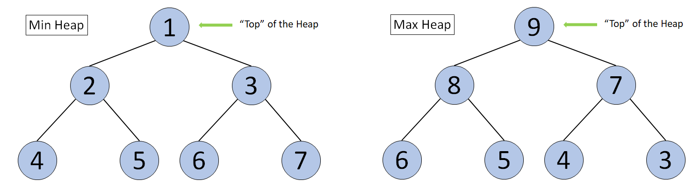
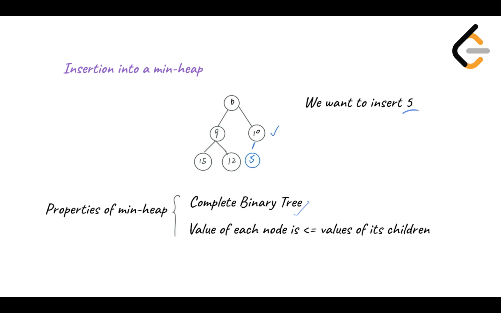
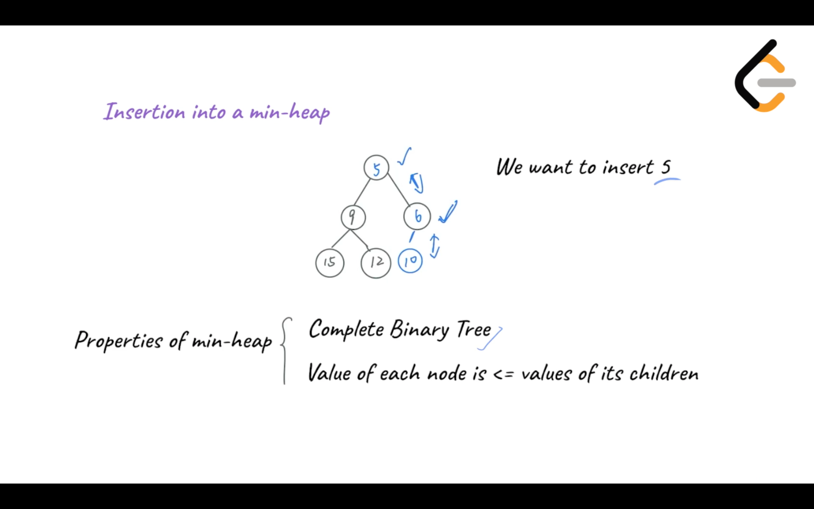
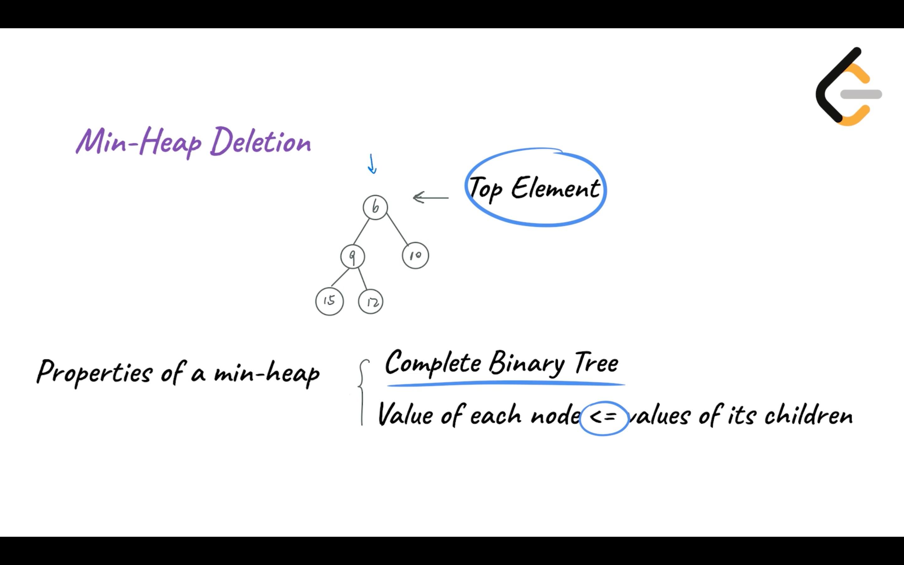
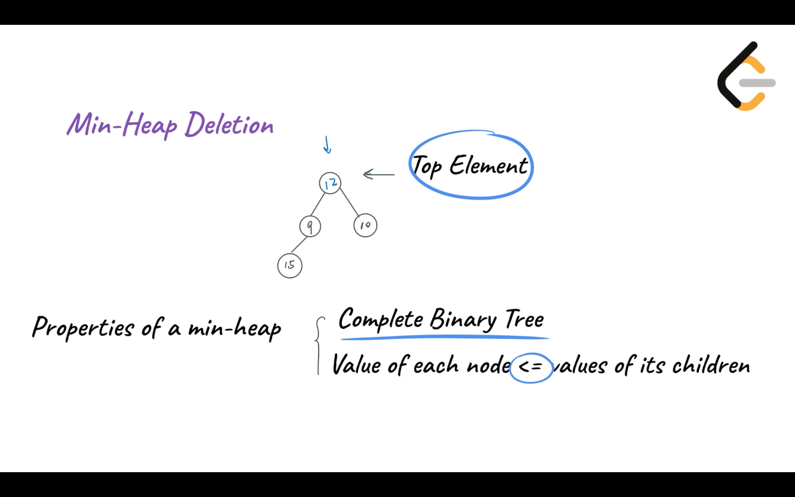
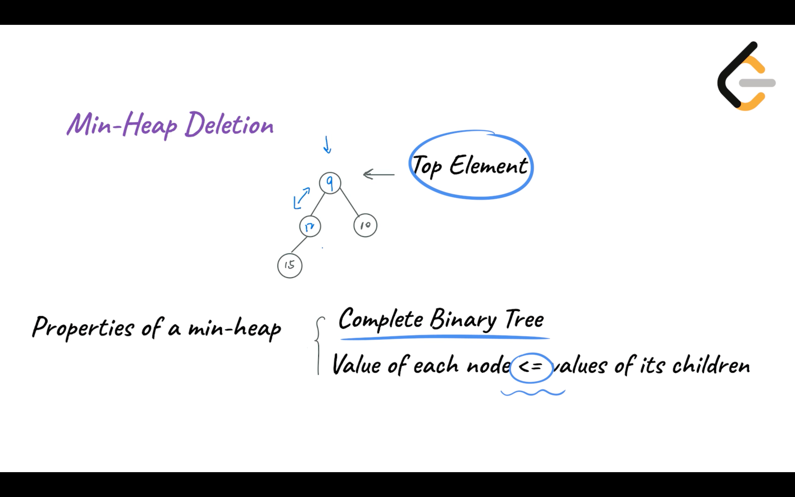

# heap

## Definition and Classification of Heap


### Priority Queues

Before introducing a Heap, let's first talk about a Priority Queue.

[Wikipedia](https://en.wikipedia.org/wiki/Priority_queue): a priority queue is an [abstract data type](https://en.wikipedia.org/wiki/Abstract_data_type) similar to a regular [queue](https://en.wikipedia.org/wiki/Queue_(abstract_data_type)) or [stack](https://en.wikipedia.org/wiki/Stack_(abstract_data_type)) data structure in which each element additionally has a "priority" associated with it. In a priority queue, an element with high priority is served before an element with low priority.

In daily life, we would assign different priorities to tasks, start working on the task with the highest priority and then proceed to the task with the second highest priority. This is an example of a Priority Queue.

A common misconception is that a Heap is the same as a Priority Queue, which is not true. A priority queue is an abstract data type, while a Heap is a data structure. Therefore, a Heap is not a Priority Queue, but a way to implement a Priority Queue.

There are multiple ways to implement a Priority Queue, such as array and linked list. However, these implementations only guarantee O(1)*O*(1) time complexity for either insertion or deletion, while the other operation will have a time complexity of O(N)*O*(*N*). On the other hand, implementing the priority queue with Heap will allow both insertion and deletion to have a time complexity of O(\log N)*O*(log*N*). So, what is a Heap?

In this chapter, we will learn to:

1. Understand the Heap data structure.
2. Understand Max Heap and Min Heap.
3. Understand the insertion and deletion of a Heap.
4. Implement a Heap.


### Definition of Heap

According to Wikipedia, a **Heap** is a special type of binary tree. A heap is a binary tree that meets the following criteria:

- Is a **complete binary tree**;
- The value of each node must be **no greater than (or no less than)** the value of its child nodes.

A Heap has the following properties:

- Insertion of an element into the Heap has a time complexity of O(\log N)*O*(log*N*);
- Deletion of an element from the Heap has a time complexity of O(\log N)*O*(log*N*);
- The maximum/minimum value in the Heap can be obtained with O(1)*O*(1) time complexity.


### Classification of Heap

There are two kinds of heaps: **Max Heap** and **Min Heap**.

- Max Heap: Each node in the Heap has a value **no less than** its child nodes. Therefore, the top element (root node) has the **largest** value in the Heap.
- Min Heap: Each node in the Heap has a value **no larger than** its child nodes. Therefore, the top element (root node) has the **smallest** value in the Heap.





Diagram of a Min Heap and a Max Heap


## Heap Insertion


**Insertion** means adding an element to the Heap. After inserting the element, the properties of the Heap should remain unchanged.

### Heap Insertion Video

In the following video we will learn how to insert a node into a heap. We will discuss this operation separately for a min heap and a max heap.






## Heap Deletion


**Deletion** means removing the “top” element from the Heap. After deleting the element, the property of Heap should remain unchanged.

### Heap Deletion Video

The following video will introduce the deletion operation in a heap. This operation will be discussed separately for a min heap and a max heap.










## Implementation of a Heap


We often perform insertion, deletion, and getting the top element with a Heap data structure.

We can implement a Heap using an array. Elements in the Heap can be stored in the array in the form of a binary tree. The code below will implement “Max Heap” and “Min Heap” for integers (In LeetCode problems or daily work, we often will use existing libraries instead of manually implementing Heap).

#### Min Heap:

```python
# Implementing "Min Heap"
class MinHeap:
    def __init__(self, heapSize):
        # Create a complete binary tree using an array
        # Then use the binary tree to construct a Heap
        self.heapSize = heapSize
        # the number of elements is needed when instantiating an array
        # heapSize records the size of the array
        self.minheap = [0] * (heapSize + 1)
        # realSize records the number of elements in the Heap
        self.realSize = 0

    # Function to add an element
    def add(self, element):
        self.realSize += 1
        # If the number of elements in the Heap exceeds the preset heapSize
        # print "Added too many elements" and return
        if self.realSize > self.heapSize:
            print("Added too many elements!")
            self.realSize -= 1
            return
        # Add the element into the array
        self.minheap[self.realSize] = element
        # Index of the newly added element
        index = self.realSize
        # Parent node of the newly added element
        # Note if we use an array to represent the complete binary tree
        # and store the root node at index 1
        # index of the parent node of any node is [index of the node / 2]
        # index of the left child node is [index of the node * 2]
        # index of the right child node is [index of the node * 2 + 1]
        parent = index // 2
        # If the newly added element is smaller than its parent node,
        # its value will be exchanged with that of the parent node 
        while (self.minheap[index] < self.minheap[parent] and index > 1):
            self.minheap[parent], self.minheap[index] = self.minheap[index], self.minheap[parent]
            index = parent
            parent = index // 2
    
    # Get the top element of the Heap
    def peek(self):
        return self.minheap[1]
    
    # Delete the top element of the Heap
    def pop(self):
        # If the number of elements in the current Heap is 0,
        # print "Don't have any elements" and return a default value
        if self.realSize < 1:
            print("Don't have any element!")
            return sys.maxsize
        else:
            # When there are still elements in the Heap
            # self.realSize >= 1
            removeElement = self.minheap[1]
            # Put the last element in the Heap to the top of Heap
            self.minheap[1] = self.minheap[self.realSize]
            self.realSize -= 1
            index = 1
            # When the deleted element is not a leaf node
            while (index <= self.realSize // 2):
                # the left child of the deleted element
                left = index * 2
                # the right child of the deleted element
                right = (index * 2) + 1
                # If the deleted element is larger than the left or right child
                # its value needs to be exchanged with the smaller value
                # of the left and right child
                if (self.minheap[index] > self.minheap[left] or self.minheap[index] > self.minheap[right]):
                    if self.minheap[left] < self.minheap[right]:
                        self.minheap[left], self.minheap[index] = self.minheap[index], self.minheap[left]
                        index = left
                    else:
                        self.minheap[right], self.minheap[index] = self.minheap[index], self.minheap[right]
                        index = right
                else:
                    break
            return removeElement
    
    # return the number of elements in the Heap
    def size(self):
        return self.realSize
    
    def __str__(self):
        return str(self.minheap[1 : self.realSize + 1])
        

if __name__ == "__main__":
    	# Test cases
        minHeap = MinHeap(5)
        minHeap.add(3)
        minHeap.add(1)
        minHeap.add(2)
        # [1,3,2]
        print(minHeap)
        # 1
        print(minHeap.peek())
        # 1
        print(minHeap.pop())
        # 2
        print(minHeap.pop())
        # 3
        print(minHeap.pop())
        minHeap.add(4)
        minHeap.add(5)
        # [4,5]
        print(minHeap)
```


#### Max Heap:

```python
# Implementing "Max Heap"
class MaxHeap:
    def __init__(self, heapSize):
        # Create a complete binary tree using an array
        # Then use the binary tree to construct a Heap
        self.heapSize = heapSize
        # the number of elements is needed when instantiating an array
        # heapSize records the size of the array
        self.maxheap = [0] * (heapSize + 1)
        # realSize records the number of elements in the Heap
        self.realSize = 0

    # Function to add an element
    def add(self, element):
        self.realSize += 1
        # If the number of elements in the Heap exceeds the preset heapSize
        # print "Added too many elements" and return
        if self.realSize > self.heapSize:
            print("Added too many elements!")
            self.realSize -= 1
            return
        # Add the element into the array
        self.maxheap[self.realSize] = element
        # Index of the newly added element
        index = self.realSize
        # Parent node of the newly added element
        # Note if we use an array to represent the complete binary tree
        # and store the root node at index 1
        # index of the parent node of any node is [index of the node / 2]
        # index of the left child node is [index of the node * 2]
        # index of the right child node is [index of the node * 2 + 1]
        parent = index // 2
        
        # If the newly added element is larger than its parent node,
        # its value will be exchanged with that of the parent node 
        while (self.maxheap[index] > self.maxheap[parent] and index > 1):
            self.maxheap[parent], self.maxheap[index] = self.maxheap[index], self.maxheap[parent]
            index = parent
            parent = index // 2
            
    # Get the top element of the Heap
    def peek(self):
        return self.maxheap[1]
    
    # Delete the top element of the Heap
    def pop(self):
        # If the number of elements in the current Heap is 0,
        # print "Don't have any elements" and return a default value
        if self.realSize < 1:
            print("Don't have any element!")
            return -sys.maxsize
        else:
            # When there are still elements in the Heap
            # self.realSize >= 1
            removeElement = self.maxheap[1]
            # Put the last element in the Heap to the top of Heap
            self.maxheap[1] = self.maxheap[self.realSize]
            self.realSize -= 1
            index = 1
            # When the deleted element is not a leaf node
            while (index <= self.realSize // 2):
                # the left child of the deleted element
                left = index * 2
                # the right child of the deleted element
                right = (index * 2) + 1
                # If the deleted element is smaller than the left or right child
                # its value needs to be exchanged with the larger value
                # of the left and right child
                if (self.maxheap[index] < self.maxheap[left] or self.maxheap[index] < self.maxheap[right]):
                    if self.maxheap[left] > self.maxheap[right]:
                        self.maxheap[left], self.maxheap[index] = self.maxheap[index], self.maxheap[left]
                        index = left
                    else:
                        self.maxheap[right], self.maxheap[index] = self.maxheap[index], self.maxheap[right]
                        index = right
                else:
                    break
            return removeElement
    
    # return the number of elements in the Heap
    def size(self):
        return self.realSize
    
    def __str__(self):
        return str(self.maxheap[1 : self.realSize + 1])
        

if __name__ == "__main__":
    	# Test cases
        maxHeap = MaxHeap(5)
        maxHeap.add(1)
        maxHeap.add(2)
        maxHeap.add(3)
        # [3,1,2]
        print(maxHeap)
        # 3
        print(maxHeap.peek())
        # 3
        print(maxHeap.pop())
        # 2
        print(maxHeap.pop())
        # 1
        print(maxHeap.pop())
        maxHeap.add(4)
        maxHeap.add(5)
        # [5,4]
        print(maxHeap)
```


