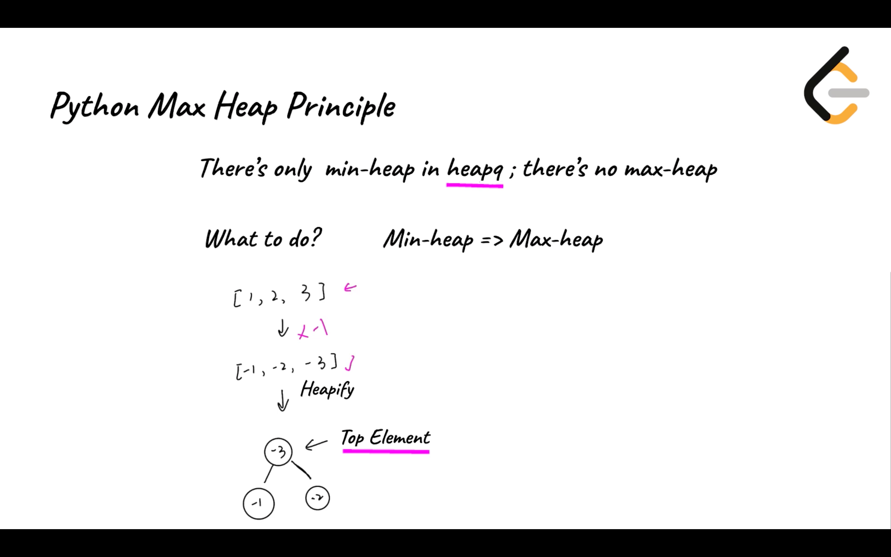
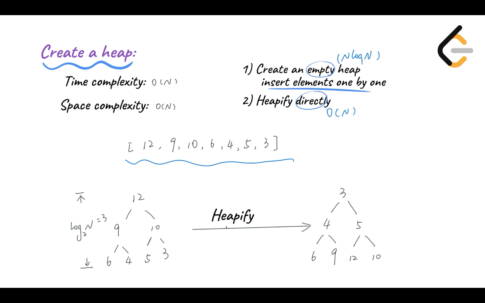
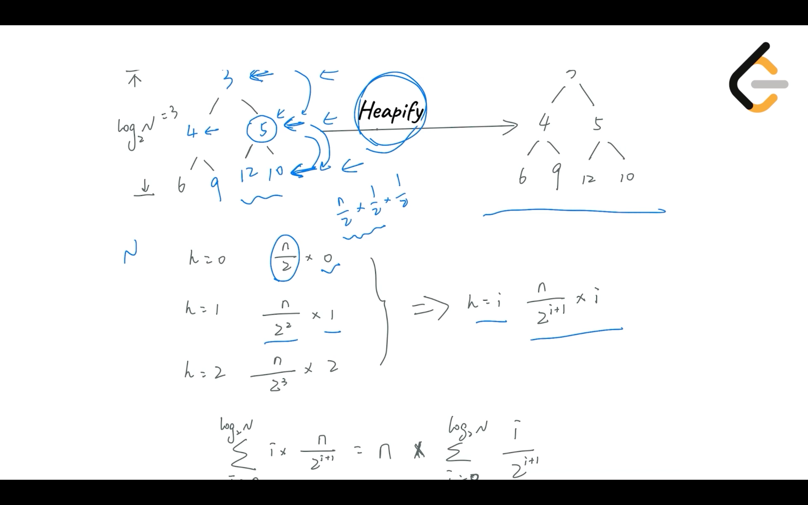
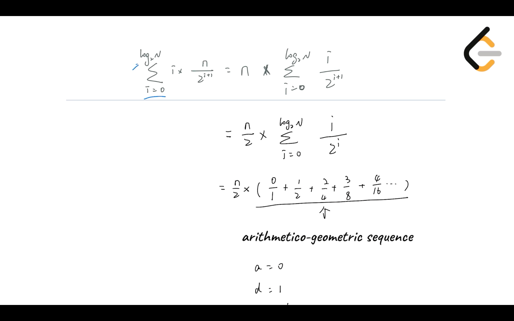
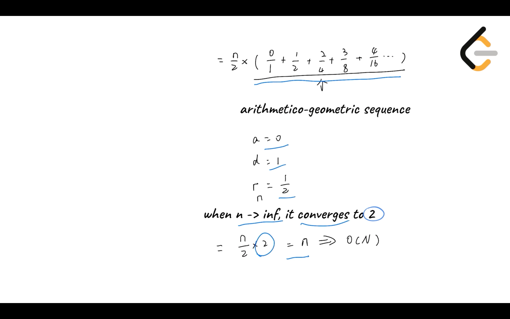

# Common applications of Heap

## Common applications of Heap


In most programming languages, Heaps are already built-in. Therefore, we usually do not need to implement a Heap from scratch. However, to use Heap adequately, we need to understand how Heap is commonly used.

In this chapter, we will learn how to:

- Construct a Max Heap and a Min Heap.
- Insert elements into a Heap.
- Get the top element of a Heap.
- Delete the top element from a Heap.
- Get the length of a Heap.
- Perform time and space complexity analysis for common applications that use a Heap.


## Construct a Heap


Constructing a Heap means initializing an instance of a Heap. All methods of Heap need to be performed on an instance. Therefore, we need to initialize an instance before applying the methods. When creating a Heap, we can simultaneously perform the **heapify** operation. Heapify means converting a group of data into a Heap.

Time complexity: *O*(*N*).

Space complexity: *O*(*N*).

```python
import heapq

# Construct an empty Min Heap
minHeap = []
heapq.heapify(minHeap)

# Construct an empty Max Heap
# As there are no internal functions to construct a Max Heap in Python,
# So, we will not construct a Max Heap.

# Construct a Heap with Initial values
# this process is called "Heapify"
# The Heap is a Min Heap
heapWithValues = [3,1,2]
heapq.heapify(heapWithValues)

# Trick in constructing a Max Heap
# As there are no internal functions to construct a Max Heap
# We can multiply each element by -1, then heapify with these modified elements.
# The top element will be the smallest element in the modified set,
# It can also be converted to the maximum value in the original dataset.
# Example
maxHeap = [1,2,3]
maxHeap = [-x for x in maxHeap]
heapq.heapify(maxHeap)
# The top element of maxHeap is -3
# Convert -3 to 3, which is the maximum value in the original maxHeap
```


### Python Max Heap Video

Python's built-in heap module, **[heapq](https://docs.python.org/3/library/heapq.html)**, differs from the standard implementation of a heap in two ways. Firstly, it uses zero-based indexing, and this means that it stores the root node at index zero instead of the size of the heap. As a result, the relationship between the index of the children and parent nodes is slightly different. Secondly, the built-in heapq module does not offer a direct way to create a max heap. Instead, we must modify the value(s) of each element when inserting it into the heap and when removing it from the heap. In the following video, we will learn more about this process. There are several benefits from implementing a heap in this way (you can read about them in the previous link).




## Inserting an Element


Insertion means inserting a new element into the Heap. Note that, after the new element is inserted, properties of the Heap are still maintained.

Time complexity: *O*(log*N*)

Space complexity: *O*(1)

```python
# Insert an element to the Min Heap
heapq.heappush(minHeap, 5)

# Insert an element to the Max Heap
# Multiply the element by -1
# As we are converting the Min Heap to a Max Heap
heapq.heappush(maxHeap, -1 * 5)
```


## Getting the Top Element of the Heap


The top element of a Max heap is the maximum value in the Heap, while the top element of a Min Heap is the smallest value in the Heap. The top element of the Heap is the most important element in the Heap.

Time complexity: *O*(1).

Space complexity: *O*(1).

```python
# Get top element from the Min Heap
# i.e. the smallest element
minHeap[0]
# Get top element from the Max Heap
# i.e. the largest element
# When inserting an element, we multiplied it by -1
# Therefore, we need to multiply the element by -1 to revert it back
-1 * maxHeap[0]
```


## Deleting the top element


Note that, after deleting the top element, the properties of the Heap will still hold. Therefore, the new top element in the Heap will be the maximum (for Max Heap) or minimum (for Min Heap) of the current Heap.

Time complexity: *O*(log*N*).

Space complexity: *O*(1).

```python
# Delete top element from the Min Heap
heapq.heappop(minHeap)

# Delete top element from the Max Heap
heapq.heappop(maxHeap)
```


## Getting the Length of a Heap


The length of the Heap can be used to determine the size of the current heap, and it can also be used to determine if the current Heap is empty. If there are no elements in the current Heap, the length of the Heap is zero.

Time complexity: *O*(1)

Space complexity: *O*(1)

```python
# Length of the Min Heap
len(minHeap)

# Length of the Max Heap
len(maxHeap)
```


## Space and Time Complexity


| Heap method            | Time complexity | Space complexity |
| ---------------------- | --------------- | ---------------- |
| Construct a Heap       | *O*(*N*)        | *O*(*N*)         |
| Insert an element      | *O*(log*N*)     | *O*(1)           |
| Get the top element    | *O*(1)          | *O*(1)           |
| Delete the top element | *O*(log*N*)     | *O*(1)           |
| Get the size of a Heap | *O*(1)          | *O*(1)           |

*N* is the number of elements in the heap.


### Time and Space Complexity Video

The following video will analyze the time and space complexity of each of the common operations of a heap. This includes creating a heap, inserting an element into a heap, getting the top element, removing the top element, and getting the size of the heap.













##  Complete Code


Listed below is the code for common methods of Heap. We strongly suggest that you type line by line into your text editor, run these methods and understand the underlying logic flow of each method.


#### Min Heap:

```python
# Code for Min Heap
import heapq

# Create an array
minHeap = []

# Heapify the array into a Min Heap
heapq.heapify(minHeap)

# Add 3，1，2 respectively to the Min Heap
heapq.heappush(minHeap, 3)
heapq.heappush(minHeap, 1)
heapq.heappush(minHeap, 2)

# Check all elements in the Min Heap, the result is [1, 3, 2]
print("minHeap: ", minHeap)

# Get the top element of the Min Heap
peekNum = minHeap[0]

# The result is 1
print("peek number: ", peekNum)

# Delete the top element in the Min Heap
popNum = heapq.heappop(minHeap)

# The result is 1
print("pop number: ", popNum)

# Check the top element after deleting 1, the result is 2
print("peek number: ", minHeap[0])

# Check all elements in the Min Heap, the result is [2,3]
print("minHeap: ", minHeap)

# Check the number of elements in the Min Heap
# Which is also the length of the Min Heap
size = len(minHeap)

# The result is 2
print("minHeap size: ", size)
```


#### Max Heap:

```python
# Code for Max Heap
import heapq

# Create an array
maxHeap = []

# Heapify the array into a Min Heap
# we need to negate each element to convert the Min Heap to a Max Heap
heapq.heapify(maxHeap)

# Add 1，3，2 respectively to the Max Heap
# Note we are actually adding -1, -3 and -2 after negating the elements
# The Min Heap is now converted to a Max Heap
heapq.heappush(maxHeap, -1 * 1)
heapq.heappush(maxHeap, -1 * 3)
heapq.heappush(maxHeap, -1 * 2)

# Check all elements in the Max Heap, the result is [-3, -1, -2]
print("maxHeap: ", maxHeap)

# Check the largest element in the Heap, which is min value in the -1 * Heap
peekNum = maxHeap[0]

# The result is 3
print("peek number: ", -1 * peekNum)

# Delete the largest element in the Max Heap
# Which is the smallest value in the current Heap
popNum = heapq.heappop(maxHeap)

# The result is 3
print("pop number: ", -1 *  popNum)

# Check the largest element after deleting 3, the result is 2
print("peek number: ", -1 * maxHeap[0])

# Check all elements in the Max Heap, the result is [-2,-1]
print("maxHeap: ", maxHeap)

# Check the number of elements in the Max Heap
# Which is also the length of the Min Heap
size = len(maxHeap)

# The result is 2
print("maxHeap size: ", size)
```

