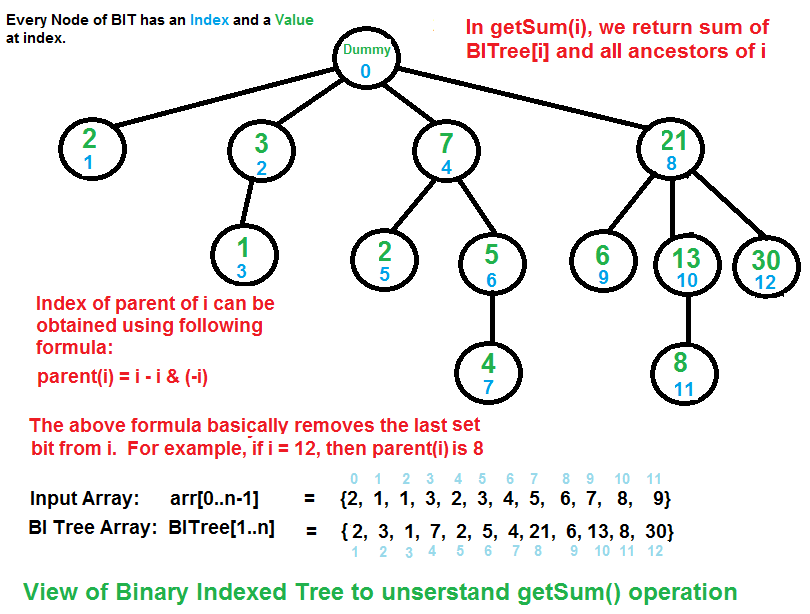

# Explore

## Data type

|           | int                           | string                                                       | hexstring                                  | binary                                      | Bytearray                     | float                             |
| --------- | ----------------------------- | ------------------------------------------------------------ | ------------------------------------------ | ------------------------------------------- | ----------------------------- | --------------------------------- |
| int       |                               |                                                              |                                            | [int to binary](#Convert-integer-to-binary) | [int to bytes](#int-to-bytes) |                                   |
| string    |                               | [str](#str), [literals](#String-literals), [Template](#string.Template) |                                            |                                             |                               |                                   |
| hexstring |                               |                                                              |                                            |                                             |                               |                                   |
| binary    |                               |                                                              |                                            |                                             |                               |                                   |
| bytearray | [bytes to int](#bytes-to-int) | [bytes to string](#decode-bytes-to-string)                   | [bytes to hexstring](#bytes-to-hex-string) |                                             |                               | [bytes to float](#bytes-to-float) |
| float     |                               | [format float](#float-to-string)                             |                                            |                                             |                               |                                   |

## Data structure

|                             |                                    |
| --------------------------- | ---------------------------------- |
| list                        | [list](#list)                      |
| collections.deque           | [deque](#Deque-in-python-&-java)   |
| tuple                       | [tuple](#tuple)                    |
| set                         | [set](#set)                        |
| dict                        | [dict](#dict)                      |
| heapq                       | [heapq](#heapq)                    |
| Enum                        | [Enum](#Enum-class)                |
| collections.Counter         | [counter](#Counter)                |
| sortedcontainers.SortedList | [SortedList](#bisect-&-SortedList) |

## Tree data structure

Tree are implemented from list in python

#### basic type: `binary search tree`

- A `full binary tree` (sometimes proper binary tree or 2-tree) is a tree in which every node other than the leaves has two children. 

  [](https://web.cecs.pdx.edu/~sheard/course/Cs163/Doc/FullvsComplete.html)

- A `complete binary tree` is a binary tree in which every level, except possibly the last, is completely filled, and all nodes are as far left as possible. [](https://web.cecs.pdx.edu/~sheard/course/Cs163/Doc/FullvsComplete.html)

- [heap](#heapq in python): min heap / max heap, heapq is a complete binary tree

- segment tree

- binary indexed tree(fenwick tree): [2179. Count Good Triplets in an Array](2179. Count Good Triplets in an Array.md)

## heapq

heap queue, aka priority queue, always keep all elements sorted with smallest element in the first position

#### two different properties:

- zero-based indexing, `h[i]`'s children are `h[2 * i + 1]` and `h[2 * i + 2]`
- min-heap, pop method returns the smallest element tip: if you want to implement a max heap, just negative all elements

#### common use functions

- initialize: `h = []` or `heapq.heapify(list)`

> here is a trick:
>
> heapify is actually sorting all elements in list
>
> this method do not return a heapq, on the other hand, it modifies the original list, converting it to a heapq, just like arr.sort()

- `heappush(heap, item)`
- `heappop(heap)`
- `heappushpop(heap, item)`: push item first, then pop the smallest item
- `heapreplace(heap, item)`: pop smallest item first, then push item
- `merge(list1, list2)`
- `merge(*iterables, key=None, reverse=False)` do not know how to use...
- nlargest/nsmallest: return a list

## pointer operations in python

this is really confusing to me at the first time, but after thinking about what we do in programming C, all things become extremely clear to me.

#### ListNode

```python
# Definition for singly-linked list.
class ListNode:
    def __init__(self, val=0, next=None):
        self.val = val
        self.next = next
```

ListNode in python is worldwidely used as LinkedList in Java Now, think about the following codes:

```Python
cur = ListNode(1, next=ListNode(2, next=ListNode(3)))
# cur: 1 -> 2 -> 3 -> None
head = jump = ListNode(0)
# head = jump: 0 -> None

# head is the real leader, never got changed, a pointer which point to the first node
# head.next is where we store our result

head.next = l = cur # pre.next = cur as well
#       0     ->    1    ->    2    ->    3   ->   None
#       ↑           ↑                     
#  head & jump      l                     

# after several operations, imagine a situation like this:
#           r ->    3    ->    None
#                   ↑
#       0     ->    1    <-    2 
#       ↑           ↑          ↑ 
#  head & jump      l         pre

jump.next = pre
#       0     ->    2    ->    1    ->    3   ->   None
#       ↑           ↑          ↑          ↑
#  head & jump     pre         l          r

jump = l 
# this is confusing to me at first
# this statement does not replace jump with l
# it changes jump pointer, pointing to where l points
# hence, head will not be affected
#       0     ->    2    ->    1    ->    3   ->   None
#       ↑           ↑          ↑          ↑
#     head         pre       l & jump     r

l = r
# this is the same as above one, just change pointer l's location
#       0     ->    2    ->    1    ->    3   ->   None
#       ↑           ↑          ↑          ↑
#     head         pre        jump      l & r
```

## Binary Search Tree, BST for short

also called an **ordered**, or **sorted** search tree.

node.val is greater than all values from its left subtree, and less than all values from its right subtree.

## Structural Pattern Matching(PEP 634)

new feature in 3.10 pre.

- no break

```python
match subject:
    case <pattern_1>:
        <action_1>
    case <pattern_2>:
        <action_2>
    case <pattern_3>:
        <action_3>
    case _:
        <action_wildcard>
```

#### Guard

We can add an if clause to a pattern, known as a “guard”. If the guard is false, match goes on to try the next case block. Note that value capture happens before the guard is evaluated:

```python
match point:
    case Point(x, y) if x == y:
        print(f"The point is located on the diagonal Y=X at {x}.")
    case Point(x, y):
        print(f"Point is not on the diagonal.")
```

## List

to use `List` type:

```python
from typing import List
a = ['a', '', '']
a.remove('') # remove one matched element at one time
```

#### append a list to another list

```python
list1.extend(list2)
```

#### add operator is compatible with list

```python
ans = list()
ans += (1, 2), (2, 3)
```

#### search for element in a list

```python
a.index(1) # value error if element is not exist
# a.find(1) this function is not implemented in list
```

#### count specific element in a list

```python
a.count(1)
```

#### remove an element from list

```python
del a[1] # by index
a.remove('a') # by value, value error if not exist
# only the first occurrence will be removed
a.pop(index = -1) # pop last element by default, or specific element if an index is passed as argument
```

#### remove all empty string from a list

```python
# using list.remove()
while '' in a:
    a.remove('')

# form a new list
a = [i for i in a if i]

# using filter, incredible
str_list = list(filter(None, str_list))
str_list = list(filter(bool, str_list))
str_list = list(filter(len, str_list))
str_list = list(filter(lambda item: item, str_list))
```

#### filter(function, sequence)

- function: function that tests if each element of a sequence true or not.
- sequence: sequence which needs to be filtered, it can be sets, lists, tuples, or containers of any iterators.
- returns: returns an iterator that is already filtered.

## set

- `.remove()` raise an keyError if element does not exist
- `.discard()` will not raise error
- `.pop()` pop out an arbitrary element, and will raise an error if set is empty
- `.update()` inserts the items in set2 into set1

```python
set1.update(set2)
set1.add(element)
```

- merge two sets


```python
ans = {1, 2} 
ans |= {2, 3} # ans = {1, 2, 3}
```

- `.union()` returns a new set with all items from both sets

```python
set3 = set1.union(set2)
```

- common operations between sets

```python
# SET1 -> {A {B} C} <- SET2
set1.union(set2) = A + B + C
set1.intersection(set2) = B
set1.difference(set2) = A
set1.symmetric_difference(set2) = A + C

set1.issubset(set2)
set1.issuperset(set2)
```

## str

- reverse a string
```python
a[::-1]
```

- str.capitalize() capitalize the first char if isalpha

```python
a.capitalize()
```

- str.index(pattern) vs str.find(pattern)

```python
text = 'No[b]'
text.index('[b]')
2
# raise an valueError if symbol not found in text
text.index(symbol)
# return -1 is symbol not found in text
text.find(symbol)
# return index of the last occurrance of symbol
text.rfind(symbol)
```

- str.isdigit() str.isdecimal() str.isnumeric()

It mainly crops up with various unicode characters, such as ^2^

```python
c = '\u00B2'
c.isdecimal()
False
c.isdigit()
True
```

You can also go further down the careful-unicode-distinction rabbit hole with the `isnumeric` method

```python
c = '\u00BD' # ½
c.isdecimal()
False
c.isdigit()
False
c.isnumeric()
True
```

- str.isupper() str.islower()

Return `True` if all cased characters in the string are uppercase/lowercase and there is at least one cased character, `False` otherwise.

## dict

```python
d = collections.defaultdict(list)
d = collections.defaultdict(int)

# create dict from a n*2 list
li = [[1, 2], [2, 4]]
li_dict = dict(li)
# {1: 2, 2: 4}
```

## Union-find algorithm

#### 947. Most Stones Removed with Same Row or Column

On a 2D plane, we place n stones at some integer coordinate points. Each coordinate point may have at most one stone.

A stone can be removed if it shares either the same row or the same column as another stone that has not been removed.

Given an array stones of length n where `stones[i] = [xi, yi]` represents the location of the ith stone, return the largest possible number of stones that can be removed.

```java
// union-find algorithm
// each stone is an edge, connect two nodes(one row and one column)
// we can remove all stones except for last one in the same tree(island)
// hence, the left stones equal to the number of trees(islands)
HashMap<Integer, Integer> root = new HashMap<>();
int island = 0;

public int removeStones(int[][] stones) {
    // attention: we need to find a way to distinguish rows and columns
    // since they both start from 1, 2, 3...
    // attempt 1: 1 ~ (N - 1) represent for rows, while N ~ (N + M - 1) for columns
    // attempt 2: 1 ~ (N - 1) for rows, while ~(1 ~ (M - 1)) for columns
    for(int i = 0; i < stones.length; i++)
        union(stones[i][0],  ~stones[i][1]);
    return stones.length - island;
}
int find(int a) {
    // a new island found with single stone(a)
    if(root.putIfAbsent(a, a) == null) island++; 
    if(root.get(a) != a) root.put(a, find(root.get(a)));
    return root.get(a);
}
void union(int a, int b) {
    if(find(a) == find(b)) return;
    root.put(find(a), find(b));
    island--; // two islands got connected
}
```

python version:

```python
# union find
group = [i for i in range(n)] # group[i] = i after initialization

def find(x):
    if group[x] == x: return x
    """
    this line is fucking essential!!! 
    improved time complexity a lot. 
    when you try to find root of x, it takes only 1 step to reach the end. ↓↓↓
    """ 
    group[x] = find(group[x])
    """
    imagine this condition:
    group[2] = 5 -> group[5] = 3 -> group[3] = 7 -> group[7] = 7
    it recursively call find method for four times when you try to find root of 2, everytime, repeatedly.
    what optimization can we do? 
    Actually, after first traversal on 2, we already know that its root and all mid nodes' root are 7. We can direct update group[2] = group[5] = group[3] = group[7] = 7 by adding this line.
    """
    return group[x]

def union(x, y):
    x_group, y_group = find(x), find(y)
    if x_group != y_group:
        group[x_group] = y_group

# pesudo code
for i, j in edge:
    if find[i] == find[j]: continue
    union(i, j)

# now you successfully generate a island map
```

#### 952. Largest Component Size by Common Factor

```python
# union find
n = max(nums)
count = Counter()
group = [i for i in range(n + 1)]

def find(x):
    if group[x] == x: return x
    group[x] = find(group[x])
    return group[x]

def union(x, y):
    x_group, y_group = find(x), find(y)
    if x_group != y_group:
        group[x_group] = y_group

for a in nums:
    for num in range(2, int(math.sqrt(a) + 1)):
        if a % num == 0:
            union(a, num)
            union(a, a // num)

for a in nums: count[find(a)] += 1
return max(count.values())
```

## collections

#### Counter

A Counter is a dict subclass for counting hashable objects. It is a collection where elements are stored as dictionary keys and their counts are stored as dictionary values. Counts are allowed to be any integer value including zero or negative counts.

```python
arr = [1, 1, 7]
count = collections.Counter(arr)
# Counter({1: 2, 7: 1})
```

## sort with customize functions

```python
arr.sort(key=functools.cmp_to_key(lambda x, y: 1 if abs(x) > abs(y) else -1))
# more concise
arr.sort(key=abs)

# multiple sort keys
arr.sort(key=lambda x: (-x[0], x[1]))

# sort original list
sorted(arr, key=abs) # do not affect original list
```

## Lambda one-line function

```python
x = lambda a : (str)((int)(a * 3000))
print(x(0.36))
print(x(10))

key = lambda x, y: 1 if abs(x) > abs(y) else -1
key = lambda x: (-x[0], x[1])

function_name = lambda input_arg: ans
# this one-line lambda function is equivalent to the following defination
def function_name(input_arg):
    return ans
```

## conversion among diverse object types

```python
i = 10000
b = b'\xc2\xda\x7a\x77'
f = 1.314
```

###### bytes to int

```python
int.from_bytes(b, byteorder = 'little', signed=True)
```

###### int to bytes

```python
i.to_bytes(4, byteorder='little', signed=True)
```

###### bytes to float

```python
# native byte order (little-endian on my machine)
struct.unpack('f', b)[0] # 1.7230105268977664e+16
# big-endian 
struct.unpack('>f', b)[0] # -109.22724914550781
```

###### decode bytes to string

```python
b.decode("utf-8")
```

###### bytes to hex string

```python
b.hex()
```

###### float to string

```python
"{:.2f}".format(f)
```


## multiple for loops and if in the same statement

The best way to remember this is that the order of for loop inside the list comprehension is based on the order in which **they appear in traditional loop approach**. Outer most loop comes first, and then the inner loops subsequently.

So, the equivalent list comprehension would be:

```python
[entry for tag in tags for entry in entries if tag in entry]
```

In general, **if-else statement comes before the first for loop**, and if you have just an if statement, it will come at the **end**. For e.g, if you would like to add an empty list, if tag is not in entry, you would do it like this:

```python
[entry if tag in entry else [] for tag in tags for entry in entries]
```

## zip() in python

```python
a =     [0, 1, 2]
a[1:] = [1, 2]
b =     [1, 2, 0]
# here is a little trick: to form a list of (a[i], a[i + 1], b[i])
tuple(zip(a, a[1:], b)) = ((0, 1, 1), (1, 2, 2))
```

## tuple

- tuple is immutable
- tuple can be key as well as value in dict

there are two common ways to modify a tuple:

- generate a new tuple with new value, and replace the elder one
- use += operator:

```python
>>> t = {'k': (1, 2)}
>>> t['k'] += (3,)
>>> t
{'k': (1, 2, 3)}
```

## periodical function

```python
# this function will be called every 2 seconds
def periodical_func():
    print(time.time())
    time.sleep(1)
    threading.Timer(1, periodical_func).start()

periodical_func() # first call here
```

## traverse dict by sorted value

```python
for k, v in sorted(x.items(), key=lambda item: item[1]):
    # your code
```

## itertools.chain

It is a function that takes a series of iterables and returns one iterable. It groups all the iterables together and produces a single iterable as output. Its output cannot be used directly and thus explicitly converted into iterables.

```python
# inner implementation
def chain(*iterables):
	for it in iterables:
       	for each in it:
           	yield each

chain (*iterables)

# example
# a list of odd numbers
odd = [1, 3, 5, 7, 9]
# a list of even numbers
even = [2, 4, 6, 8, 10]
# chaining odd and even numbers
numbers = list(chain(odd, even))
# [1, 3, 5, 7, 9, 2, 4, 6, 8, 10]
```

just concatenate multiple iterators together without any additional operations.

## itertools.product

In the terms of Mathematics Cartesian Product of two sets is defined as the set of all ordered pairs (a, b) where a belongs to A and b belongs to B.

```python
arr1 = [1, 2, 3] 
arr2 = [5, 6, 7] 
# product(arr1, arr2)
[(1, 5), (1, 6), (1, 7), (2, 5), (2, 6), (2, 7), (3, 5), (3, 6), (3, 7)]

arr1 = [10, 12] 
arr2 = [8, 9, 10] 
# product(arr1, arr2)
[(10, 8), (10, 9), (10, 10), (12, 8), (12, 9), (12, 10)] 
```

- **`itertools.product(*iterables, repeat=1)`:**
  It returns the cartesian product of the provided iterable with itself for the number of times specified by the optional keyword “repeat”. For example, `product(arr, repeat=3)` means the same as `product(arr, arr, arr)`.
- **`itertools.product(*iterables)`:**
  It returns the cartesian product of all the iterable provided as the argument. For example, `product(arr1, arr2, arr3)`.

## String literals

- `f'{variable}'` represented formatted string
- `r''` represented raw string, which treat backslashes as literal characters
- `b''` byte string, which produce an instance of the [`bytes`](https://docs.python.org/3/library/stdtypes.html#bytes) type instead of the [`str`](https://docs.python.org/3/library/stdtypes.html#str) type

```python
a = 1
print(f'a = {a}')
print(r'/User/huayu/Downloads/')
print(b'\x00\xff')
```

## Jupyter

coding notebook, can view realtime variable states

⇧ ⌘ P: create new blank notebook


## pytest

1. mkdir test && cd test
2. create empty __init\_\_.py file
3. create test_sample.py file and write test cases in this file
4. **==Prepare test cases first, then write your real test function==**

```python
def test_function():
    input_data = '***'
    result = function_to_be_test(input_data)
    assert variable == result
```

## kwarg

[https://book.pythontips.com/en/latest/args_and_kwargs.html](https://book.pythontips.com/en/latest/args_and_kwargs.html)

\*args and \*\*kwargs are mostly used in function definitions. *args and \*\*kwargs allow you to pass an ==unspecified number of arguments== to a function, so when writing the function definition, you do not need to know how many arguments will be passed to your function. \*args is used to send a ==non-keyworded== variable length argument list to the function.

```python
def test_var_args(f_arg, *argv):
    print(f_arg)
    print(argv)
test_var_args('yasoob', 'python', 'eggs', 'test')

"""output
yasoob
('python', 'eggs', 'test')
"""

def greet_me(**kwargs):
    for k, v in kwargs.items():
        print(k, v)
greet_me(a = 1, b = 2)

"""output
a 1
b 2
"""
```

## count non-zero bit

Python 3.10 introduce a new function:[`int.bit_count()`](https://docs.python.org/3.10/library/stdtypes.html#int.bit_count)

This is functionally equivalent to `bin(n).count("1")` but should be [~6 times faster](https://github.com/python/cpython/pull/771#issuecomment-288570744).

## simple command-line http server

```shell
python3 -m http.server 7777
```

## pdf export

选取图像，从pdf中截取矢量图，可以导入画图软件(paid app)

## Another trick of a = 1 if True else 2

```python
b = 1
a = 'XO'[b == 1]
# since b == 1 is True, True is equivalent to 1, 'XO' is a string
# 'XO'[0] = 'X', 'XO'[1] = 'O'
```

#### There is a trap in this code syntax:

Think about this line `[a/b, b][b==0]`. This line will generate a string/list/dict/.. whatever object, and calculate results for both conditions even though you will pick up only one of them eventually. Thus, if one of them got error, it will throw an Exception. While if..else.. only run the True part.

But still, this syntax is excellent. And we should always learn new thoughts from others

## regex

- `re.sub`(*pattern*, *repl*, *string*, *count=0*, *flags=0*)[¶](https://docs.python.org/3/library/re.html#re.sub)

Return the string obtained by replacing the leftmost non-overlapping occurrences of *pattern* in *string* by the replacement *repl*. If the pattern isn’t found, *string* is returned unchanged. *repl* can be a `string` or a `function`

```python
import re
# replace value="<old_param_value>" to value="<new_param_value>"
# r'\b' empty matches only when string is not adjacent to a previous character
line = re.sub(r'\bvalue="[a-zA-Z0-9]*"', rf'value="{post_data[param]}"', line, 0, 0)
```

- `\b` matches the empty string, but only at the beginning and end of a word. `\b` is defined as the ==boundary== between a `\w` and a `\w` character. It is equivalent to the match whole word option when you are searching for some text.
- `\d` matches any decimal ==digit==. This is equivalent to [0-9].
- `\D` matches any character which is ==not== a decimal ==digit==. opposite of `\d`.
- `\s` matches the ==whitespace== characters.

## match object

`re.search()` & `re.match()` returns a match object

```python
>>> m = re.match(r"(\w+) (\w+)", "Isaac Newton, physicist")
>>> m.group(0)       # The entire match
'Isaac Newton'
>>> m.group(1)       # The first parenthesized subgroup.
'Isaac'
>>> m.group(2)       # The second parenthesized subgroup.
'Newton'
>>> m.group(1, 2)    # Multiple arguments give us a tuple.
('Isaac', 'Newton')
```

```python
# start/end index of first match
temp = 'hello world hello'
m = re.search('hello', temp)
m.start()
0
m.end()
5
```

## Nohup

`-u` not buffering output stream

`>>` append to file, not truncated previous log

```shell
nohup python3 -u ./test.py > test.log &
nohup python3 -u sort_test_server.py >> sort_test_server.log 2>&1 &
```

#### disable stdout buffer

- python

```python
# in single print line
print('hello', flush=True)
# flush stdout buffer
sys.stdout.flush()
# using -u when run python script
nohup python3 -u ./test.py > test.log &
```

- c

```c
setvbuf(stdout, NULL, _IONBF, 0);
```

## subprocess

The child process receives the same SIGINT as your parent process because it's in the same process group. You can put the child in its own process group by calling `os.setpgrp()` in the child process. Popen's `preexec_fn` argument is useful here:

- `preexec_fn=os.setpgrp`: make script to run even when its parent process is killed

```python
# The child process receives the same SIGINT as your parent process 
# because it's in the same process group. 
# You can put the child in its own process group by calling os.setpgrp() in the child process. 
# Popen's preexec_fn argument is useful here:
# preexec_fn=os.setpgrp: make script to run even when its parent process is killed
subprocess.Popen(['nohup', './test_c_api_sdo_retry.elf', nodeid, '2147483647', speed, homing, acc, '>> test_c_api.logg 2>&1 &'],
        stdout=subprocess.PIPE, # default
        stderr=open('err.log', 'a'), # redirect to custom file | 'w': write | 'a': append
        preexec_fn=os.setpgrp)

subprocess.run(['python3 test.py', '-i', nodeid, '>> test.log'])
```

## get local ip address

```python
def get_host_ip():
    try:
        s = socket.socket(socket.AF_INET, socket.SOCK_DGRAM)
        s.connect(('8.8.8.8', 80))
        ip = s.getsockname()[0]
    finally:
        s.close()
    return ip
```

## interesting code style

```python
target = sum(nums)

# code by junior programmer
if target % 2: return False
target //= 2

# code by experienced programmer
if target & 1: return False
target >>= 1
```

## random

```python
import random

# choose k unique random elements from a nums
# nums could be a list or a set
def random.sample(nums, k)

# ex.
sample([1, 5, 10, 7], 4)
sample(range(100), 20)

# there is a hiden argument: count = None
# represents for the count of each element
sample([1, 10], counts = [3, 2], k = 2)
# input list = [1, 1, 1, 10, 10]
```

## Built-in method

Example: count word in string

image macro defination, you can replace `low_count` with `text.lower().split().count`

```python
# low_count is used as a built-in method
low_count = text.lower().split().count
return {w: low_count(w) for w in words}
```

## map(function, sequence)

```python
pawn = 'a3'
c, r = map(ord, pawn)
time = '13:16'
h, m = map(int, time.split(':'))
# replace key with value
d = dict()
map(d.get, d.keys())
```

## Enum class

```python
from enum import Enum
class Conveyor_state(Enum):
    Idle = 1
    Ready = 2
    Loading = 3
    
Conveyor_state.Idle # Conveyor_state.Idle
repr(Conveyor_state.Idle) # <Conveyor_state.Idle: 1>
type(Conveyor_state.Idle) # <enum 'Conveyor_state'>
isinstance(Conveyor_state.Idle, Conveyor_state) # True
```

Enumerations support ==iteration==, in definition order:

```python
for state in Conveyor_state:
    print(state)
# Conveyor_state.Idle
# Conveyor_state.Ready
# Conveyor_state.Loading
list(Conveyor_state)
# [<Conveyor_state.Idle: 1>, <Conveyor_state.Ready: 2>, <Conveyor_state.Loading: 3>]
```

Enumeration members are ==hashable==, so they can be used in dictionaries and sets.

#### Access to enumeration members and their attributes

- by value `Conveyor_state(1)`

- by name `Conveyor_state.Idle` or `Conveyor_state['Idle']`

Enum members have a property that contains their ==name/value==:

```python
Conveyor_state.Loading.name # Loading
Conveyor_state.Loading.value # 3
```

#### Annotations

- `@enum.unique` Enum members must have unique names while their values can be duplicate, unless you add an annotation ahead of Enum class like the following:

```python
from enum import Enum, unique
@unique
class Mistake(Enum):
    ONE = 1
    TWO = 2
    THREE = 2
```

#### Automatically assign values to enum members

```python
from enum import Enum, auto
class Color(Enum):
    RED = auto() # this will automatically assign 1 to RED
    ...
```

#### One-line

```python
CS = Enum('Conveyor_state', 'Idle Ready Loading')
print(list(CS))
# [<Conveyor_state.Idle: 1>, <Conveyor_state.Ready: 2>, <Conveyor_state.Loading: 3>]
print(CS(1).name)
# Idle
```

## string.Template

```python
from string import Template
s = Template('state is $state')
curr_state = Conveyor_state.Idle
s.substitute(state=curr_state.name)
# state is Idle

from datetime import datetime
s = Template(f'{datetime.now()} state is $state')
s.substitute(state='idle')
# '2021-12-24 15:26:36.211590 state is idle'
```

==safe_substitute== allows you to parse only part of arguments, while substitute will throw an Exception.

```python
Template('$who likes $what').safe_substitute(d)
# 'tim likes $what'
```

- `"identifier"` is restricted to any case-insensitive ASCII ==alphanumeric== string (including underscores) that ==starts== with an ==underscore== or ASCII ==letter==. The first non-identifier character after the `$` character terminates this placeholder specification.

```python
Template('$_1').substitute(_1=1) # 1
Template('$_ 1').substitute(_=1) # 1 1
Template('$1').substitute(1) # ValueError
Template('$_1').substitute(_=1) # KeyError
Template('$_1').safe_substitute(_=1) # $_1
```

## gcd & lcm

$$
lcm(a,b)=\frac{|a*b|}{gcd(a,b)}
$$

```python
math.gcd() # math has this function already
def gcd(x, y):
    while y: x, y = y, x % y
    return x

def lcm(x, y):
    return abs(x * y) // gcd(x, y)
```

## next() in loop

```python
for i in arr:
	j = next(arr)
# you can get two elements in one loop, and the pointer to the next element will be updated
```

## subclass

You need to create the class ==Warrior== , the instances of which will have 2 parameters - health (equal to 50 points) and attack (equal to 5 points), and 1 property - is_alive, which can be True (if warrior's health is > 0) or False (in the other case). In addition you have to create the second unit type - ==Knight==, which should be the subclass of the Warrior but have the increased attack - 7.

```python
class Warrior:
    def __init__(self, attack = 5):
        self.health = 50
        self.attack = attack
    
    @property
    def is_alive(self):
        return self.health > 0
    
    def hit(self, other):
        other.loss(self.attack)
        
    def loss(self, attack):
        self.health -= attack

class Knight(Warrior):
    def __init__(self):
        super().__init__(attack = 7)
```

- `@property` annotation: when you add this annotation ahead of a function, you can call it without append brackets to it. For instance, `Alan.is_alive` is acceptable. It is equivalent to `foo = property(foo)`. It return a property object instead of function object, which requires arguments.

## value variable and object

```python
a = 1 # this is an value variable
b = a # just copy a's value to b
class test:
	def __init__(self):
		self.a = 1
a = test()
b = a # copy a's address to b, they point to the same object
```

## deepcopy

```python
import copy
rect = copy.deepcopy(rectangle)

copy.copy(x)
# Return a shallow copy of x.
copy.deepcopy(x[, memo])
# Return a deep copy of x.
```

- A *shallow copy* constructs a new compound object and then (to the extent possible) inserts *references* into it to the objects found in the original.
- A *deep copy* constructs a new compound object and then, recursively, inserts *copies* into it of the objects found in the original.

## yield

if a function contains `yield` inside it, it returns a generator, rather than a value or list.

Look at the following code block:

```python
def func_yield(n):
    while True:
        yield n ** 2
        n += 1

yield_return = func_yield(7) # <class 'generator'>
while True:
    curr = next(yield_return)
    if curr > 100: break
    print(curr)
"""output
49
64
81
100
"""
# below is an alternative version of the above code
yield_return_alter = func_yield(7)
"""
note: to iterate from 7 again, you have to initial generator again. once an element is iterated, it will be dropped and cannot be iterated again with the same generator
this is the main different between yield and return.
if you return a list. you can iterate it as many times as you want without calling function repeatedly, since these values have already been stored in a memory.
"""
for i in yield_return_alter:
    if i > 80: break
    print(i)
"""
49
64
"""
# last yield value from yield_return is 121
# last yield value from yield_return_alter is 81
print(next(yield_return)) # 144
print(next(yield_return_alter)) # 100
```

`yield_return` is a generator. func_yield is a function which returns a [generator iterator](dfile:///Users/huayu/Library/Application Support/Dash/DocSets/Python_3/Python 3.docset/Contents/Resources/Documents/doc/glossary.html#term-generator-iterator). It looks like a normal function except that it contains [`yield`](dfile:///Users/huayu/Library/Application Support/Dash/DocSets/Python_3/Python 3.docset/Contents/Resources/Documents/doc/reference/simple_stmts.html#yield) expressions for producing a series of values usable in a for-loop or that can be retrieved one at a time with the [`next()`](dfile:///Users/huayu/Library/Application Support/Dash/DocSets/Python_3/Python 3.docset/Contents/Resources/Documents/doc/library/functions.html#next) function.

I have seen an easy-understand explanation of how yield and next() work: 

1. When you see `next()`, you start run this function
2. When you meet `yield`, pause this function here and jump out, assigning the yield value to the left part of next().
3. when you see `next()` again, you resume the pause function until you meet `yield` again.

## Default and keyword args

Non-default argument must be put ==ahead== of default argument when you specify a function.

```python
def func(default_argu = True, value):
    return 0
# SyntaxError: non-default argument follows default argument
```

Non-keyword argument must be put ahead of keyword argument when you call a function.

the order of keyword arguments does not have to be the same as it is specified in function defination, since we have keyword to help us assign the right values to each argument.

```python
approximate_size(size=4000, False)
# SyntaxError: non-keyword arg after keyword arg
```

## import search path

```python
import sys
print(sys.path)
"""
['/Users/huayu/hcrobot/yuhua_test/explore_leet', '/usr/local/Cellar/python@3.9/3.9.9/Frameworks/Python.framework/Versions/3.9/lib/python39.zip', '/usr/local/Cellar/python@3.9/3.9.9/Frameworks/Python.framework/Versions/3.9/lib/python3.9', '/usr/local/Cellar/python@3.9/3.9.9/Frameworks/Python.framework/Versions/3.9/lib/python3.9/lib-dynload', '/Users/huayu/Library/Python/3.9/lib/python/site-packages', '/usr/local/lib/python3.9/site-packages', '/usr/local/Cellar/sip/6.4.0/libexec/lib/python3.9/site-packages']
"""

import can
print(can.__file__)
"""
/usr/local/lib/python3.9/site-packages/can/__init__.py
after I copied can directory from site-packages to current folder
/Users/huayu/hcrobot/yuhua_test/explore_leet/can/__init__.py
since current folder is the first search path in sys.path
"""
```

You can customize import search order by modifying `sys.path`. The effect lasts as long as Python is running.

```python
import sys
sys.path.insert(0, 'your-favorite-search-path')
```


## test functions in module

this line must be familiar to you: `if __name__ == '_main_'`. If you want to run current python script directly, you will add this line at the end of class, followed by several function calls.


modules are objects, and all modules have a built-in attribute `__name__`. A module’s `__name__` depends on how you’re using the module. If you import the module, then

`__name__` is the module’s filename, without a directory path or file extension.

```python
import humansize
humansize.__name__
# 'humansize'
```

But you can also run the module directly as a standalone program, in which case `__name__` will be a special

default value, `__main__`.

## Convert integer to binary

```python
bin(6) # '0b110'
bin(6)[2:] # '110'
bin(6)[2:].zfill(8) # '00000110'

f'{6:08b}' <=> '{0:08b}'.format(6)
# convert negative integer to binary format
# since integer has unlimit length in python, you have to specify how fat to sign extend
bin((1 << 32) - 27) # 32-bit binary format of -27

# there is a trick about how to get the LSB of a binary number
lambda i: (i) & (-i)
```

## Convert str into char array

```python
s = 'har '
list(s) # ['h', 'a', 'r', ' ']
```

## Deque in python & java

deque is short for “double ended queue”, and is usually pronounced “deck”

double ended version of list in Python

```python
dq = collections.deque([1, 2, 3])
# deque share the same functions with list
dq.popleft() # same as list.pop(0) but much faster
dq.appendleft()
dq.extendleft()
dq.reverse()
dq.rotate(n = 1) # rotate the deque n steps to the right, or left if n < 0
```

double ended version of queue in Java

`LinkedList<E>` is an indirect subclass of it

```java
Deque<String> dq = new LinkedList<String> ();
dq.addLast(e); // add(e)
dq.offerLast(e); // offer(e)
dq.offerFirst(e); // push(e)
dq.removeFirst(e); // pop(e)
dq.removeLast(e); // remove(e)
dq.pollFirst(e);
dq.peekFirst(e);
// you have to specify the direction when you make some actions to deque
```

## 220124 design pattern

- Reusable and extendable maintainable objects
- 23 classical patterns
- ==Alt + enter== on interface
- java coding with intelliJ
- Static method can be called without creating an object of this class
- loose coupling system
- interface is a contract, they are consists of method definations instead of method body
- dependency injection framework
- we should not change the state of other classes directly in main method, which means, property should be private and there should be a public method to modify it
- ==Encapsulation== principle ↑↑
- ==Abstraction== principle ↓↓
- hide unnecessary details, set sub method to private
- main class will not get effected if we only changed private methods and properties
- ==Inheritance== 
- extends 
- Reuse duplicate codes
- ==Polymorphism==
- Abstract method cannot have body, and its class should be annotated as abstract as well
- implement method body in classes that extends the base class
- ==UML== unify modeling language
- relationships: Extends implements composed(property) dependency(reference)
- 
- ==memento pattern==
- setContent, and undo
- single responsibility principle  SRP
- Editor —.-.-> EditorState History
- ==State pattern==
- State machine, create Enum in Java
- Allow an object behave differently according to its state
- abstract class vs interface
- Canvas Tools brushTool selectTool
- instead of doing switch-case in main class, use a base class or interface and create several different classes from it, then our main class do not need to care what type of class it is, just name it with base class or interface
- open close principle, extendable and robust
- avoiding from ==abusing== those design patterns
- bad example:
- if a state is boolean and only have two states: True or False, and this state checker only appears in few places, using state pattern is over engineering


## 220126 UML

- diagrams to visualize design: structural & behavioral
- class diagram: inheritance relationships
- component: composed relationships
- Deployment diagram: distribute relationships
- object diagram: show data structure
- composite diagram: internal structure of a class
- profile diagram: prototypes
- Use case diagram:
- Activity diagram: model computation
- state machine diagram: permitted states and transform
- sequence diagram
- Communication diagram: object collaboration
- interaction overview diagram: interaction
- timing diagram: time flows

Examine system in diverse aspects

Class: create objects and depict objects’ initial state and properties, as well as related functions


#### [class diagram](https://en.wikipedia.org/wiki/Class_diagram)

Square -> class

only class name is mandatory


To specify the visibility of a class member (i.e. any attribute or method), these notations must be placed before the member's name:

| `+`  | Public    |
| ---- | --------- |
| `-`  | Private   |
| `#`  | Protected |
| `~`  | Package   |

#### relationships between classes/interfaces in UML


- Association: A student learns from multiple teathers, and a teacher teaches multiple students
- inheritance/generation: parent class and child classes
- Realisation/implementation: interface and object that implement this interface
- Dependency: one class ==use== object from another class as input parameter
- Aggregation: a class is formed with multiple classes, but those classes will not be deleted even the aggregated class is deleted (working position <= desk, chair, computer)
- Composition: same as aggregation, but those classes will be destoried (human body = brain + blood + bones)


- 封装：隐藏细节，仅暴露精简必要的指令参数。
- 抽象：抽象类，其实是可以被实例化的，比如`List`是一个抽象类，不能简单地通过`new List<> ();`来实例化。但是在实例化子类时，会先实例化父类（抽象类），比如`List<String> arr = new LinkedList<> ();`。这样创建了继承抽象类的子类对象，也就把其父类（抽象类）给实例化了。
- 继承：只能继承一个父类，但可以实现多个接口。
- 实现：接口与抽象类非常类似，但是它不可以被实例化，因为接口压根没有构造函数。
- 多态：一个在接口或父类的抽象方法，可以以不同的方式进行实现（@override）。

## Counter.most_common()

```python
>>> Counter('abracadabra').most_common(3)
[('a', 5), ('b', 2), ('r', 2)]

>>> Counter('111').most_common(2)
[('1', 3)]
```

## os

```python
import os
os.getcwd()
'/Users/huayu/hcrobot/yuhua_test/explore_leet/scratchpad'
os.chdir('/Users/huayu/hcrobot/yuhua_test')
os.getcwd()
'/Users/huayu/hcrobot/yuhua_test'
os.path()
dirname, filename = os.path.split('/Users/huayu/111.py')
# '/Users/huayu', '111.py'
shortname, extension = os.path.splitext(filename)
# '111', '.py'

os.stat('scratch.ipynb')
# os.stat_result(st_mode=33188, st_ino=36951387, st_dev=16777220, st_nlink=1, st_uid=501, st_gid=20, st_size=31062, st_atime=1645522131, st_mtime=1645684611, st_ctime=1645684611)
os.path.realpath('scratch.ipynb')
# '/Users/huayu/hcrobot/yuhua_test/explore_leet/scratchpad/scratch.ipynb'
```

## bisect & SortedList

```python
import bisect
# initializing list
li = [1, 3, 4, 4, 4, 6, 7]
  
# returns 5 ( right most possible index )
print (bisect.bisect(li, 4))
  
# returns 2 ( left most possible index )
print (bisect.bisect_left(li, 4))
  
# returns 4 ( right most possible index )
print (bisect.bisect_right(li, 4, 0, 4))
```

`SortedList` is an implementation of `Sorted Containers`, which is an Apache2 licensed Python sorted collections library.

```python
from sortedcontainers import SortedList

a = SortedList([])
a.bisect_left(element)
# SortedList.bisect_left got accepted while bisect.bisect_left got TLE...

# seems like we cannot update existing element in SortedList
```

## doctest

```python
def main():
    """
    # Create our localizers
    >>> e, g = get_localizer(language="English"), get_localizer(language="Greek")

    # Localize some text
    >>> for msg in "dog parrot cat bear".split():
    ...     print(e.localize(msg), g.localize(msg))
    dog σκύλος
    parrot parrot
    cat γάτα
    bear bear
    """

if __name__ == "__main__":
    import doctest
    doctest.testmod()
    
"""
doctest.testmod()
Test examples in docstrings in functions and classes reachable
    from module m (or the current module if m is not supplied), starting
    with m.__doc__.
"""
```

then you can run this python file like this

```shell
> python3 factory.py -v
Trying:
    e, g = get_localizer(language="English"), get_localizer(language="Greek")
Expecting nothing
ok
Trying:
    for msg in "dog parrot cat bear".split():
        print(e.localize(msg), g.localize(msg))
Expecting:
    dog σκύλος
    parrot parrot
    cat γάτα
    bear bear
ok
7 items had no tests:
    __main__
    __main__.EnglishLocalizer
    __main__.EnglishLocalizer.localize
    __main__.GreekLocalizer
    __main__.GreekLocalizer.__init__
    __main__.GreekLocalizer.localize
    __main__.get_localizer
1 items passed all tests:
   2 tests in __main__.main
2 tests in 8 items.
2 passed and 0 failed.
Test passed.
```

## Segment tree

Let us consider the following problem to understand Segment Trees.
We have an array `arr[0 . . . n-1]`. We should be able to 

> **1** - sum(l, r): Find the sum of elements from index l to r where 0 <= l <= r <= n-1
> **2** - update(i, x): Change value of a specified element of the array to a new value x. We need to do `arr[i] = x` where 0 <= i <= n-1.

- A **simple solution** is to run a loop from l to r and calculate the sum of elements in the given range. To update a value, simply do `arr[i] = x`. The first operation takes `O(n)` time and the second operation takes `O(1)` time. 

- **Another solution** is to create another array and store sum from start to i at the ith index in this array. The sum of a given range can now be calculated in `O(1)` time, but update operation takes `O(n)` time now. This works well if the number of query operations is large and very few updates.
- We can use a ==Segment Tree== to do both operations in `O(log n)` time.

| algorithm    | Simple solution | Another solution | segment tree | binary indexed tree |
| ------------ | --------------- | ---------------- | ------------ | ------------------- |
| Sum(l, r)    | O(N)            | O(1)             | O(logN)      | O(logN)             |
| update(i, x) | O(1)            | O(N)             | O(logN)      | O(logN)             |


here is a segment tree:


> for a given array, we put all elements as leaves of segment tree. Each inner node’s val is the sum of the subtree from this node.


Segment tree has three main methods:

- ==construction==
- ==sum==(st, idx, 0, n, start, end)
- ==update==(st, idx, 0, n, update_idx, update_diff)

>  ==RECURSION== plays the critical role in all three methods

### Construction

given an array

1. Divide arr into ==two halves== if array length is greater than 1
2. Make a ==recursive== call on both halves
3. Store the sum of two children in parent node

### sum & update

you may have noticed that there are so many argument for these methods

let’s take a look at their docstring:

```python
""" A recursive function to get the sum of values
    in the given range of the array. The following
    are parameters for this function.
 
    st --> Pointer to segment tree
    si --> Index of current node in the segment tree.
           Initially 0 is passed as root is always at index 0
    ss & se --> Starting and ending indexes of the segment
                represented by current node, i.e., st[si]
    qs & qe --> Starting and ending indexes of query range """
def getSumUtil(st, ss, se, qs, qe, si) :
```

we have four common argument: segment tree, current index, starting index of current node, ending index of current node.


as we elaborated previously, for each node in a segment tree, there is a corresponding range. the value of node `i` is the sum of `arr[starti, endi]`. we do not use an extra space to store these corresponding range, instead, we provide range along with node index when we call `sum` and `update`.


## Binary indexed tree

*An alternative solution is ==Binary Indexed Tree==, which also achieves O(Logn) time complexity for both operations. Compared with Segment Tree, Binary Indexed Tree requires less space and is easier to implement.*.


unlike segment tree, sum method of binary indexed tree always take 0 as starting index, thus, we only need to provide ending index when calling it.


Binary indexed tree also has three main methods:

- construction
- sum(x)
- update(x, val)

> they have much less arguments than segment tree does

### **Construction**

We initialize all the values in BITree[] as 0. Then we call update() for all the indexes, the update() operation is discussed below.

### sum

***getSum(x): Returns the sum of the sub-array arr[0,…,x]*** 
*// Returns the sum of the sub-array arr[0,…,x] using BITree[0..n], which is constructed from arr[0..n-1]* 

1. Initialize the output sum as 0, the current index as x + 1.
2. Do following while the current index is greater than 0.
   1. Add BITree[index] to sum
   2. Go to the parent of BITree[index]. The ==parent== can be obtained by ==removing the last set bit== from the current index, i.e., index = index – (index & (-index))
3. Return sum.




### update

***update(x, val): Updates the Binary Indexed Tree (BIT) by performing arr[index] += val*** 
*// Note that the update(x, val) operation will not change arr[]. It only makes changes to BITree[]* 
*1) Initialize the current index as x+1.* 
*2) Do the following while the current index is smaller than or equal to n.* 
*…a) Add the val to BITree[index]* 
*…b) Go to next element of BITree[index]. The next element can be obtained by incrementing the last set bit of the current index, i.e., index = index + (index & (-index))*


> Q. Why do we use 1-indexed list for binary indexed tree?
>
> A. index 0 is a special number, which do not have a LSB, all bits of 0 is 0. Hence we cannot pass 0 as an argument to getSum and update, in another word, we cannot assign 0 as an element’s index.

## glob


## tree traversal order

#### DFS

- Inorder(left, root, right)

```python
# recursive
def inorder(root):
  	return  inorder(root.left) + [root.val] + inorder(root.right) if root else []

# iterating
def inorderTraversal(self, root: Optional[TreeNode]) -> List[int]:
    ans = []
    curr = []
    # append and pop elements from the end of curr list
    while True:
        while root:
        	curr.append(root.left)
            root = root.left
        if not root: return ans
        temp = curr.pop()
        ans.append(temp.val)
        root = temp.right
    return ans
```

- Preorder(root, left, right)

```python
# recursive
def preorder(root):
  	return [root.val] + preorder(root.left) + preorder(root.right) if root else []

# iterating
def preorderTraversal(self, root: Optional[TreeNode]) -> List[int]:
    if not root: return []
    ans = []
    curr = deque([root])
    while curr:
        temp = curr.popleft()
        ans.append(temp.val)
        if temp.right: curr.appendleft(temp.right)
        if temp.left: curr.appendleft(temp.left)
    return ans
```

- Postorder(left, right, root)

```python
# recursive
def postorder(root):
  	return  postorder(root.left) + postorder(root.right) + [root.val] if root else []

# iterating, this is a reverse order of (root, right, left)
def postorderTraversal(self, root: Optional[TreeNode]) -> List[int]:
    if not root: return []
    ans = []
    curr = deque([root])
    while curr:
        temp = curr.popleft()
        ans.append(temp.val)
        if temp.left: curr.appendleft(temp.left)
        if temp.right: curr.appendleft(temp.right)
    return ans[::-1]
```

## operator precedence

```python
(5 >> 1) + 1 # 3
5 >> 1 + 1 # 1
```


后台服务器开发工程师

大数据开发工程师

ETL服务 SQL

Hive，Impala，Spark，HBase等Hadoop相关工具

广告投放算法工程师

数据分析（日志收集及可视化平台）工程师

