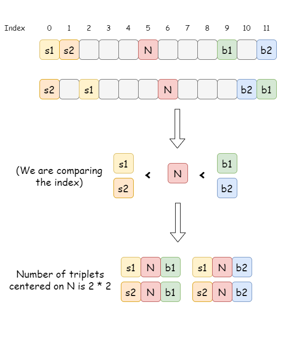
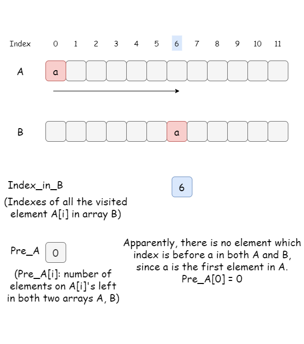
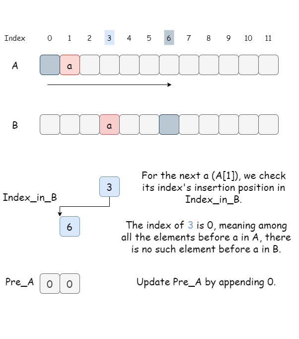
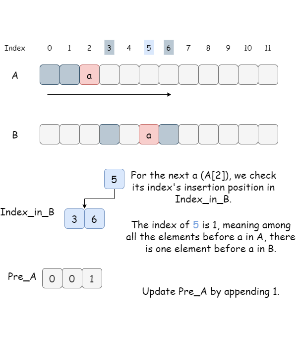
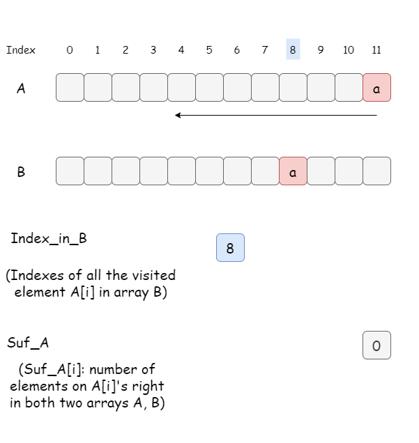
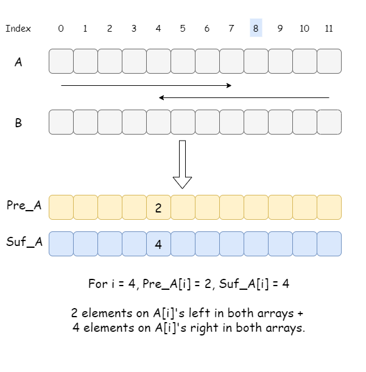

You are given two **0-indexed** arrays `nums1` and `nums2` of length `n`, both of which are **permutations** of `[0, 1, ..., n - 1]`.

A **good triplet** is a set of `3` **distinct** values which are present in **increasing order** by position both in `nums1` and `nums2`. In other words, if we consider `pos1v` as the index of the value `v` in `nums1` and `pos2v` as the index of the value `v` in `nums2`, then a good triplet will be a set `(x, y, z)` where `0 <= x, y, z <= n - 1`, such that `pos1x < pos1y < pos1z` and `pos2x < pos2y < pos2z`.

Return *the **total number** of good triplets*.

 

**Example 1:**

```
Input: nums1 = [2,0,1,3], nums2 = [0,1,2,3]
Output: 1
Explanation: 
There are 4 triplets (x,y,z) such that pos1x < pos1y < pos1z. They are (2,0,1), (2,0,3), (2,1,3), and (0,1,3). 
Out of those triplets, only the triplet (0,1,3) satisfies pos2x < pos2y < pos2z. Hence, there is only 1 good triplet.
```

**Example 2:**

```
Input: nums1 = [4,0,1,3,2], nums2 = [4,1,0,2,3]
Output: 4
Explanation: The 4 good triplets are (4,0,3), (4,0,2), (4,1,3), and (4,1,2).
```

 

**Constraints:**

- `n == nums1.length == nums2.length`
- `3 <= n <= 105`
- `0 <= nums1[i], nums2[i] <= n - 1`
- `nums1` and `nums2` are permutations of `[0, 1, ..., n - 1]`.

didn’t come up with a solution with less time complexity than O(N ^ 2)


here are several wonderful discussion post from geeks

### [bisect module](https://leetcode.com/problems/count-good-triplets-in-an-array/discuss/1783205/Python-Explanation-with-pictures.-O(N-logN)-Time.)

> main point is: for each element `a`, we count the amount of same elements on a’s left in both A and B as `a_left`, and the amount of same elements on `a`’s right in both A and B as `a_right`. Then they can form `a_left * a_right` good triplets

We focus on the middle element of the triplet.

> For an element a, how many triplets are centered at a?

This problem equals to:

- How many elements on a's left in both A and B;
- How many elements on a's right in both A and B;

Take a look at the figure below.

Let's say we focus on the number **N** with index of 5 in A, suppose we find two numbers **s1, s2** which are on **N's left** in both A and B, and two numbers **b1, b2** which are on **N's right** in both A and B.
Then the number of unique triplets **centered at N** is 2 * 2.



Therefore, for each element **a**, we could count how many elements on a's left in both two arrays A and B.
Similarly, count how many elements on a's right in both two arrays A and B (and get their product).

------

Start with building `pre_a`.
Apparently, there is no element on A[0] left, thus `pre_a[0] = 0`.
Save the index of A[0] in B in `pos_in_b`, for future binary search.



Now we are visiting **A[1]**, it's guaranteed that there is one element (A[0]) on **A[1]**'s left in A, but how about the case in B?

> It can be calculated by binary searching the index of **1** in `pos_in_b`.
> The indexes on **1**'s left in `pos_in_b` stands for the elements on A[1]'s left in B.



So on so forth, until we finish the iteration.

> We can take adavantage of BST which allows binary search and insertion in logN time.



Build `suf_a` in the similar way.



Finally, iterate over `pre_a` and `suf_a` and sum up the number of triplets centered at each element.



**Python**

```python
from sortedcontainers import SortedList
class Solution:
    def goodTriplets(self, A: List[int], B: List[int]) -> int:
        # Index of a (from A) in B.
        pos = [0] * len(A)               
        for idx, b in enumerate(B):
            pos[b] = idx
        
        # Build pre_a[i]: number of elements on a[i]'s left in both A and B.
        # pos_in_b: sorted indexes (in B) of all the visited elements in A.
        pos_in_b, pre_a = SortedList([pos[A[0]]]), [0]      
        for a in A[1:]:       
            pos_in_b.add(pos[a])
            pre_a.append(pos_in_b.bisect_left(pos[a]))
    
        # Build suf_a[i]: number of elements on a[i]'s right in both A and B.
        pos_in_b, suf_a = SortedList([pos[A[-1]]]), [0]
        for a in reversed(A[:len(A)-1]):
            idx = pos_in_b.bisect(pos[a])
            suf_a.append(len(pos_in_b) - idx)
            pos_in_b.add(pos[a])
        suf_a.reverse()
        
        # Sum up all unique triplets centered on A[i].
        ans = 0
        for x, y in zip(pre_a, suf_a):
            ans += x * y
        return ans
```

> got TLE if I use bisect.bisect_left(a, element) rather than a.bisect_left(element)

### [Fenwick tree](https://leetcode.com/problems/count-good-triplets-in-an-array/discuss/1783180/Python-2-Fenwick-trees-solution-explained)

Let us consider the following problem to understand Binary Indexed Tree.
We have an array arr[0 . . . n-1]. We would like to 

1. Compute the sum of the first i elements. 

2. Modify the value of a specified element of the array arr[i] = x where 0 <= i <= n-1.

A **simple solution** is to run a loop from 0 to i-1 and calculate the sum of the elements. To update a value, simply do arr[i] = x. The first operation takes O(n) time and the second operation takes O(1) time. Another simple solution is to create an extra array and store the sum of the first i-th elements at the i-th index in this new array. The sum of a given range can now be calculated in O(1) time, but the update operation takes O(n) time now. This works well if there are a large number of query operations but a very few number of update operations.
**Could we perform both the query and update operations in O(log n) time?** 
One efficient solution is to use [Segment Tree](https://www.geeksforgeeks.org/segment-tree-set-1-sum-of-given-range/) that performs both operations in O(Logn) time.

