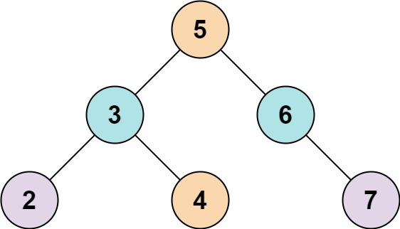

### 217. Contains Duplicate

Given an integer array `nums`, return `true` if any value appears **at least twice** in the array, and return `false` if every element is distinct.

 

**Example 1:**

```
Input: nums = [1,2,3,1]
Output: true
```

**Example 2:**

```
Input: nums = [1,2,3,4]
Output: false
```

**Example 3:**

```
Input: nums = [1,1,1,3,3,4,3,2,4,2]
Output: true
```

 

**Constraints:**

- `1 <= nums.length <= 10 ** 5`
- `-10 ** 9 <= nums[i] <= 10 ** 9`

```python
def containsDuplicate(self, nums: List[int]) -> bool:
    visited = set()
    for i in nums:
        if i in visited: return True	
        visited.add(i)
    return False
```

### 53. Maximum Subarray

Given an integer array `nums`, find the contiguous subarray (containing at least one number) which has the largest sum and return *its sum*.

A **subarray** is a **contiguous** part of an array.

 

**Example 1:**

```
Input: nums = [-2,1,-3,4,-1,2,1,-5,4]
Output: 6
Explanation: [4,-1,2,1] has the largest sum = 6.
```

**Example 2:**

```
Input: nums = [1]
Output: 1
```

**Example 3:**

```
Input: nums = [5,4,-1,7,8]
Output: 23
```

 

**Constraints:**

- `1 <= nums.length <= 10 ** 5`
- `-10 ** 4 <= nums[i] <= 10 ** 4`

 

**Follow up:** If you have figured out the `O(n)` solution, try coding another solution using the **divide and conquer** approach, which is more subtle.

```python
def maxSubArray(self, nums: List[int]) -> int:
    pre_min = 0
    ans = nums[0]
    s = 0
    for i in nums:
        s += i
        ans = max(ans, s - pre_min)
        pre_min = min(pre_min, s)
    return ans
```

### 1. Two Sum

Given an array of integers `nums` and an integer `target`, return *indices of the two numbers such that they add up to `target`*.

You may assume that each input would have ***exactly\* one solution**, and you may not use the *same* element twice.

You can return the answer in any order.

 

**Example 1:**

```
Input: nums = [2,7,11,15], target = 9
Output: [0,1]
Explanation: Because nums[0] + nums[1] == 9, we return [0, 1].
```

**Example 2:**

```
Input: nums = [3,2,4], target = 6
Output: [1,2]
```

**Example 3:**

```
Input: nums = [3,3], target = 6
Output: [0,1]
```

 

**Constraints:**

- `2 <= nums.length <= 10 ** 4`
- `-10 ** 9 <= nums[i] <= 10 ** 9`
- `-10 ** 9 <= target <= 10 ** 9`
- **Only one valid answer exists.**

```python
def twoSum(self, nums: List[int], target: int) -> List[int]:
    visited = dict()
    for i, v in enumerate(nums):
        if target - v in visited:
            return [visited[target - v], i]
        visited[v] = i
```

### 88. Merge Sorted Array

You are given two integer arrays `nums1` and `nums2`, sorted in **non-decreasing order**, and two integers `m` and `n`, representing the number of elements in `nums1` and `nums2` respectively.

**Merge** `nums1` and `nums2` into a single array sorted in **non-decreasing order**.

The final sorted array should not be returned by the function, but instead be *stored inside the array* `nums1`. To accommodate this, `nums1` has a length of `m + n`, where the first `m` elements denote the elements that should be merged, and the last `n` elements are set to `0` and should be ignored. `nums2` has a length of `n`.

 

**Example 1:**

```
Input: nums1 = [1,2,3,0,0,0], m = 3, nums2 = [2,5,6], n = 3
Output: [1,2,2,3,5,6]
Explanation: The arrays we are merging are [1,2,3] and [2,5,6].
The result of the merge is [1,2,2,3,5,6] with the underlined elements coming from nums1.
```

**Example 2:**

```
Input: nums1 = [1], m = 1, nums2 = [], n = 0
Output: [1]
Explanation: The arrays we are merging are [1] and [].
The result of the merge is [1].
```

**Example 3:**

```
Input: nums1 = [0], m = 0, nums2 = [1], n = 1
Output: [1]
Explanation: The arrays we are merging are [] and [1].
The result of the merge is [1].
Note that because m = 0, there are no elements in nums1. The 0 is only there to ensure the merge result can fit in nums1.
```

 

**Constraints:**

- `nums1.length == m + n`
- `nums2.length == n`
- `0 <= m, n <= 200`
- `1 <= m + n <= 200`
- `-10 ** 9 <= nums1[i], nums2[j] <= 10 ** 9`

 

**Follow up:** Can you come up with an algorithm that runs in `O(m + n)` time?

```python
def merge(self, nums1: List[int], m: int, nums2: List[int], n: int) -> None:
    """
    Do not return anything, modify nums1 in-place instead.
    """
    stack = collections.deque([])

    i = j = 0
    while i < m or j < n:
        if j == n or (i < m and nums1[i] <= nums2[j]):
            stack.append(nums1[i])
            nums1[i] = stack.popleft()
            i += 1
        elif i == m or (j < n and nums1[i] > nums2[j]):
            stack.append(nums2[j])
            j += 1
    while i < m + n:
        nums1[i] = stack.popleft()
        i += 1
```

### 141. Linked List Cycle

Given `head`, the head of a linked list, determine if the linked list has a cycle in it.

There is a cycle in a linked list if there is some node in the list that can be reached again by continuously following the `next` pointer. Internally, `pos` is used to denote the index of the node that tail's `next` pointer is connected to. **Note that `pos` is not passed as a parameter**.

Return `true` *if there is a cycle in the linked list*. Otherwise, return `false`.

 

**Example 1:**


```
Input: head = [3,2,0,-4], pos = 1
Output: true
Explanation: There is a cycle in the linked list, where the tail connects to the 1st node (0-indexed).
```

**Example 2:**


```
Input: head = [1,2], pos = 0
Output: true
Explanation: There is a cycle in the linked list, where the tail connects to the 0th node.
```

**Example 3:**


```
Input: head = [1], pos = -1
Output: false
Explanation: There is no cycle in the linked list.
```

 

**Constraints:**

- The number of the nodes in the list is in the range `[0, 10 ** 4]`.
- `-10 ** 5 <= Node.val <= 10 ** 5`
- `pos` is `-1` or a **valid index** in the linked-list.

 

**Follow up:** Can you solve it using `O(1)` (i.e. constant) memory?

> Problems about finding a cycle in LinkedList, can be easily solved by two pointers with different steps

```python
def hasCycle(self, head: ListNode) -> bool:
    if not head or not head.next: return False
    move, jump = head, head.next
    while jump and jump.next:
        if move == jump: return True
        move = move.next
        jump = jump.next.next
    return False
```

### 21. Merge Two Sorted Lists

You are given the heads of two sorted linked lists `list1` and `list2`.

Merge the two lists in a one **sorted** list. The list should be made by splicing together the nodes of the first two lists.

Return *the head of the merged linked list*.

 

**Example 1:**


```
Input: list1 = [1,2,4], list2 = [1,3,4]
Output: [1,1,2,3,4,4]
```

**Example 2:**

```
Input: list1 = [], list2 = []
Output: []
```

**Example 3:**

```
Input: list1 = [], list2 = [0]
Output: [0]
```

 

**Constraints:**

- The number of nodes in both lists is in the range `[0, 50]`.
- `-100 <= Node.val <= 100`
- Both `list1` and `list2` are sorted in **non-decreasing** order.

```python
def mergeTwoLists(self, list1: ListNode, list2: ListNode) -> ListNode:
    ans = ListNode(-1)
    curr = ans
    while list1 and list2:
        if list1.val < list2.val:
            curr.next = ListNode(list1.val)
            list1 = list1.next
        else:
            curr.next = ListNode(list2.val)
            list2 = list2.next
        curr = curr.next
    if list1: curr.next = list1
    if list2: curr.next = list2
    return ans.next
```

### 203. Remove Linked List Elements

Given the `head` of a linked list and an integer `val`, remove all the nodes of the linked list that has `Node.val == val`, and return *the new head*.

 

**Example 1:**


```
Input: head = [1,2,6,3,4,5,6], val = 6
Output: [1,2,3,4,5]
```

**Example 2:**

```
Input: head = [], val = 1
Output: []
```

**Example 3:**

```
Input: head = [7,7,7,7], val = 7
Output: []
```

 

**Constraints:**

- The number of nodes in the list is in the range `[0, 10 ** 4]`.
- `1 <= Node.val <= 50`
- `0 <= val <= 50`

```python
def removeElements(self, head: ListNode, val: int) -> ListNode:
    pre = ans = ListNode(-1)
    ans.next = head
    while head:
        if head.val == val: 
            pre.next = head.next
            head = head.next
        else:
            pre, head = head, head.next
    return ans.next
```

### 206. Reverse Linked List

Given the `head` of a singly linked list, reverse the list, and return *the reversed list*.

 

**Example 1:**


```
Input: head = [1,2,3,4,5]
Output: [5,4,3,2,1]
```

**Example 2:**


```
Input: head = [1,2]
Output: [2,1]
```

**Example 3:**

```
Input: head = []
Output: []
```

 

**Constraints:**

- The number of nodes in the list is the range `[0, 5000]`.
- `-5000 <= Node.val <= 5000`

 

**Follow up:** A linked list can be reversed either iteratively or recursively. Could you implement both?

```python
def reverseList(self, head: ListNode) -> ListNode:
    if not head: return head
    nxt = head.next
    head.next = None

    while nxt:
        temp = nxt.next
        nxt.next = head
        head, nxt = nxt, temp
    return head
```

### 83. Remove Duplicates from Sorted List

Given the `head` of a sorted linked list, *delete all duplicates such that each element appears only once*. Return *the linked list **sorted** as well*.

 

**Example 1:**


```
Input: head = [1,1,2]
Output: [1,2]
```

**Example 2:**


```
Input: head = [1,1,2,3,3]
Output: [1,2,3]
```

 

**Constraints:**

- The number of nodes in the list is in the range `[0, 300]`.
- `-100 <= Node.val <= 100`
- The list is guaranteed to be **sorted** in ascending order.

```python
def deleteDuplicates(self, head: ListNode) -> ListNode:
    if not head: return head
    curr = head

    while curr:
        first = curr
        temp = curr.val
        while curr and curr.val == temp:
            curr = curr.next
        first.next = curr
    return head
```

### 20. Valid Parentheses

Given a string `s` containing just the characters `'('`, `')'`, `'{'`, `'}'`, `'['` and `']'`, determine if the input string is valid.

An input string is valid if:

1. Open brackets must be closed by the same type of brackets.
2. Open brackets must be closed in the correct order.

 

**Example 1:**

```
Input: s = "()"
Output: true
```

**Example 2:**

```
Input: s = "()[]{}"
Output: true
```

**Example 3:**

```
Input: s = "(]"
Output: false
```

 

**Constraints:**

- `1 <= s.length <= 104`
- `s` consists of parentheses only `'()[]{}'`.

```python
def isValid(self, s: str) -> bool:
    remain = []
    pair = {'(': ')', '[': ']', '{': '}'}
    for i in s:
        if i in '([{':
            remain.append(i)
        else:
            if not remain or i != pair[remain.pop()]: return False
    return not remain
```

### 232. Implement Queue using Stacks

Implement a first in first out (FIFO) queue using only two stacks. The implemented queue should support all the functions of a normal queue (`push`, `peek`, `pop`, and `empty`).

Implement the `MyQueue` class:

- `void push(int x)` Pushes element x to the back of the queue.
- `int pop()` Removes the element from the front of the queue and returns it.
- `int peek()` Returns the element at the front of the queue.
- `boolean empty()` Returns `true` if the queue is empty, `false` otherwise.

**Notes:**

- You must use **only** standard operations of a stack, which means only `push to top`, `peek/pop from top`, `size`, and `is empty` operations are valid.
- Depending on your language, the stack may not be supported natively. You may simulate a stack using a list or deque (double-ended queue) as long as you use only a stack's standard operations.

 

**Example 1:**

```
Input
["MyQueue", "push", "push", "peek", "pop", "empty"]
[[], [1], [2], [], [], []]
Output
[null, null, null, 1, 1, false]

Explanation
MyQueue myQueue = new MyQueue();
myQueue.push(1); // queue is: [1]
myQueue.push(2); // queue is: [1, 2] (leftmost is front of the queue)
myQueue.peek(); // return 1
myQueue.pop(); // return 1, queue is [2]
myQueue.empty(); // return false
```

 

**Constraints:**

- `1 <= x <= 9`
- At most `100` calls will be made to `push`, `pop`, `peek`, and `empty`.
- All the calls to `pop` and `peek` are valid.

 

**Follow-up:** Can you implement the queue such that each operation is **[amortized](https://en.wikipedia.org/wiki/Amortized_analysis)** `O(1)` time complexity? In other words, performing `n` operations will take overall `O(n)` time even if one of those operations may take longer.


### 101. Symmetric Tree

Given the `root` of a binary tree, *check whether it is a mirror of itself* (i.e., symmetric around its center).

 

**Example 1:**


```
Input: root = [1,2,2,3,4,4,3]
Output: true
```

**Example 2:**


```
Input: root = [1,2,2,null,3,null,3]
Output: false
```

 

**Constraints:**

- The number of nodes in the tree is in the range `[1, 1000]`.
- `-100 <= Node.val <= 100`

 

**Follow up:** Could you solve it both recursively and iteratively?

```python
def isSymmetric(self, root: Optional[TreeNode]) -> bool:
    # each level should be symmetric
    stack = deque([[root.left, root.right]])
    while stack:
        l, r = stack.popleft()
        if l == None and r == None: continue
        if l == None or r == None or l.val != r.val: return False
        stack.append([l.left, r.right])
        stack.append([l.right, r.left])
    return True
```

### 226. Invert Binary Tree

Given the `root` of a binary tree, invert the tree, and return *its root*.

 

**Example 1:**


```
Input: root = [4,2,7,1,3,6,9]
Output: [4,7,2,9,6,3,1]
```

**Example 2:**


```
Input: root = [2,1,3]
Output: [2,3,1]
```

**Example 3:**

```
Input: root = []
Output: []
```

 

**Constraints:**

- The number of nodes in the tree is in the range `[0, 100]`.
- `-100 <= Node.val <= 100`

```python
def invertTree(self, root: Optional[TreeNode]) -> Optional[TreeNode]:
    if not root: return root
    root.left, root.right = self.invertTree(root.right), self.invertTree(root.left)
    return root
```

### 700. Search in a Binary Search Tree

You are given the `root` of a binary search tree (BST) and an integer `val`.

Find the node in the BST that the node's value equals `val` and return the subtree rooted with that node. If such a node does not exist, return `null`.

 

**Example 1:**


```
Input: root = [4,2,7,1,3], val = 2
Output: [2,1,3]
```

**Example 2:**


```
Input: root = [4,2,7,1,3], val = 5
Output: []
```

 

**Constraints:**

- The number of nodes in the tree is in the range `[1, 5000]`.
- `1 <= Node.val <= 10 ** 7`
- `root` is a ==binary search tree==.
- `1 <= val <= 10 ** 7`

```python
def searchBST(self, root: Optional[TreeNode], val: int) -> Optional[TreeNode]:
    # iterating, recommanded
    while root:
        if root.val > val:
            root = root.left
        elif root.val < val:
            root = root.right
        else: break
    return root
    
    # recursion
    if not root: return None
    if root.val > val: return self.searchBST(root.left, val)
    if root.val < val: return self.searchBST(root.right, val)
    return root
```

### 701. Insert into a Binary Search Tree

You are given the `root` node of a binary search tree (BST) and a `value` to insert into the tree. Return *the root node of the BST after the insertion*. It is **guaranteed** that the new value does not exist in the original BST.

**Notice** that there may exist multiple valid ways for the insertion, as long as the tree remains a BST after insertion. You can return **any of them**.

 

**Example 1:**


```
Input: root = [4,2,7,1,3], val = 5
Output: [4,2,7,1,3,5]
Explanation: Another accepted tree is:
```

**Example 2:**

```
Input: root = [40,20,60,10,30,50,70], val = 25
Output: [40,20,60,10,30,50,70,null,null,25]
```

**Example 3:**

```
Input: root = [4,2,7,1,3,null,null,null,null,null,null], val = 5
Output: [4,2,7,1,3,5]
```

 

**Constraints:**

- The number of nodes in the tree will be in the range `[0, 10 ** 4]`.
- `-10 ** 8 <= Node.val <= 10 ** 8`
- All the values `Node.val` are **unique**.
- `-10 ** 8 <= val <= 10 ** 8`
- It's **guaranteed** that `val` does not exist in the original BST.

```python
def insertIntoBST(self, root: TreeNode, val: int) -> TreeNode:
    if not root: return TreeNode(val)
    temp = root
    while temp:
        if temp.val > val:
            if not temp.left:
                temp.left = TreeNode(val)
                break
            else: temp = temp.left
        elif temp.val < val:
            if not temp.right:
                temp.right = TreeNode(val)
                break
            else: temp = temp.right
    return root
```

### 98. Validate Binary Search Tree

Given the `root` of a binary tree, *determine if it is a valid binary search tree (BST)*.

A **valid BST** is defined as follows:

- The left subtree of a node contains only nodes with keys **less than** the node's key.
- The right subtree of a node contains only nodes with keys **greater than** the node's key.
- Both the left and right subtrees must also be binary search trees.

 

**Example 1:**


```
Input: root = [2,1,3]
Output: true
```

**Example 2:**


```
Input: root = [5,1,4,null,null,3,6]
Output: false
Explanation: The root node's value is 5 but its right child's value is 4.
```

 

**Constraints:**

- The number of nodes in the tree is in the range `[1, 10 ** 4]`.
- `-2 ** 31 <= Node.val <= 2 ** 31 - 1`

```python
def isValidBST(self, root: TreeNode) -> bool:
    def inorder(node):
        return inorder(node.left) + [node.val] + inorder(node.right) if node else []

    ans = inorder(root)
    return ans == sorted(ans) and len(set(ans)) == len(ans)
```


```python
def isValidBST(self, root: TreeNode) -> bool:
    def valid(node):
        start = end = node.val
        if node.left: 
            ls, le = valid(node.left)
            if le >= node.val:
                return [-float('inf'), float('inf')]
            else: start = ls
        if node.right:
            rs, re = valid(node.right)
            if rs <= node.val:
                return [-float('inf'), float('inf')]
            else: end = re
        return [start, end]

    return valid(root)[0] > -float('inf')
```

### 235. Lowest Common Ancestor of a Binary Search Tree

Given a binary search tree (BST), find the lowest common ancestor (LCA) of two given nodes in the BST.

According to the [definition of LCA on Wikipedia](https://en.wikipedia.org/wiki/Lowest_common_ancestor): “The lowest common ancestor is defined between two nodes `p` and `q` as the lowest node in `T` that has both `p` and `q` as descendants (where we allow **a node to be a descendant of itself**).”

 

**Example 1:**


```
Input: root = [6,2,8,0,4,7,9,null,null,3,5], p = 2, q = 8
Output: 6
Explanation: The LCA of nodes 2 and 8 is 6.
```

**Example 2:**


```
Input: root = [6,2,8,0,4,7,9,null,null,3,5], p = 2, q = 4
Output: 2
Explanation: The LCA of nodes 2 and 4 is 2, since a node can be a descendant of itself according to the LCA definition.
```

**Example 3:**

```
Input: root = [2,1], p = 2, q = 1
Output: 2
```

 

**Constraints:**

- The number of nodes in the tree is in the range `[2, 105]`.
- `-109 <= Node.val <= 109`
- All `Node.val` are **unique**.
- `p != q`
- `p` and `q` will exist in the BST.

```python
def lowestCommonAncestor(self, root: 'TreeNode', p: 'TreeNode', q: 'TreeNode') -> 'TreeNode':
    while root:
        if root.val == q.val or root.val == p.val: return root
        pp, qq = p.val < root.val, q.val < root.val
        if pp != qq: return root
        if pp and qq: root = root.left
        else: root = root.right
```

### 653. Two Sum IV - Input is a BST

Given the `root` of a Binary Search Tree and a target number `k`, return *`true` if there exist two elements in the BST such that their sum is equal to the given target*.

 

**Example 1:**



```
Input: root = [5,3,6,2,4,null,7], k = 9
Output: true
```

**Example 2:**


```
Input: root = [5,3,6,2,4,null,7], k = 28
Output: false
```

 

**Constraints:**

- The number of nodes in the tree is in the range `[1, 10 ** 4]`.
- `-10 ** 4 <= Node.val <= 10 ** 4`
- `root` is guaranteed to be a **valid** binary search tree.
- `-10 ** 5 <= k <= 10 ** 5`

```python
def findTarget(self, root: Optional[TreeNode], k: int) -> bool:
    visited = set()
    curr = deque([root])
    while curr:
        temp = curr.popleft()
        if k - temp.val in visited: return True
        visited.add(temp.val)
        if temp.left: curr.append(temp.left)
        if temp.right: curr.append(temp.right)
    return False
```

### 876. Middle of the Linked List

Given the `head` of a singly linked list, return *the middle node of the linked list*.

If there are two middle nodes, return **the second middle** node.

 

**Example 1:**


```
Input: head = [1,2,3,4,5]
Output: [3,4,5]
Explanation: The middle node of the list is node 3.
```

**Example 2:**


```
Input: head = [1,2,3,4,5,6]
Output: [4,5,6]
Explanation: Since the list has two middle nodes with values 3 and 4, we return the second one.
```

 

**Constraints:**

- The number of nodes in the list is in the range `[1, 100]`.
- `1 <= Node.val <= 100`

```python
def middleNode(self, head: ListNode) -> ListNode:
    if not head.next: return head
    slow, fast = head, head.next
    while fast and fast.next:
        slow = slow.next
        fast = fast.next.next
    return slow if not fast else slow.next
```

