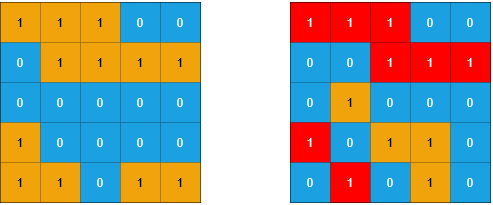
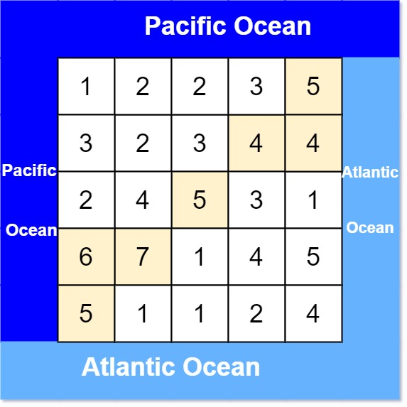
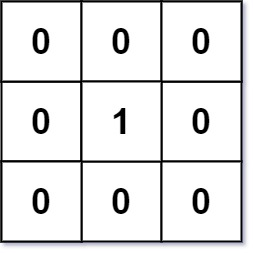
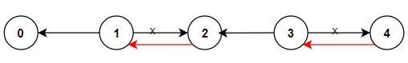

### 695. Max Area of Island

You are given an `m x n` binary matrix `grid`. An island is a group of `1`'s (representing land) connected **4-directionally** (horizontal or vertical.) You may assume all four edges of the grid are surrounded by water.

The **area** of an island is the number of cells with a value `1` in the island.

Return *the maximum **area** of an island in* `grid`. If there is no island, return `0`.

 

**Example 1:**


```
Input: grid = [[0,0,1,0,0,0,0,1,0,0,0,0,0],[0,0,0,0,0,0,0,1,1,1,0,0,0],[0,1,1,0,1,0,0,0,0,0,0,0,0],[0,1,0,0,1,1,0,0,1,0,1,0,0],[0,1,0,0,1,1,0,0,1,1,1,0,0],[0,0,0,0,0,0,0,0,0,0,1,0,0],[0,0,0,0,0,0,0,1,1,1,0,0,0],[0,0,0,0,0,0,0,1,1,0,0,0,0]]
Output: 6
Explanation: The answer is not 11, because the island must be connected 4-directionally.
```

**Example 2:**

```
Input: grid = [[0,0,0,0,0,0,0,0]]
Output: 0
```

 

**Constraints:**

- `m == grid.length`
- `n == grid[i].length`
- `1 <= m, n <= 50`
- `grid[i][j]` is either `0` or `1`.

```python
def maxAreaOfIsland(self, grid: List[List[int]]) -> int:
    ans = 0
    m, n = len(grid), len(grid[0])
    dir = [[0, 1], [0, -1], [1, 0], [-1, 0]]
    def extend(x, y):
        curr = collections.deque([[x, y]])
        grid[x][y] = 0
        cnt = 0
        while curr:
            cnt += 1
            x, y = curr.popleft()
            for i, j in dir:
                xi, yj = x + i, y + j
                if m > xi >= 0 <= yj < n and grid[xi][yj] == 1:
                    grid[xi][yj] = 0
                    curr.append([xi, yj])
        return cnt

    for i, j in product(range(m), range(n)):
        if grid[i][j] == 1:
            ans = max(ans, extend(i, j))
    return ans
```

### 1254. Number of Closed Islands

Given a 2D `grid` consists of `0s` (land) and `1s` (water). An *island* is a maximal 4-directionally connected group of `0s` and a *closed island* is an island **totally** (all left, top, right, bottom) surrounded by `1s.`

Return the number of *closed islands*.

 

**Example 1:**


```
Input: grid = [[1,1,1,1,1,1,1,0],[1,0,0,0,0,1,1,0],[1,0,1,0,1,1,1,0],[1,0,0,0,0,1,0,1],[1,1,1,1,1,1,1,0]]
Output: 2
Explanation: 
Islands in gray are closed because they are completely surrounded by water (group of 1s).
```

**Example 2:**


```
Input: grid = [[0,0,1,0,0],[0,1,0,1,0],[0,1,1,1,0]]
Output: 1
```

**Example 3:**

```
Input: grid = [[1,1,1,1,1,1,1],
               [1,0,0,0,0,0,1],
               [1,0,1,1,1,0,1],
               [1,0,1,0,1,0,1],
               [1,0,1,1,1,0,1],
               [1,0,0,0,0,0,1],
               [1,1,1,1,1,1,1]]
Output: 2
```

 

**Constraints:**

- `1 <= grid.length, grid[0].length <= 100`
- `0 <= grid[i][j] <=1`

```python
def closedIsland(self, grid: List[List[int]]) -> int:
    m, n = len(grid), len(grid[0])
    dir = [[0, 1], [0, -1], [1, 0], [-1, 0]]
    if m == 1 or n == 1: return 0

    def extend(x, y):
        curr = collections.deque([[x, y]])
        grid[x][y] = 1
        while curr:
            x, y = curr.popleft()
            for i, j in dir:
                xi, yj = x + i, y + j
                if m > xi >= 0 <= yj < n and grid[xi][yj] == 0:
                    grid[xi][yj] = 1
                    curr.append([xi, yj])

    for i in range(m):
        if grid[i][0] == 0:
            extend(i, 0)
        if grid[i][n - 1] == 0:
            extend(i, n - 1)
    for i in range(n):
        if grid[0][i] == 0:
            extend(0, i)
        if grid[m - 1][i] == 0:
            extend(m - 1, i)

    ans = 0
    for i, j in product(range(m), range(n)):
        if grid[i][j] == 0:
            ans += 1
            extend(i, j)
    return ans
```

### 1020. Number of Enclaves

You are given an `m x n` binary matrix `grid`, where `0` represents a sea cell and `1` represents a land cell.

A **move** consists of walking from one land cell to another adjacent (**4-directionally**) land cell or walking off the boundary of the `grid`.

Return *the number of land cells in* `grid` *for which we cannot walk off the boundary of the grid in any number of **moves***.

 

**Example 1:**


```
Input: grid = [[0,0,0,0],[1,0,1,0],[0,1,1,0],[0,0,0,0]]
Output: 3
Explanation: There are three 1s that are enclosed by 0s, and one 1 that is not enclosed because its on the boundary.
```

**Example 2:**


```
Input: grid = [[0,1,1,0],[0,0,1,0],[0,0,1,0],[0,0,0,0]]
Output: 0
Explanation: All 1s are either on the boundary or can reach the boundary.
```

 

**Constraints:**

- `m == grid.length`
- `n == grid[i].length`
- `1 <= m, n <= 500`
- `grid[i][j]` is either `0` or `1`.

```python
def numEnclaves(self, grid: List[List[int]]) -> int:
    m, n = len(grid), len(grid[0])
    dir = [[0, 1], [0, -1], [1, 0], [-1, 0]]
    curr = collections.deque([])
    cnt = 0
    for i, j in product(range(m), range(n)):
        if grid[i][j] == 1:
            if i == 0 or j == 0 or i == m - 1 or j == n - 1:
                # boundary
                curr.append((i, j))
                grid[i][j] = 0
            cnt += 1

    while curr:
        x, y = curr.popleft()
        cnt -= 1
        for i, j in dir:
            xi, yj = x + i, y + j
            if m > xi >= 0 <= yj < n and grid[xi][yj] == 1:
                grid[xi][yj] = 0
                curr.append((xi, yj))
    return cnt
```

### 1905. Count Sub Islands

You are given two `m x n` binary matrices `grid1` and `grid2` containing only `0`'s (representing water) and `1`'s (representing land). An **island** is a group of `1`'s connected **4-directionally** (horizontal or vertical). Any cells outside of the grid are considered water cells.

An island in `grid2` is considered a **sub-island** if there is an island in `grid1` that contains **all** the cells that make up **this** island in `grid2`.

Return the ***number** of islands in* `grid2` *that are considered **sub-islands***.

 

**Example 1:**



```
Input: grid1 = [[1,1,1,0,0],[0,1,1,1,1],[0,0,0,0,0],[1,0,0,0,0],[1,1,0,1,1]], grid2 = [[1,1,1,0,0],[0,0,1,1,1],[0,1,0,0,0],[1,0,1,1,0],[0,1,0,1,0]]
Output: 3
Explanation: In the picture above, the grid on the left is grid1 and the grid on the right is grid2.
The 1s colored red in grid2 are those considered to be part of a sub-island. There are three sub-islands.
```

**Example 2:**


```
Input: grid1 = [[1,0,1,0,1],[1,1,1,1,1],[0,0,0,0,0],[1,1,1,1,1],[1,0,1,0,1]], grid2 = [[0,0,0,0,0],[1,1,1,1,1],[0,1,0,1,0],[0,1,0,1,0],[1,0,0,0,1]]
Output: 2 
Explanation: In the picture above, the grid on the left is grid1 and the grid on the right is grid2.
The 1s colored red in grid2 are those considered to be part of a sub-island. There are two sub-islands.
```

 

**Constraints:**

- `m == grid1.length == grid2.length`
- `n == grid1[i].length == grid2[i].length`
- `1 <= m, n <= 500`
- `grid1[i][j]` and `grid2[i][j]` are either `0` or `1`.

```python
def countSubIslands(self, grid1: List[List[int]], grid2: List[List[int]]) -> int:
    """count subIsland from grid2 of grid1

    Args:
        grid1 (List[List[int]]): the original grid
        grid2 (List[List[int]]): the grid to search subIslands

    Returns:
        int: the count of valid subIslands
    """
    # search islands in grid2, and determine if it is a sub island of grid1(all corresponding cells in grid1 are lands as well)
    m, n = len(grid2), len(grid2[0])
    dir = [[0, 1], [0, -1], [1, 0], [-1, 0]]

    def island(x, y):
        ans = True
        curr = collections.deque([(x, y)])
        grid2[x][y] = 0
        while curr:
            x, y = curr.popleft()
            if grid1[x][y] == 0: ans = False
            for i, j in dir:
                xi, yj = x + i, y + j
                if m > xi >= 0 <= yj < n and grid2[xi][yj] == 1:
                    grid2[xi][yj] = 0
                    curr.append((xi, yj))
        return ans

    return sum(1 for i, j in product(range(m), range(n)) if grid2[i][j] == 1 and island(i, j))
```

### 1162. As Far from Land as Possible

Given an `n x n` `grid` containing only values `0` and `1`, where `0` represents water and `1` represents land, find a water cell such that its distance to the nearest land cell is maximized, and return the distance. If no land or water exists in the grid, return `-1`.

The distance used in this problem is the Manhattan distance: the distance between two cells `(x0, y0)` and `(x1, y1)` is `|x0 - x1| + |y0 - y1|`.

 

**Example 1:**


```
Input: grid = [[1,0,1],[0,0,0],[1,0,1]]
Output: 2
Explanation: The cell (1, 1) is as far as possible from all the land with distance 2.
```

**Example 2:**


```
Input: grid = [[1,0,0],[0,0,0],[0,0,0]]
Output: 4
Explanation: The cell (2, 2) is as far as possible from all the land with distance 4.
```

 

**Constraints:**

- `n == grid.length`
- `n == grid[i].length`
- `1 <= n <= 100`
- `grid[i][j]` is `0` or `1`

> it is the same question as flooding water
>
> ==BFS== is recommanded 

```python
def maxDistance(self, grid: List[List[int]]) -> int:
    """find the max distance from a water cell to its nearest land cell

    Args:
        grid (List[List[int]]): water = 0 | land = 1

    Returns:
        int: return the max distance, -1 if there is no water not no land
    """
    # BFS
    # we extend land in each loop until there is no water, return the steps we take
    n = len(grid)
    dir = [[0, 1], [0, -1], [1, 0], [-1, 0]]
    curr = []
    for i, j in product(range(n), range(n)):
        if grid[i][j] == 1:
            curr.append((i, j))

    if not curr or len(curr) == n * n: return -1
    step = 0
    while curr:
        step += 1
        nxt = []
        for x, y in curr:
            for i, j in dir:
                xi, yj = x + i, y + j
                if n > xi >= 0 <= yj < n and grid[xi][yj] == 0:
                    grid[xi][yj] = 1
                    nxt.append((xi, yj))
        curr = nxt
    return step - 1
```

### 417. Pacific Atlantic Water Flow

There is an `m x n` rectangular island that borders both the **Pacific Ocean** and **Atlantic Ocean**. The **Pacific Ocean** touches the island's left and top edges, and the **Atlantic Ocean** touches the island's right and bottom edges.

The island is partitioned into a grid of square cells. You are given an `m x n` integer matrix `heights` where `heights[r][c]` represents the **height above sea level** of the cell at coordinate `(r, c)`.

The island receives a lot of rain, and the rain water can flow to neighboring cells directly north, south, east, and west if the neighboring cell's height is **less than or equal to** the current cell's height. Water can flow from any cell adjacent to an ocean into the ocean.

Return *a **2D list** of grid coordinates* `result` *where* `result[i] = [ri, ci]` *denotes that rain water can flow from cell* `(ri, ci)` *to **both** the Pacific and Atlantic oceans*.

 

**Example 1:**



```
Input: heights = [[1,2,2,3,5],[3,2,3,4,4],[2,4,5,3,1],[6,7,1,4,5],[5,1,1,2,4]]
Output: [[0,4],[1,3],[1,4],[2,2],[3,0],[3,1],[4,0]]
```

**Example 2:**

```
Input: heights = [[2,1],[1,2]]
Output: [[0,0],[0,1],[1,0],[1,1]]
```

 

**Constraints:**

- `m == heights.length`
- `n == heights[r].length`
- `1 <= m, n <= 200`
- `0 <= heights[r][c] <= 10 ** 5`

```python
def pacificAtlantic(self, heights: List[List[int]]) -> List[List[int]]:
    """water flood from higher cells to adjacent lower cells

    Args:
        heights (List[List[int]]): an island with height specified to each cell

    Returns:
        List[List[int]]: return the count of cells that can be flood by both seas
    """
    m, n = len(heights), len(heights[0])
    dir = [[0, 1], [0, -1], [1, 0], [-1, 0]]

    water = collections.defaultdict(int)
    def drawn(edge):
        visited = set(edge)
        while edge:
            x, y = edge.pop()
            water[(x, y)] += 1
            for i, j in dir:
                xi, yj = x + i, y + j
                if m > xi >= 0 <= yj < n and (xi, yj) not in visited and heights[xi][yj] >= heights[x][y]:
                    visited.add((xi, yj))
                    edge.append((xi, yj))

    # pacific: top-left side
    edge = [(0, 0)]
    for i in range(1, m):
        edge.append((i, 0))
    for i in range(1, n):
        edge.append((0, i))
    drawn(edge)

    edge = [(m - 1, n - 1)]
    for i in range(m - 1):
        edge.append((i, n - 1))
    for i in range(n - 1):
        edge.append((m - 1, i))
    drawn(edge)

    return [[x, y] for (x, y), cnt in water.items() if cnt == 2]
```

### 1091. Shortest Path in Binary Matrix

Given an `n x n` binary matrix `grid`, return *the length of the shortest **clear path** in the matrix*. If there is no clear path, return `-1`.

A **clear path** in a binary matrix is a path from the **top-left** cell (i.e., `(0, 0)`) to the **bottom-right** cell (i.e., `(n - 1, n - 1)`) such that:

- All the visited cells of the path are `0`.
- All the adjacent cells of the path are **8-directionally** connected (i.e., they are different and they share an edge or a corner).

The **length of a clear path** is the number of visited cells of this path.

 

**Example 1:**


```
Input: grid = [[0,1],[1,0]]
Output: 2
```

**Example 2:**


```
Input: grid = [[0,0,0],[1,1,0],[1,1,0]]
Output: 4
```

**Example 3:**

```
Input: grid = [[1,0,0],[1,1,0],[1,1,0]]
Output: -1
```

 

**Constraints:**

- `n == grid.length`
- `n == grid[i].length`
- `1 <= n <= 100`
- `grid[i][j] is 0 or 1`

```python
def shortestPathBinaryMatrix(self, grid: List[List[int]]) -> int:
    if grid[0][0] == 1: return -1
    dir = [[0, 1], [0, -1], [-1, -1], [-1, 0], [-1, 1], [1, -1], [1, 0], [1, 1]]
    pq = [(1, 0, 0)]
    m, n = len(grid), len(grid[0])
    while pq:
        cnt, x, y = heapq.heappop(pq)
        if x == m - 1 and y == n - 1: return cnt
        for i, j in dir:
            xi, yj = x + i, y + j
            if m > xi >= 0 <= yj < n and grid[xi][yj] == 0:
                grid[xi][yj] = 1
                heapq.heappush(pq, (cnt + 1, xi, yj))
    return -1
```

### 542. 01 Matrix

Given an `m x n` binary matrix `mat`, return *the distance of the nearest* `0` *for each cell*.

The distance between two adjacent cells is `1`.

 

**Example 1:**



```
Input: mat = [[0,0,0],[0,1,0],[0,0,0]]
Output: [[0,0,0],[0,1,0],[0,0,0]]
```

**Example 2:**


```
Input: mat = [[0,0,0],[0,1,0],[1,1,1]]
Output: [[0,0,0],[0,1,0],[1,2,1]]
```

 

**Constraints:**

- `m == mat.length`
- `n == mat[i].length`
- `1 <= m, n <= 104`
- `1 <= m * n <= 104`
- `mat[i][j]` is either `0` or `1`.
- There is at least one `0` in `mat`.

```python
def updateMatrix(self, mat: List[List[int]]) -> List[List[int]]:
    """water flood

    Args:
        mat (List[List[int]]): 0-1 matrix

    Returns:
        List[List[int]]: return the disrance of the nearest 0 for each cell
    """
    m, n = len(mat), len(mat[0])
    dir = [[0, 1], [0, -1], [1, 0], [-1, 0]]

    ans = [[0] * n for _ in range(m)]
    curr = []
    for i, j in product(range(m), range(n)):
        if mat[i][j] == 0:
            curr.append((i, j))

    step = 0
    while curr:
        step += 1
        nxt = []
        for (x, y), (i, j) in product(curr, dir):
            xi, yj = x + i, y + j
            if m > xi >= 0 <= yj < n and mat[xi][yj] == 1:
                mat[xi][yj] = 0
                nxt.append((xi, yj))
                ans[xi][yj] = step
        curr = nxt
    return ans
```

### 934. Shortest Bridge

You are given an `n x n` binary matrix `grid` where `1` represents land and `0` represents water.

An **island** is a 4-directionally connected group of `1`'s not connected to any other `1`'s. There are **exactly two islands** in `grid`.

You may change `0`'s to `1`'s to connect the two islands to form **one island**.

Return *the smallest number of* `0`*'s you must flip to connect the two islands*.

 

**Example 1:**

```
Input: grid = [[0,1],[1,0]]
Output: 1
```

**Example 2:**

```
Input: grid = [[0,1,0],[0,0,0],[0,0,1]]
Output: 2
```

**Example 3:**

```
Input: grid = [[1,1,1,1,1],[1,0,0,0,1],[1,0,1,0,1],[1,0,0,0,1],[1,1,1,1,1]]
Output: 1
```

 

**Constraints:**

- `n == grid.length == grid[i].length`
- `2 <= n <= 100`
- `grid[i][j]` is either `0` or `1`.
- There are exactly two islands in `grid`.

> Initially, lands are represented as 1’s, while water are represented as 0’s
>
> we start traverse on all cells, once we find a land, extend it and update all connected land cells to -1, indicating that we have already visited it. return a list of all cells that belong to this island.

- then we can start searching another island from this island
- record the step we take

```python
def shortestBridge(self, grid: List[List[int]]) -> int:
    # shortest distance between two islands
    n = len(grid)
    dir = [[0, 1], [0, -1], [1, 0], [-1, 0]]

    # find all land cells and update its value to -1, indicating that we have already visited it
    def edge(x, y):
        curr = collections.deque([[x, y]])
        grid[x][y] = -1
        ans = []
        while curr:
            x, y = curr.popleft()
            ans.append([x, y])
            for i, j in dir:
                xi, yj = x + i, y + j
                if n > xi >= 0 <= yj < n and grid[xi][yj] == 1:
                    grid[xi][yj] = -1
                    curr.append([xi, yj])
        return ans

    for i, j in product(range(n), range(n)):
        if grid[i][j] == 1: 
            e = edge(i, j)
            break

    # extend land
    step = 0
    while e:
        nxt = []
        for x, y in e:
            for i, j in dir:
                xi, yj = x + i, y + j
                if n > xi >= 0 <= yj < n:
                    if grid[xi][yj] == 1: return step
                    if grid[xi][yj] == 0:
                        grid[xi][yj] = -1
                        nxt.append([xi, yj])
        step += 1
        e = nxt
```

### 1376. Time Needed to Inform All Employees

A company has `n` employees with a unique ID for each employee from `0` to `n - 1`. The head of the company is the one with `headID`.

Each employee has one direct manager given in the `manager` array where `manager[i]` is the direct manager of the `i-th` employee, `manager[headID] = -1`. Also, it is guaranteed that the subordination relationships have a tree structure.

The head of the company wants to inform all the company employees of an urgent piece of news. He will inform his direct subordinates, and they will inform their subordinates, and so on until all employees know about the urgent news.

The `i-th` employee needs `informTime[i]` minutes to inform all of his direct subordinates (i.e., After informTime[i] minutes, all his direct subordinates can start spreading the news).

Return *the number of minutes* needed to inform all the employees about the urgent news.

 

**Example 1:**

```
Input: n = 1, headID = 0, manager = [-1], informTime = [0]
Output: 0
Explanation: The head of the company is the only employee in the company.
```

**Example 2:**


```
Input: n = 6, headID = 2, manager = [2,2,-1,2,2,2], informTime = [0,0,1,0,0,0]
Output: 1
Explanation: The head of the company with id = 2 is the direct manager of all the employees in the company and needs 1 minute to inform them all.
The tree structure of the employees in the company is shown.
```

 

**Constraints:**

- `1 <= n <= 10 ** 5`
- `0 <= headID < n`
- `manager.length == n`
- `0 <= manager[i] < n`
- `manager[headID] == -1`
- `informTime.length == n`
- `0 <= informTime[i] <= 1000`
- `informTime[i] == 0` if employee `i` has no subordinates.
- It is **guaranteed** that all the employees can be informed.

```python
def numOfMinutes(self, n: int, headID: int, manager: List[int], informTime: List[int]) -> int:
    subs = collections.defaultdict(list)
    for idx, i in enumerate(manager):
        subs[i].append(idx)

    curr = deque([[headID, 0]]) # element: id, time to inform
    ans = 0
    while curr:
        emp, time = curr.popleft()
        ans = max(ans, time)
        for sub in subs[emp]:
            curr.append([sub, time + informTime[emp]])
    return ans
```

### 802. Find Eventual Safe States

There is a directed graph of `n` nodes with each node labeled from `0` to `n - 1`. The graph is represented by a **0-indexed** 2D integer array `graph` where `graph[i]` is an integer array of nodes adjacent to node `i`, meaning there is an edge from node `i` to each node in `graph[i]`.

A node is a **terminal node** if there are no outgoing edges. A node is a **safe node** if every possible ==path== starting from that node leads to a **terminal node**.

Return *an array containing all the **safe nodes** of the graph*. The answer should be sorted in **ascending** order.

 

**Example 1:**


```
Input: graph = [[1,2],[2,3],[5],[0],[5],[],[]]
Output: [2,4,5,6]
Explanation: The given graph is shown above.
Nodes 5 and 6 are terminal nodes as there are no outgoing edges from either of them.
Every path starting at nodes 2, 4, 5, and 6 all lead to either node 5 or 6.
```

**Example 2:**

```
Input: graph = [[1,2,3,4],[1,2],[3,4],[0,4],[]]
Output: [4]
Explanation:
Only node 4 is a terminal node, and every path starting at node 4 leads to node 4.
```

 

**Constraints:**

- `n == graph.length`
- `1 <= n <= 10 ** 4`
- `0 <= graph[i].length <= n`
- `0 <= graph[i][j] <= n - 1`
- `graph[i]` is sorted in a strictly increasing order.
- The graph may contain self-loops.
- The number of edges in the graph will be in the range `[1, 4 * 10 ** 4]`.

> notice this sentence:
>
> A node is a **safe node** if every possible ==path== starting from that node leads to a **terminal node**.
>
> Path = a bunch of contiguous edges
>
> 
>
> Thus, a node is an unsafe node only if there is a path starting from it contains a self-loop

```python
def eventualSafeNodes(self, graph: List[List[int]]) -> List[int]:
    ans = []
    out = [0] * len(graph)
    back = collections.defaultdict(list)
    curr = deque([])
    for i, node in enumerate(graph):
        out[i] = len(node)
        if len(node) == 0: curr.append(i)
        for j in node:
            back[j].append(i)

    while curr:
        i = curr.popleft()
        ans.append(i)
        for j in back[i]:
            out[j] -= 1
            if out[j] == 0:
                curr.append(j)
    return sorted(ans)
```

### 1129. Shortest Path with Alternating Colors

You are given an integer `n`, the number of nodes in a directed graph where the nodes are labeled from `0` to `n - 1`. Each edge is red or blue in this graph, and there could be self-edges and parallel edges.

You are given two arrays `redEdges` and `blueEdges` where:

- `redEdges[i] = [ai, bi]` indicates that there is a directed red edge from node `ai` to node `bi` in the graph, and
- `blueEdges[j] = [uj, vj]` indicates that there is a directed blue edge from node `uj` to node `vj` in the graph.

Return an array `answer` of length `n`, where each `answer[x]` is the length of the shortest path from node `0` to node `x` such that the edge colors alternate along the path, or `-1` if such a path does not exist.

 

**Example 1:**

```
Input: n = 3, redEdges = [[0,1],[1,2]], blueEdges = []
Output: [0,1,-1]
```

**Example 2:**

```
Input: n = 3, redEdges = [[0,1]], blueEdges = [[2,1]]
Output: [0,1,-1]
```

 

**Constraints:**

- `1 <= n <= 100`
- `0 <= redEdges.length, blueEdges.length <= 400`
- `redEdges[i].length == blueEdges[j].length == 2`
- `0 <= ai, bi, uj, vj < n`

```python
def shortestAlternatingPaths(self, n: int, redEdges: List[List[int]], blueEdges: List[List[int]]) -> List[int]:
    # form two graph according to the color of edges
    graph_red = collections.defaultdict(list)
    graph_blue = collections.defaultdict(list)
    for i, j in redEdges:
        graph_red[i].append(j)
    for i, j in blueEdges:
        graph_blue[i].append(j)

    # iteration
    # we have two choice, start with red edge, or start with blue edge
    curr = deque([[0, 0, True], [0, 0, False]]) # element = [current_node, steps, previous_edge_color: red = True, blue = False]
    visited = {(0, True), (0, False)} # element = (node, color), at most 2*n elements
    ans = [0] + [float('inf')] * (n - 1)
    while curr and len(visited) < 2 * n:
        node, step, red = curr.popleft()
        ans[node] = min(ans[node], step)
        nxt = graph_blue[node] if red else graph_red[node]
        for nx in nxt:
            if (nx, not red) in visited: continue
            visited.add((nx, not red))
            curr.append([nx, step + 1, not red])
    return [i if i < float('inf') else -1 for i in ans]
```

### 1466. Reorder Routes to Make All Paths Lead to the City Zero

There are `n` cities numbered from `0` to `n - 1` and `n - 1` roads such that there is only one way to travel between two different cities (this network form a tree). Last year, The ministry of transport decided to orient the roads in one direction because they are too narrow.

Roads are represented by `connections` where `connections[i] = [ai, bi]` represents a road from city `ai` to city `bi`.

This year, there will be a big event in the capital (city `0`), and many people want to travel to this city.

Your task consists of reorienting some roads such that each city can visit the city `0`. Return the **minimum** number of edges changed.

It's **guaranteed** that each city can reach city `0` after reorder.

 

**Example 1:**


```
Input: n = 6, connections = [[0,1],[1,3],[2,3],[4,0],[4,5]]
Output: 3
Explanation: Change the direction of edges show in red such that each node can reach the node 0 (capital).
```

**Example 2:**



```
Input: n = 5, connections = [[1,0],[1,2],[3,2],[3,4]]
Output: 2
Explanation: Change the direction of edges show in red such that each node can reach the node 0 (capital).
```

**Example 3:**

```
Input: n = 3, connections = [[1,0],[2,0]]
Output: 0
```

 

**Constraints:**

- `2 <= n <= 5 * 10 ** 4`
- `connections.length == n - 1`
- `connections[i].length == 2`
- `0 <= ai, bi <= n - 1`
- `ai != bi`

```python
def minReorder(self, n: int, connections: List[List[int]]) -> int:
    in_graph = collections.defaultdict(list)
    out_graph = collections.defaultdict(list)

    for i, j in connections:
        in_graph[j].append(i)
        out_graph[i].append(j)

    ans = 0
    # start from node 0
    curr = deque([[0, -1]]) # element = [node, pre_node]
    while curr:
        node, pre = curr.popleft()
        for i in in_graph[node] + out_graph[node]:
            if i == pre: continue
            curr.append([i, node])
        ans += len(out_graph[node]) - 1 if pre in out_graph[node] else len(out_graph[node])
    return ans
```

### 847. Shortest Path Visiting All Nodes

You have an undirected, connected graph of `n` nodes labeled from `0` to `n - 1`. You are given an array `graph` where `graph[i]` is a list of all the nodes connected with node `i` by an edge.

Return *the length of the shortest path that visits every node*. You may start and stop at any node, you may revisit nodes multiple times, and you may reuse edges.

 

**Example 1:**


```
Input: graph = [[1,2,3],[0],[0],[0]]
Output: 4
Explanation: One possible path is [1,0,2,0,3]
```

**Example 2:**


```
Input: graph = [[1],[0,2,4],[1,3,4],[2],[1,2]]
Output: 4
Explanation: One possible path is [0,1,4,2,3]
```

 

**Constraints:**

- `n == graph.length`
- `1 <= n <= 12`
- `0 <= graph[i].length < n`
- `graph[i]` does not contain `i`.
- If `graph[a]` contains `b`, then `graph[b]` contains `a`.
- The input graph is always connected.

```python
def shortestPathLength(self, graph: List[List[int]]) -> int:
    n = len(graph)
    curr = deque([[1 << i, i, 0] for i in range(n)]) # element = [visited, node, step]
    state = {(1 << i, i) for i in range(n)}
    while curr:
        visited, node, step = curr.popleft()
        for i in graph[node]:
            nxt = visited | (1 << i)
            if (nxt, i) in state: continue
            state.add((nxt, i))
            if nxt == (1 << n) - 1: return step + 1
            curr.append([nxt, i, step + 1])
    return 0
```

### 1306. Jump Game III

Given an array of non-negative integers `arr`, you are initially positioned at `start` index of the array. When you are at index `i`, you can jump to `i + arr[i]` or `i - arr[i]`, check if you can reach to **any** index with value 0.

Notice that you can not jump outside of the array at any time.

 

**Example 1:**

```
Input: arr = [4,2,3,0,3,1,2], start = 5
Output: true
Explanation: 
All possible ways to reach at index 3 with value 0 are: 
index 5 -> index 4 -> index 1 -> index 3 
index 5 -> index 6 -> index 4 -> index 1 -> index 3 
```

**Example 2:**

```
Input: arr = [4,2,3,0,3,1,2], start = 0
Output: true 
Explanation: 
One possible way to reach at index 3 with value 0 is: 
index 0 -> index 4 -> index 1 -> index 3
```

**Example 3:**

```
Input: arr = [3,0,2,1,2], start = 2
Output: false
Explanation: There is no way to reach at index 1 with value 0.
```

 

**Constraints:**

- `1 <= arr.length <= 5 * 10 ** 4`
- `0 <= arr[i] < arr.length`
- `0 <= start < arr.length`

```python
def canReach(self, arr: List[int], start: int) -> bool:
    # iteration
    n = len(arr)
    state = deque([start])
    visited = {start}
    while state:
        curr = state.popleft()
        if arr[curr] == 0: return True
        nxt = [curr + arr[curr], curr - arr[curr]]
        for i in nxt:
            if 0 <= i < n and i not in visited:
                visited.add(i)
                state.append(i)
    return False
```

### 1654. Minimum Jumps to Reach Home

A certain bug's home is on the x-axis at position `x`. Help them get there from position `0`.

The bug jumps according to the following rules:

- It can jump exactly `a` positions **forward** (to the right).
- It can jump exactly `b` positions **backward** (to the left).
- It cannot jump backward twice in a row.
- It cannot jump to any `forbidden` positions.

The bug may jump forward **beyond** its home, but it **cannot jump** to positions numbered with **negative** integers.

Given an array of integers `forbidden`, where `forbidden[i]` means that the bug cannot jump to the position `forbidden[i]`, and integers `a`, `b`, and `x`, return *the minimum number of jumps needed for the bug to reach its home*. If there is no possible sequence of jumps that lands the bug on position `x`, return `-1.`

 

**Example 1:**

```
Input: forbidden = [14,4,18,1,15], a = 3, b = 15, x = 9
Output: 3
Explanation: 3 jumps forward (0 -> 3 -> 6 -> 9) will get the bug home.
```

**Example 2:**

```
Input: forbidden = [8,3,16,6,12,20], a = 15, b = 13, x = 11
Output: -1
```

**Example 3:**

```
Input: forbidden = [1,6,2,14,5,17,4], a = 16, b = 9, x = 7
Output: 2
Explanation: One jump forward (0 -> 16) then one jump backward (16 -> 7) will get the bug home.
```

 

**Constraints:**

- `1 <= forbidden.length <= 1000`
- `1 <= a, b, forbidden[i] <= 2000`
- `0 <= x <= 2000`
- All the elements in `forbidden` are distinct.
- Position `x` is not forbidden.

> one important math proof: the positions we reach in this problem must be a multiple of `g = gcd(a, b)`


Not sure if you can prove max_val = max([target] + forbidden) + a + b is safe,
But you can prove max_val = max([target] + forbidden) + a + a + b is safe


let mx = max([target] + forbidden)

- if a >= b, then anything beyond mx + b cannot hit the target.
- if b > a:
  you only need to go up to mx + a + a + b (proof)
  1. if you are able to step above mx, you step into some position x between (mx, mx + a]
  2. take the result of XGCD(a,b) to get equation Xa + Yb = GCD(a,b), where the X is positive and the Y is negative.
  3. you can now step forward to x + GCD(a,b) using a walk sequence where you ==thrash== (反复横跳hhh) within [x, x+a+b]
  4. by multiplying the equation, it is also clear that you can hit every position p in [x, x+a+b] where p divides GCD(a,b)
     (note that every hittable position in general is a multiple of GCD(a,b))
  5. note that every path to target which goes above x+a+b must eventually step somewhere on [x, x+a+b] in order to go back to below x. Hence there is no need to check paths which walk beyond x+a+b since they are redundant

more detailed explanation:


