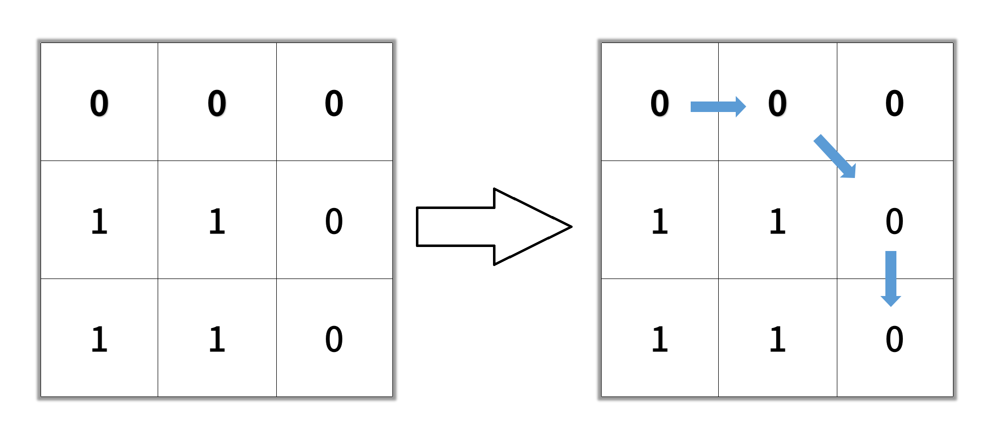
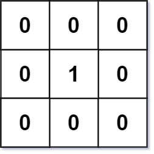

### 695. Max Area of Island

You are given an `m x n` binary matrix `grid`. An island is a group of `1`'s (representing land) connected **4-directionally** (horizontal or vertical.) You may assume all four edges of the grid are surrounded by water.

The **area** of an island is the number of cells with a value `1` in the island.

Return *the maximum **area** of an island in* `grid`. If there is no island, return `0`.

 

**Example 1:**


```
Input: grid = [[0,0,1,0,0,0,0,1,0,0,0,0,0],[0,0,0,0,0,0,0,1,1,1,0,0,0],[0,1,1,0,1,0,0,0,0,0,0,0,0],[0,1,0,0,1,1,0,0,1,0,1,0,0],[0,1,0,0,1,1,0,0,1,1,1,0,0],[0,0,0,0,0,0,0,0,0,0,1,0,0],[0,0,0,0,0,0,0,1,1,1,0,0,0],[0,0,0,0,0,0,0,1,1,0,0,0,0]]
Output: 6
Explanation: The answer is not 11, because the island must be connected 4-directionally.
```

**Example 2:**

```
Input: grid = [[0,0,0,0,0,0,0,0]]
Output: 0
```

 

**Constraints:**

- `m == grid.length`
- `n == grid[i].length`
- `1 <= m, n <= 50`
- `grid[i][j]` is either `0` or `1`.

```python
def maxAreaOfIsland(self, grid: List[List[int]]) -> int:
    ans = 0
    m, n = len(grid), len(grid[0])
    dir = [[0, 1], [0, -1], [1, 0], [-1, 0]]
    def extend(x, y):
        curr = collections.deque([[x, y]])
        grid[x][y] = 0
        cnt = 0
        while curr:
            cnt += 1
            x, y = curr.popleft()
            for i, j in dir:
                xi, yj = x + i, y + j
                if m > xi >= 0 <= yj < n and grid[xi][yj] == 1:
                    grid[xi][yj] = 0
                    curr.append([xi, yj])
        return cnt

    for i, j in product(range(m), range(n)):
        if grid[i][j] == 1:
            ans = max(ans, extend(i, j))
    return ans
```

### 1254. Number of Closed Islands

Given a 2D `grid` consists of `0s` (land) and `1s` (water). An *island* is a maximal 4-directionally connected group of `0s` and a *closed island* is an island **totally** (all left, top, right, bottom) surrounded by `1s.`

Return the number of *closed islands*.

 

**Example 1:**


```
Input: grid = [[1,1,1,1,1,1,1,0],[1,0,0,0,0,1,1,0],[1,0,1,0,1,1,1,0],[1,0,0,0,0,1,0,1],[1,1,1,1,1,1,1,0]]
Output: 2
Explanation: 
Islands in gray are closed because they are completely surrounded by water (group of 1s).
```

**Example 2:**


```
Input: grid = [[0,0,1,0,0],[0,1,0,1,0],[0,1,1,1,0]]
Output: 1
```

**Example 3:**

```
Input: grid = [[1,1,1,1,1,1,1],
               [1,0,0,0,0,0,1],
               [1,0,1,1,1,0,1],
               [1,0,1,0,1,0,1],
               [1,0,1,1,1,0,1],
               [1,0,0,0,0,0,1],
               [1,1,1,1,1,1,1]]
Output: 2
```

 

**Constraints:**

- `1 <= grid.length, grid[0].length <= 100`
- `0 <= grid[i][j] <=1`

```python
def closedIsland(self, grid: List[List[int]]) -> int:
    m, n = len(grid), len(grid[0])
    dir = [[0, 1], [0, -1], [1, 0], [-1, 0]]
    if m == 1 or n == 1: return 0

    def extend(x, y):
        curr = collections.deque([[x, y]])
        grid[x][y] = 1
        while curr:
            x, y = curr.popleft()
            for i, j in dir:
                xi, yj = x + i, y + j
                if m > xi >= 0 <= yj < n and grid[xi][yj] == 0:
                    grid[xi][yj] = 1
                    curr.append([xi, yj])

    for i in range(m):
        if grid[i][0] == 0:
            extend(i, 0)
        if grid[i][n - 1] == 0:
            extend(i, n - 1)
    for i in range(n):
        if grid[0][i] == 0:
            extend(0, i)
        if grid[m - 1][i] == 0:
            extend(m - 1, i)

    ans = 0
    for i, j in product(range(m), range(n)):
        if grid[i][j] == 0:
            ans += 1
            extend(i, j)
    return ans
```

### 1020. Number of Enclaves

You are given an `m x n` binary matrix `grid`, where `0` represents a sea cell and `1` represents a land cell.

A **move** consists of walking from one land cell to another adjacent (**4-directionally**) land cell or walking off the boundary of the `grid`.

Return *the number of land cells in* `grid` *for which we cannot walk off the boundary of the grid in any number of **moves***.

 

**Example 1:**


```
Input: grid = [[0,0,0,0],[1,0,1,0],[0,1,1,0],[0,0,0,0]]
Output: 3
Explanation: There are three 1s that are enclosed by 0s, and one 1 that is not enclosed because its on the boundary.
```

**Example 2:**


```
Input: grid = [[0,1,1,0],[0,0,1,0],[0,0,1,0],[0,0,0,0]]
Output: 0
Explanation: All 1s are either on the boundary or can reach the boundary.
```

 

**Constraints:**

- `m == grid.length`
- `n == grid[i].length`
- `1 <= m, n <= 500`
- `grid[i][j]` is either `0` or `1`.

```python
def numEnclaves(self, grid: List[List[int]]) -> int:
    m, n = len(grid), len(grid[0])
    dir = [[0, 1], [0, -1], [1, 0], [-1, 0]]
    curr = collections.deque([])
    cnt = 0
    for i, j in product(range(m), range(n)):
        if grid[i][j] == 1:
            if i == 0 or j == 0 or i == m - 1 or j == n - 1:
                # boundary
                curr.append((i, j))
                grid[i][j] = 0
            cnt += 1

    while curr:
        x, y = curr.popleft()
        cnt -= 1
        for i, j in dir:
            xi, yj = x + i, y + j
            if m > xi >= 0 <= yj < n and grid[xi][yj] == 1:
                grid[xi][yj] = 0
                curr.append((xi, yj))
    return cnt
```

### 1905. Count Sub Islands

You are given two `m x n` binary matrices `grid1` and `grid2` containing only `0`'s (representing water) and `1`'s (representing land). An **island** is a group of `1`'s connected **4-directionally** (horizontal or vertical). Any cells outside of the grid are considered water cells.

An island in `grid2` is considered a **sub-island** if there is an island in `grid1` that contains **all** the cells that make up **this** island in `grid2`.

Return the ***number** of islands in* `grid2` *that are considered **sub-islands***.

 

**Example 1:**


```
Input: grid1 = [[1,1,1,0,0],[0,1,1,1,1],[0,0,0,0,0],[1,0,0,0,0],[1,1,0,1,1]], grid2 = [[1,1,1,0,0],[0,0,1,1,1],[0,1,0,0,0],[1,0,1,1,0],[0,1,0,1,0]]
Output: 3
Explanation: In the picture above, the grid on the left is grid1 and the grid on the right is grid2.
The 1s colored red in grid2 are those considered to be part of a sub-island. There are three sub-islands.
```

**Example 2:**


```
Input: grid1 = [[1,0,1,0,1],[1,1,1,1,1],[0,0,0,0,0],[1,1,1,1,1],[1,0,1,0,1]], grid2 = [[0,0,0,0,0],[1,1,1,1,1],[0,1,0,1,0],[0,1,0,1,0],[1,0,0,0,1]]
Output: 2 
Explanation: In the picture above, the grid on the left is grid1 and the grid on the right is grid2.
The 1s colored red in grid2 are those considered to be part of a sub-island. There are two sub-islands.
```

 

**Constraints:**

- `m == grid1.length == grid2.length`
- `n == grid1[i].length == grid2[i].length`
- `1 <= m, n <= 500`
- `grid1[i][j]` and `grid2[i][j]` are either `0` or `1`.

```python
def countSubIslands(self, grid1: List[List[int]], grid2: List[List[int]]) -> int:
    """count subIsland from grid2 of grid1

    Args:
        grid1 (List[List[int]]): the original grid
        grid2 (List[List[int]]): the grid to search subIslands

    Returns:
        int: the count of valid subIslands
    """
    # search islands in grid2, and determine if it is a sub island of grid1(all corresponding cells in grid1 are lands as well)
    m, n = len(grid2), len(grid2[0])
    dir = [[0, 1], [0, -1], [1, 0], [-1, 0]]

    def island(x, y):
        ans = True
        curr = collections.deque([(x, y)])
        grid2[x][y] = 0
        while curr:
            x, y = curr.popleft()
            if grid1[x][y] == 0: ans = False
            for i, j in dir:
                xi, yj = x + i, y + j
                if m > xi >= 0 <= yj < n and grid2[xi][yj] == 1:
                    grid2[xi][yj] = 0
                    curr.append((xi, yj))
        return ans

    return sum(1 for i, j in product(range(m), range(n)) if grid2[i][j] == 1 and island(i, j))
```

### 1162. As Far from Land as Possible

Given an `n x n` `grid` containing only values `0` and `1`, where `0` represents water and `1` represents land, find a water cell such that its distance to the nearest land cell is maximized, and return the distance. If no land or water exists in the grid, return `-1`.

The distance used in this problem is the Manhattan distance: the distance between two cells `(x0, y0)` and `(x1, y1)` is `|x0 - x1| + |y0 - y1|`.

 

**Example 1:**


```
Input: grid = [[1,0,1],[0,0,0],[1,0,1]]
Output: 2
Explanation: The cell (1, 1) is as far as possible from all the land with distance 2.
```

**Example 2:**


```
Input: grid = [[1,0,0],[0,0,0],[0,0,0]]
Output: 4
Explanation: The cell (2, 2) is as far as possible from all the land with distance 4.
```

 

**Constraints:**

- `n == grid.length`
- `n == grid[i].length`
- `1 <= n <= 100`
- `grid[i][j]` is `0` or `1`

> it is the same question as flooding water
>
> ==BFS== is recommanded 

```python
def maxDistance(self, grid: List[List[int]]) -> int:
    """find the max distance from a water cell to its nearest land cell

    Args:
        grid (List[List[int]]): water = 0 | land = 1

    Returns:
        int: return the max distance, -1 if there is no water not no land
    """
    # BFS
    # we extend land in each loop until there is no water, return the steps we take
    n = len(grid)
    dir = [[0, 1], [0, -1], [1, 0], [-1, 0]]
    curr = []
    for i, j in product(range(n), range(n)):
        if grid[i][j] == 1:
            curr.append((i, j))

    if not curr or len(curr) == n * n: return -1
    step = 0
    while curr:
        step += 1
        nxt = []
        for x, y in curr:
            for i, j in dir:
                xi, yj = x + i, y + j
                if n > xi >= 0 <= yj < n and grid[xi][yj] == 0:
                    grid[xi][yj] = 1
                    nxt.append((xi, yj))
        curr = nxt
    return step - 1
```

### 417. Pacific Atlantic Water Flow

There is an `m x n` rectangular island that borders both the **Pacific Ocean** and **Atlantic Ocean**. The **Pacific Ocean** touches the island's left and top edges, and the **Atlantic Ocean** touches the island's right and bottom edges.

The island is partitioned into a grid of square cells. You are given an `m x n` integer matrix `heights` where `heights[r][c]` represents the **height above sea level** of the cell at coordinate `(r, c)`.

The island receives a lot of rain, and the rain water can flow to neighboring cells directly north, south, east, and west if the neighboring cell's height is **less than or equal to** the current cell's height. Water can flow from any cell adjacent to an ocean into the ocean.

Return *a **2D list** of grid coordinates* `result` *where* `result[i] = [ri, ci]` *denotes that rain water can flow from cell* `(ri, ci)` *to **both** the Pacific and Atlantic oceans*.

 

**Example 1:**


```
Input: heights = [[1,2,2,3,5],[3,2,3,4,4],[2,4,5,3,1],[6,7,1,4,5],[5,1,1,2,4]]
Output: [[0,4],[1,3],[1,4],[2,2],[3,0],[3,1],[4,0]]
```

**Example 2:**

```
Input: heights = [[2,1],[1,2]]
Output: [[0,0],[0,1],[1,0],[1,1]]
```

 

**Constraints:**

- `m == heights.length`
- `n == heights[r].length`
- `1 <= m, n <= 200`
- `0 <= heights[r][c] <= 10 ** 5`

```python
def pacificAtlantic(self, heights: List[List[int]]) -> List[List[int]]:
    """water flood from higher cells to adjacent lower cells

    Args:
        heights (List[List[int]]): an island with height specified to each cell

    Returns:
        List[List[int]]: return the count of cells that can be flood by both seas
    """
    m, n = len(heights), len(heights[0])
    dir = [[0, 1], [0, -1], [1, 0], [-1, 0]]

    water = collections.defaultdict(int)
    def drawn(edge):
        visited = set(edge)
        while edge:
            x, y = edge.pop()
            water[(x, y)] += 1
            for i, j in dir:
                xi, yj = x + i, y + j
                if m > xi >= 0 <= yj < n and (xi, yj) not in visited and heights[xi][yj] >= heights[x][y]:
                    visited.add((xi, yj))
                    edge.append((xi, yj))

    # pacific: top-left side
    edge = [(0, 0)]
    for i in range(1, m):
        edge.append((i, 0))
    for i in range(1, n):
        edge.append((0, i))
    drawn(edge)

    edge = [(m - 1, n - 1)]
    for i in range(m - 1):
        edge.append((i, n - 1))
    for i in range(n - 1):
        edge.append((m - 1, i))
    drawn(edge)

    return [[x, y] for (x, y), cnt in water.items() if cnt == 2]
```

### 1091. Shortest Path in Binary Matrix

Given an `n x n` binary matrix `grid`, return *the length of the shortest **clear path** in the matrix*. If there is no clear path, return `-1`.

A **clear path** in a binary matrix is a path from the **top-left** cell (i.e., `(0, 0)`) to the **bottom-right** cell (i.e., `(n - 1, n - 1)`) such that:

- All the visited cells of the path are `0`.
- All the adjacent cells of the path are **8-directionally** connected (i.e., they are different and they share an edge or a corner).

The **length of a clear path** is the number of visited cells of this path.

 

**Example 1:**


```
Input: grid = [[0,1],[1,0]]
Output: 2
```

**Example 2:**



```
Input: grid = [[0,0,0],[1,1,0],[1,1,0]]
Output: 4
```

**Example 3:**

```
Input: grid = [[1,0,0],[1,1,0],[1,1,0]]
Output: -1
```

 

**Constraints:**

- `n == grid.length`
- `n == grid[i].length`
- `1 <= n <= 100`
- `grid[i][j] is 0 or 1`

```python
def shortestPathBinaryMatrix(self, grid: List[List[int]]) -> int:
    if grid[0][0] == 1: return -1
    dir = [[0, 1], [0, -1], [-1, -1], [-1, 0], [-1, 1], [1, -1], [1, 0], [1, 1]]
    pq = [(1, 0, 0)]
    m, n = len(grid), len(grid[0])
    while pq:
        cnt, x, y = heapq.heappop(pq)
        if x == m - 1 and y == n - 1: return cnt
        for i, j in dir:
            xi, yj = x + i, y + j
            if m > xi >= 0 <= yj < n and grid[xi][yj] == 0:
                grid[xi][yj] = 1
                heapq.heappush(pq, (cnt + 1, xi, yj))
    return -1
```

### 542. 01 Matrix

Given an `m x n` binary matrix `mat`, return *the distance of the nearest* `0` *for each cell*.

The distance between two adjacent cells is `1`.

 

**Example 1:**



```
Input: mat = [[0,0,0],[0,1,0],[0,0,0]]
Output: [[0,0,0],[0,1,0],[0,0,0]]
```

**Example 2:**


```
Input: mat = [[0,0,0],[0,1,0],[1,1,1]]
Output: [[0,0,0],[0,1,0],[1,2,1]]
```

 

**Constraints:**

- `m == mat.length`
- `n == mat[i].length`
- `1 <= m, n <= 104`
- `1 <= m * n <= 104`
- `mat[i][j]` is either `0` or `1`.
- There is at least one `0` in `mat`.

```python
def updateMatrix(self, mat: List[List[int]]) -> List[List[int]]:
    """water flood

    Args:
        mat (List[List[int]]): 0-1 matrix

    Returns:
        List[List[int]]: return the disrance of the nearest 0 for each cell
    """
    m, n = len(mat), len(mat[0])
    dir = [[0, 1], [0, -1], [1, 0], [-1, 0]]

    ans = [[0] * n for _ in range(m)]
    curr = []
    for i, j in product(range(m), range(n)):
        if mat[i][j] == 0:
            curr.append((i, j))

    step = 0
    while curr:
        step += 1
        nxt = []
        for (x, y), (i, j) in product(curr, dir):
            xi, yj = x + i, y + j
            if m > xi >= 0 <= yj < n and mat[xi][yj] == 1:
                mat[xi][yj] = 0
                nxt.append((xi, yj))
                ans[xi][yj] = step
        curr = nxt
    return ans
```

